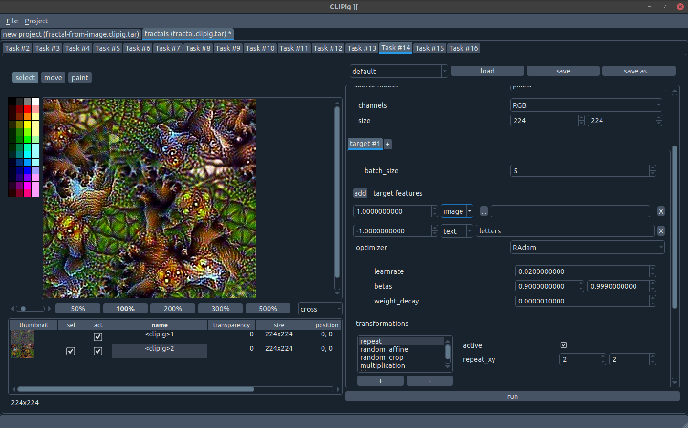

Personal testbed and collection of utilities for torch-based 
neural net experiments.

Folder structure:

- [src/](src/) and [test/](src/) is mostly the library part.
  There is a lot of work on torch Datasets, some of it is
  obsoleted by torch's `DataPipes` library which i do NOT yet use.
- [scripts/](scripts/) contains a couple of different experiments.
  The files are pretty similar in structure and vary in dataset,
  model and training details. Most of it superseded by:
- [experiments/](experiments/) contains new experiments based on
  yaml file descriptions. It's an opinionated wrapper around
  my [Trainer class](src/train/trainer.py) that can also run 
  permutations of parameters and log the results.
- [notebooks-cleaned/](notebooks-cleaned/) contains the cleaned (no output)
  version of all the jupyter notebooks used for experimentation. 
  Some of them are useful, some of them are collections of crap from
  middle-of-the-night trial-and-error sessions.

Experiments from the [experiments/](experiments/) folder are run in project root with:

```shell
python exp.py experiments/the-name.yml run
```

Create a github issue if you are interested in playing with it and
need some documentation.


### :strawberry: Logbooks

[docs/logs/](docs/logs/) contains logbooks of some experiments


### CLIPig 2 

After the roaring success of [CLIPig](https://github.com/defgsus/clipig) (ha ha)
i started a version that is configured through a graphical UI instead of yaml files.



Run it with 
```shell
python src/clipig
```


### 🤗  (Small) Language Model chat

There's a small tool to put prompts into the 
[huggingface language generators](https://huggingface.co/models?pipeline_tag=text-generation) 
using a browser, which is much nicer than a command line interface. 

```shell
python scripts/chat_lm_browser.py [--model <hf-model-name>]
# and visit http://127.0.0.1:8000
```

I'm currently having fun with 

```shell
python scripts/chat_lm_browser.py \
    --model microsoft/phi-1_5
    --device auto
    --bits 8
```

`bits` reduces the precision of the weights
([doc](https://huggingface.co/docs/transformers/llm_tutorial_optimization#1-lower-precision))
which reduces memory requirements and let's you actually put some of the models
on a normal GPU.
