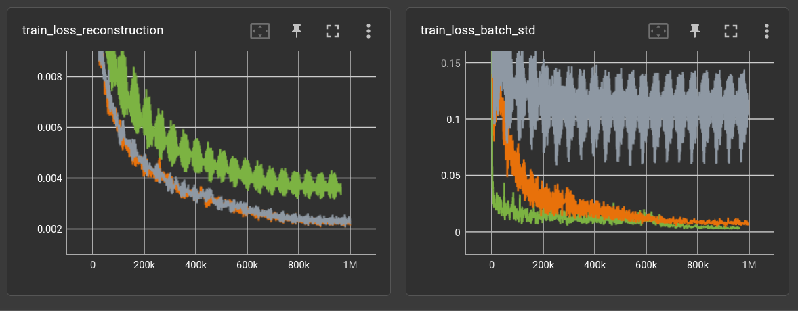

# "implicit neural representation"

which mainly means, calculate: `position + code -> color`.

After preliminary experiments, running this setup:

    DalleManifoldAutoencoder(
        shape=(1, 32, 32), 
        vocab_size=128, n_hid=64, n_blk_per_group=1, act_fn=nn.GELU, space_to_depth=True, 
        decoder_n_blk=4, decoder_n_layer=2, decoder_n_hid=64,
    )
    encoder params: 1,725,264
    decoder params: 42,497
    batch_size: 64
    steps: 1M
    learnrate: .0003 AdamW, CosineAnnealingLR 

on only 300 (randomly h&v-flipped) images of the RPG-tiles dataset (/scripts/datasets.py).

Find the code at [scripts.train_autoencoder](../../scripts/train_autoencoder.py).

The encoder is a small version of the DALL-E VQ-VAE model.
The decoder is basically a function of

    encoding, pixel-position -> pixel-color

which i call "manifold" for now until i stumble across a better name.
It's made of X equal blocks of Y fully connected layers with
batch-normalization and residual skip connections per block.

Besides l2 reconstruction loss there is an extra constraint on the distribution of the encoding:

    loss_batch_std = (.5 - feature_batch.std(0).mean()).abs()
    loss_batch_mean = (0. - feature_batch.mean()).abs()

The three runs add these losses with factor 0.1 (green), 0.001 (orange) and 0.0 (gray).



Below are reproduced (right) samples of the orange model.


and rendered to 64x64 resolution:


### upgrade decoder

fixed the std/mean loss factor to 0.0001 and increased number of decoder blocks:

    decoder_n_blk=8,  decoder_n_layer=2, decoder_n_hid=128, params: 283,649

plots in x = steps (top) and relative time (bottom):


The reproductions from the training set look good enough.
other tiles can hardly be reproduced:


Some (very short) tests with different block/layer settings:

    (cyan)    decoder_n_blk=8,  decoder_n_layer=2, decoder_n_hid=128, params: 283,649 
    (yellow)  decoder_n_blk=8,  decoder_n_layer=4, decoder_n_hid=128, params: 547,841
    (brown)   decoder_n_blk=16, decoder_n_layer=1, decoder_n_hid=128, params: 285,697 
    (magenta) decoder_n_blk=16, decoder_n_layer=2, decoder_n_hid=128, params: 549,889


### back to "real" dataset

The current dataset of choice for my autoencoders is a mixture of all
the rpg tiles (about 8k, h&v-flipped) and kali-set fractal patches
(about 50k, at 128x128 randomly cropped to 32x32).


    (light green) decoder_n_blk=8, decoder_n_layer=2, decoder_n_hid=300, params: 1,490,401
    (dark green)  decoder_n_blk=8, decoder_n_layer=2, decoder_n_hid=128, params: 283,649
    (cyan)        sames as dark green but on above small dataset

The light-green model above was quite unsuccessful in terms of
image quality. It still uses 0.1 factor for std/mean-loss.
Dark green model uses factor 0.0001 and performs a little better
even though having less parameters. It's not getting close
to the desirable baseline of the 300-tile dataset (cyan), though.

Increasing the number of hidden cells in the decoder to 256 does
not seem to be enough for acceptable quality:

    (yellow) decoder_n_blk=8, decoder_n_layer=2, decoder_n_hid=256, params: 1,091,585


It might get below 0.004 reconstruction loss with another 10 hours
but i'm targeting < 0.001. Stopping it.

### 2023-11-10: back to small dataset

Changing residual logic to either add (like previous) or concat features:

    decoder_n_blk=8, decoder_n_layer=2, decoder_n_hid=64, 
        decoder_concat_residual=[True, False] * 4,
        params: 3,502,785

    which leads to hidden sizes per block:
        64, 128, 128, 256, 256, 512, 512, 1024

With no apparent difference within the first 80k steps (cyan)
compared to the previous small-dataset-experiments.
Unless it's runtime, which is just terrible:


# 2023-11-12: transformer on mnist

clamped torch's TransformerEncoder/Decoder between a conv layer
for image patches and tried a couple of parameters:

```yaml
matrix:
  opt: ["Adam"]
  lr: [0.001]
  patch: [4, 8]
  stride: [2, 4, 8]
  $filter: ${stride} <= ${patch}
  l: [2, 4, 8, 12, 16]
  head: [4, 8]
  hid: [64, 128, 256]

experiment_name: mnist/tr1_${matrix_slug}

trainer: TrainAutoencoder

globals:
  SHAPE: (1, 28, 28)
  CODE_SIZE: 28 * 28 // 10

train_set: |
  TransformDataset(
    TensorDataset(torchvision.datasets.MNIST("~/prog/data/datasets/", train=True).data),
    transforms=[lambda x: x.unsqueeze(0).float() / 255.],
  )

validation_set: |
  TransformDataset(
    TensorDataset(torchvision.datasets.MNIST("~/prog/data/datasets/", train=False).data),
    transforms=[lambda x: x.unsqueeze(0).float() / 255.],
  )

batch_size: 64
learnrate: ${lr}
optimizer: ${opt}
scheduler: CosineAnnealingLR
loss_function: l1
max_inputs: 1_000_000

model: |
  from experiments.ae.transformer import *
  
  TransformerAutoencoder(
      shape=SHAPE, code_size=CODE_SIZE,
      patch_size=${patch},
      stride=${stride},
      num_layers=${l},
      num_hidden=${hid},
      num_heads=${head},
  )
```


# resnet21 for embedding -> ImageManifoldModel

Autoencoder with pre-trained resnet21 (without last avgpool).

```yaml
matrix:
  # compression ratio
  cr: [10]
  opt: ["Adam"]
  lr: [0.001]

  hid: [256]
  # blocks
  bl: [2]
  # layers per block
  lpb: [2]
  act: ["gelu"]

experiment_name: tests/rpg_res5_${matrix_slug}

trainer: experiments.ae.trainer.TrainAutoencoderSpecial

globals:
  SHAPE: (3, 32, 32)
  CODE_SIZE: 32 * 32 // ${cr}

train_set: |
  from experiments.datasets import rpg_tile_dataset 
  rpg_tile_dataset(SHAPE, validation=False, shuffle=True, random_shift=4, random_flip=True)

freeze_validation_set: True
validation_set: |
  from experiments.datasets import rpg_tile_dataset 
  rpg_tile_dataset(SHAPE, validation=True, shuffle=True, limit=500)

batch_size: 64
learnrate: ${lr}
optimizer: ${opt}
scheduler: CosineAnnealingLR
loss_function: l1
max_inputs: 1_000_000

model: |
  from src.models.encoder import resnet
  encoder = resnet.resnet18_open(weights=torchvision.models.ResNet18_Weights.IMAGENET1K_V1)
  with torch.no_grad():
      out_shape = encoder(torch.empty(2, *SHAPE)).shape[-3:]
  encoder = nn.Sequential(
      encoder,
      nn.Flatten(1),
      nn.Linear(math.prod(out_shape), CODE_SIZE)
  )
  #for p in encoder.parameters():
  #  p.requires_grad = False
  
  EncoderDecoder(
      encoder,
      ImageManifoldDecoder(
          num_input_channels=CODE_SIZE,
          num_output_channels=SHAPE[0],
          default_shape=SHAPE[-2:],
          num_hidden=${hid},
          num_blocks=${bl},
          num_layers_per_block=${lpb},
          activation="${act}",
      )
  )
```

Increasing the *number of hidden cells*, *blocks* and *layers per block*
did **not** provide a benefit on the 7k rpg tile dataset.
All larger versions performed worse:


And, actually, it turns out that a simple 3-layer CNN (ks=3, channels=[16, 24, 32])
as the encoder performs much better than the resnet:

```
(encoder): EncoderConv2d(
    (convolution): Conv2dBlock(
      (_act_fn): ReLU()
      (layers): Sequential(
        (0): Conv2d(3, 16, kernel_size=(3, 3), stride=(1, 1))
        (1): ReLU()
        (2): Conv2d(16, 24, kernel_size=(3, 3), stride=(1, 1))
        (3): ReLU()
        (4): Conv2d(24, 32, kernel_size=(3, 3), stride=(1, 1))
        (5): ReLU()
      )
    )
    (linear): Linear(in_features=21632, out_features=102, bias=True)
  )
```


## back to simple CNN encoder 

Everything i tried in the last couple of days is performing 
worse, e.g. changing the pos-embedding frequencies, 
using FFTs in some way and increasing the encoder params.

By the way, running the tests for 1M steps (about 20 epochs
with the current RPG tile dataset) might not be 
enough either... but i'm actually looking for methods that
enhance performance already before 1M steps. For the sake
of logging: 


The gray line is the reference with simple CNN encoder from 
above and yellow has increased the encoder channels from 
`(16, 24, 32)` to `(24, 32, 48)` which, of course!, performed
a little worse than the smaller encoder (:questionmark:). 
Let it run for 7M steps, which is over 200 epochs 
(on a randomly flipped and pixel-shifted dataset). 
It went **below 0.04** l1 validation loss, but this is still bad:


The idea behind using the implicit generation is to be
able to increase the resolution, but if it already looks
blurry in the original resolution...
