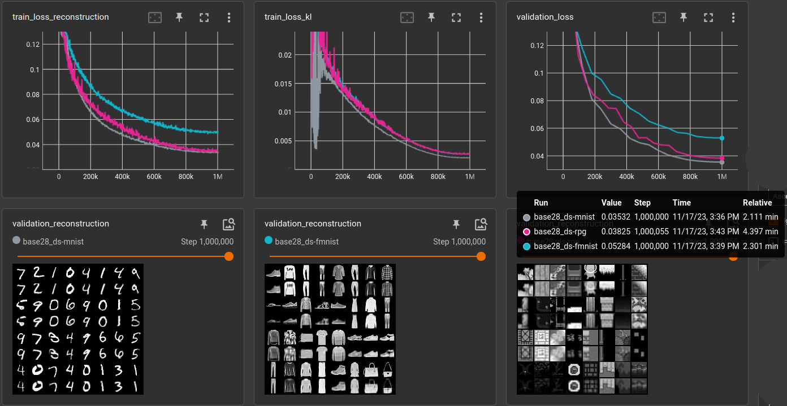
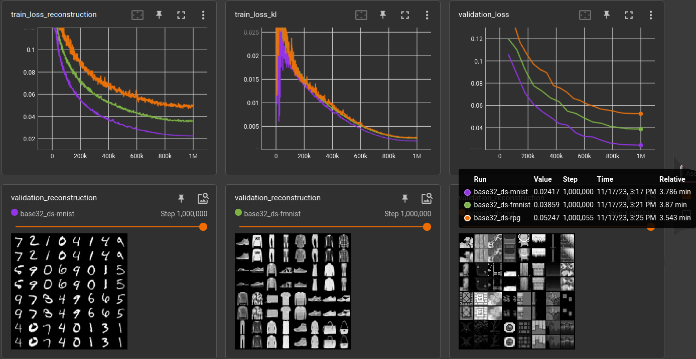
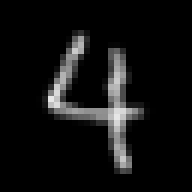
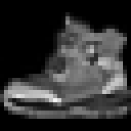
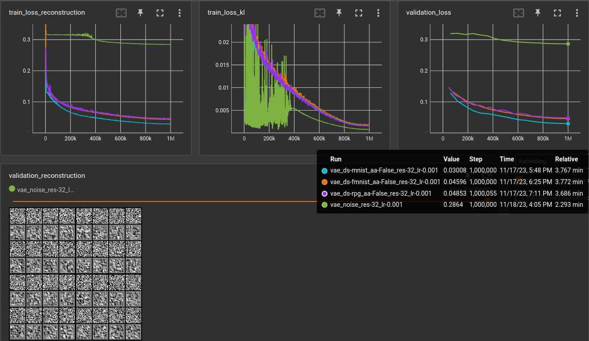

# variational auto-encoder on RPG Tile dataset

There is a *deep* love/hate relationships with neural networks.
Why the heck do i need to train a small network like this

```python
model = VariationalAutoencoderConv(
    shape=(3, 32, 32), channels=[16, 24, 32], kernel_size=5,
    latent_dims=128,
)

optimizer = Adam(model.default_parameters(), lr=.0001, weight_decay=0.000001)
```

for 10 hours and it still does not reach the optimum?


And how could one tell after 30 minutes where this is going
to go? The plot shows the l1 validation loss (right) over
**1700 epochs!** Why does this network need to look at 
things 1700 times???

Well, it's a complicated dataset, for sure.


But i feel there is something wrong in the method. 
This *backpropagation gradient descent*, although
mathematically grounded, feels like a brute-force approach.

# comparing different datasets

The rpg tile dataset is now fixed to 47579 training and 2505 
validation grayscale images at 32x32 pixels. 
Running the following experiment to compare
with the *"classic"* datasets:

```yaml
trainer: src.train.TrainAutoencoder

matrix:
  ds:
  - "mnist"
  - "fmnist"
  - "rpg"

experiment_name: vae/base28_${matrix_slug}

train_set: | 
  {
      "mnist": mnist_dataset(train=True, shape=SHAPE),
      "fmnist": fmnist_dataset(train=True, shape=SHAPE),
      "rpg": rpg_tile_dataset_3x32x32(validation=False, shape=SHAPE),
  }["${ds}"]

validation_set: |
  {
      "mnist": mnist_dataset(train=False, shape=SHAPE),
      "fmnist": fmnist_dataset(train=False, shape=SHAPE),
      "rpg": rpg_tile_dataset_3x32x32(validation=True, shape=SHAPE)
  }["${ds}"]

batch_size: 64
learnrate: 0.0003
optimizer: Adam
scheduler: CosineAnnealingLR
max_inputs: 1_000_000

globals:
  SHAPE: (1, 28, 28)
  CODE_SIZE: 128

model: |
  encoder = EncoderConv2d(SHAPE, code_size=CODE_SIZE, channels=(16, 24, 32), kernel_size=3)
  decoder = DecoderConv2d(SHAPE, code_size=CODE_SIZE, channels=(32, 24, 16), kernel_size=3)
  
  VariationalAutoencoder(
      encoder = VariationalEncoder(
          encoder, CODE_SIZE, CODE_SIZE
      ),
      decoder = decoder,
      reconstruction_loss = "l1",
      reconstruction_loss_weight = 1.,
      kl_loss_weight = 1.,
  )
```

Note that the MNIST and [FMNIST](https://arxiv.org/abs/1708.07747) images are 28x28 pixels and
the RPG dataset is resized (via BILINEAR filter) to the same
resolution.



So, the RPG datasets seems to be equally easy/complicated
like MNIST and FMNIST is pretty hard in comparison.
Doing the same for 32x32 pixels (where the other two datasets
are resized):



Huh? Very different results. 
MNIST easiest, FMNIST middle, RPG hardest. 

### Take care of the choice of interpolation!

After some testing it seems that the interpolation mode 
during resizing has a strong influence. So i ran the above
experiment on different resolutions (**res**) and with
interpolation mode `BILINEAR` (**aa** = True) and
`NEAREST` (**aa** = False) and two different 
learning rates (**lr**):

(using file `experiments/vae/compare-datasets.yml`)

| dataset | aa    | res |     lr | validation loss (1,000,000 steps) | meter                 |
|:--------|:------|----:|-------:|----------------------------------:|:----------------------|
| mnist   | False |  20 | 0.0003 |                         0.0274497 | *******               |
| fmnist  | False |  20 | 0.0003 |                         0.0482327 | ******************    |
| rpg     | False |  20 | 0.0003 |                          0.052915 | ********************  |
| mnist   |       |  28 | 0.0003 |                         0.0351929 | ***********           |
| fmnist  |       |  28 | 0.0003 |                         0.0534702 | ********************* |
| rpg     | False |  28 | 0.0003 |                         0.0514313 | *******************   |
| mnist   | False |  32 | 0.0003 |                         0.0333494 | **********            |
| fmnist  | False |  32 | 0.0003 |                         0.0495315 | ******************    |
| rpg     |       |  32 | 0.0003 |                         0.0532157 | ********************  |
| mnist   | True  |  20 | 0.0003 |                         0.0193185 | **                    |
| fmnist  | True  |  20 | 0.0003 |                         0.0337913 | **********            |
| rpg     | True  |  20 | 0.0003 |                         0.0337807 | **********            |
| mnist   |       |  28 | 0.0003 |                         0.0357742 | ***********           |
| fmnist  |       |  28 | 0.0003 |                         0.0528828 | ********************  |
| rpg     | True  |  28 | 0.0003 |                         0.0369611 | ************          |
| mnist   | True  |  32 | 0.0003 |                         0.0246818 | *****                 |
| fmnist  | True  |  32 | 0.0003 |                         0.0380947 | ************          |
| rpg     |       |  32 | 0.0003 |                         0.0533928 | ********************  |
| ------  |       |     |        |                                   |                       |
| mnist   | False |  20 |  0.001 |                           0.0221466 | ****                  |
| fmnist  | False |  20 |  0.001 |                           0.0421959 | ***************       |
| rpg     | False |  20 |  0.001 |                           0.0454093 | ****************      |
| mnist   |       |  28 |  0.001 |                           0.0326754 | *********             |
| fmnist  |       |  28 |  0.001 |                           0.0491466 | ******************    |
| rpg     | False |  28 |  0.001 |                           0.0472919 | *****************     |
| mnist   | False |  32 |  0.001 |                           0.0300777 | ********              |
| fmnist  | False |  32 |  0.001 |                           0.0459637 | *****************     |
| rpg     |       |  32 |  0.001 |                           0.0485321 | ******************    |
| mnist   | True  |  20 |  0.001 |                           0.0157305 | *                     |
| fmnist  | True  |  20 |  0.001 |                           0.0278209 | *******               |
| rpg     | True  |  20 |  0.001 |                           0.0281536 | *******               |
| mnist   |       |  28 |  0.001 |                           0.0321101 | *********             |
| fmnist  |       |  28 |  0.001 |                           0.0492271 | ******************    |
| rpg     | True  |  28 |  0.001 |                           0.0349186 | ***********           |
| mnist   | True  |  32 |  0.001 |                           0.0221171 | ****                  |
| fmnist  | True  |  32 |  0.001 |                           0.0357977 | ***********           |
| rpg     |       |  32 |  0.001 |                           0.0489479 | ******************    |

(No entry in **aa** means that there was no resizing necessary)

It confirms the strong correlation of the dataset difficulty
and the interpolation method. It gave me some headache in 
the beginning but looking at resized examples makes it 
understandable:

| Original MNIST image (28x28) | resized to 32x32 *without* | and *with* bilinear filtering |
|------------------------------|----------------------------|-------------------------------|
|  |  |  |

| Original FMNIST image (28x28)                 | resized to 32x32 *without*             | and *with* bilinear filtering  |
|-----------------------------------------------|----------------------------------------|--------------------------------|
|   |  |  |    

| Original RPG image (32x32) | resized to 28x28 *without* | and *with* bilinear filtering |
|---------------|----------------------------------------|--------------------------------|
|  |  |  |


The bilinear filter blurs out a lot of the single pixel 
details and makes the images *"easier"* to auto-encode.
Ignoring the `aa = True` runs in the table above we can see
that the RPG dataset is, in comparison, equally *"hard*" 
when down-scaled to the FMNIST size and a little harder 
when FMNIST is up-scaled (because some pixels are just
repeated).

Side note: Many of the images in RPG are originally 16x16
but there is a good percentage of images that were 32x32
or larger. All of them have been resized to 32x32 **without**
interpolation.

For comparison, below is a run on a dataset of 60,000
noise images (mean=0.5, std=0.5, clamped to range [0, 1]),
+10,000 for validation (green). 



