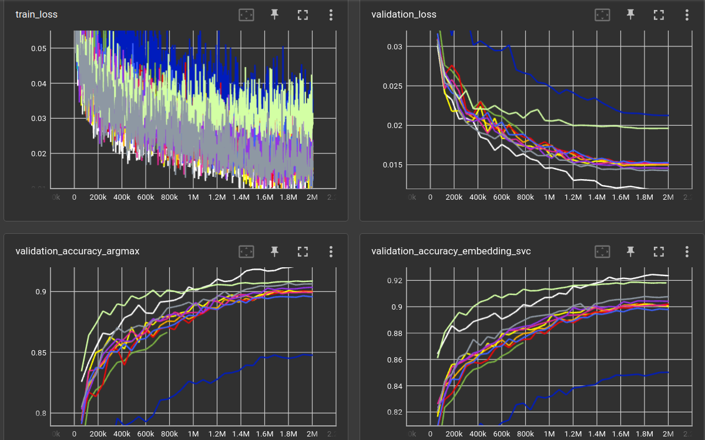

# Experiments with vision transformers

## Classifying FMNIST

Using the `torchvision.models.VisionTransformer` on the `FMNIST` dataset,
with `torchvision.transforms.TrivialAugmentWide` data augmentation.

Training is done for 2M steps which translates to ~32 passes through the
training set.

The training (and validation) loss is the l2 distance between the 
FMNIST class (10 numbers, either 0 or 1) and the network output.

There is an additional layer (of size `cs`) before the classification layer
that is used as *embedding*. During validation, a Support Vector Classifier
(`sklearn.svm.SVC` with default parameters) is fitted to the embedding/labels to see
if the embedding contains enough information to classify the images in 
a non-NN fashion (`accuracy (svc)`). Also the `torch.argmax` is
compared between FMNIST class logits and network output (`accuracy (argmax)`)
to measure the accuracy of the true network output.

```yaml
matrix:
  patch: [7]     # transformer input patch size
  layer: [8]     # number of layers 
  head: [16]     # number of attention heads
  hidden: [256]  # size of hidden dimension
  mlp: [512]     # size of hidden dimension in MLP stage
  drop: [0.]     # MLP dropout
  cs: [784]      # size of code before classification layer 

experiment_name: aug/fmnist_vit_trivaug_${matrix_slug}

train_set: |
  ClassLogitsDataset(
      fmnist_dataset(train=True, shape=SHAPE),
      num_classes=CLASSES, tuple_position=1, label_to_index=True,
  )

validation_set: |
  ClassLogitsDataset(
      fmnist_dataset(train=False, shape=SHAPE),
      num_classes=CLASSES, tuple_position=1, label_to_index=True,
  )

trainer: experiments.reptrainer.RepresentationClassTrainer
batch_size: 64
learnrate: 0.0003
optimizer: AdamW
scheduler: CosineAnnealingLR
loss_function: l2
max_inputs: 2_000_000
train_input_transforms: |
  [
      lambda x: (x * 255).to(torch.uint8),
      VT.TrivialAugmentWide(),
      lambda x: x.to(torch.float32) / 255.,
  ]

globals:
  SHAPE: (3, 28, 28)
  CODE_SIZE: ${cs}
  CLASSES: 10

model: |
  class Encoder(nn.Module):
      def __init__(self):
          super().__init__()
    
          from torchvision.models import VisionTransformer
          self.encoder = VisionTransformer(
              image_size=SHAPE[-1],
              patch_size=${patch},
              num_layers=${layer},
              num_heads=${head},
              hidden_dim=${hidden},
              mlp_dim=${mlp},
              num_classes=CODE_SIZE,
              dropout=${drop},
          )
          self.linear = nn.Linear(CODE_SIZE, CLASSES)
      
      def forward(self, x):
          return self.linear(self.encoder(x))
    
  Encoder()
```

I varied a few parameters of the transformer without significant change
to the downstream accuracy, except, of course, that a much bigger network
performs much worse (like in previous experiments).

For comparison there is included an untrained ResNet18 (`RN18`) and a simple 
ConvEncoder (`CNN`, ks=3, channels=(32, 32, 32), ReLU, output=128). 

|                 model | patch | layer | head | hidden |  mlp | drop |  cs | validation loss (2,000,000 steps) | accuracy (argmax) | accuracy (svc) |  model params |   
|----------------------:|------:|------:|-----:|-------:|-----:|-----:|----:|----------------------------------:|------------------:|---------------:|--------------:|
|      **RN18** (white) |       |       |      |        |      |      | 128 |                       **0.01189** |        **0.9206** |     **0.9237** |    11,243,466 |
|            ViT (grey) |     7 |     4 |   16 |    256 |  512 |    0 | 128 |                           0.01429 |            0.9063 |         0.9076 |     2,185,610 |
|          ViT (purple) |     7 |     4 |    8 |    256 |  512 |    0 | 128 |                           0.01460 |            0.9034 |         0.9042 |     2,185,610 |
|     ViT (*not shown*) |     7 |     4 |   32 |    256 |  512 |    0 | 128 |                           0.01482 |            0.9025 |         0.9013 |     2,185,610 |
|          ViT (orange) |     7 |     8 |    8 |    256 |  512 |    0 | 128 |                           0.01499 |            0.8992 |         0.9014 |     4,294,026 |
|          ViT (yellow) |     7 |     8 |   16 |    256 |  512 |    0 | 128 |                           0.01514 |            0.8997 |         0.9003 |     4,294,026 |
|         ViT (magenta) |     7 |     8 |   16 |    256 |  512 |    0 | 784 |                           0.01518 |            0.8993 |         0.9009 |     4,469,178 |
|             ViT (red) |     7 |     8 |    8 |    256 | 1024 |    0 | 128 |                           0.01526 |            0.9002 |         0.9019 |     6,395,274 |
|            ViT (blue) |     7 |     4 |    4 |    256 |  512 |    0 | 128 |                           0.01529 |            0.8958 |         0.8980 |     2,185,610 |
|           ViT (green) |     7 |    16 |    8 |    256 |  512 |    0 | 128 |           (780,000 steps) 0.01897 |            0.8665 |         0.8728 |     8,510,858 |
| **CNN** (light green) |       |       |      |        |      |      | 128 |                           0.01962 |            0.9086 |         0.9181 | **2,002,698** |
|       ViT (dark blue) |     7 |     8 |   12 |    768 |  512 |    0 | 128 |                           0.02125 |            0.8477 |         0.8502 |    25,453,962 |



Noteable things:
- `TrivialAugmentWide` creates quite some training loss noise ;)
- Despite the bad validation loss (l2 distance of class logits), the CNN
  has comparatively good accuracy
- Generally, the validation loss does not entirely correlate with the classification accuracy
- And, of course, i obviously don't know how to train Transformers. The ResNet beats them all!
  It is very likely that 30 epochs are too short to even see a difference between
  the different Transformer sizes. They all seem to converge at roughly the same place after 2M steps, 
  with a little trend: smaller is better :facepalm:
- The SVC accuracy is always (very slightly) higher than the argmax accuracy. 
  One can probably assume that a Support Vector Machine is more powerful than a 
  single linear NN layer.
