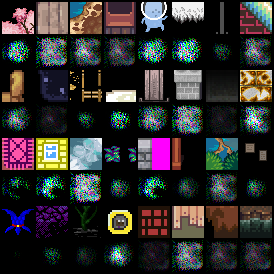
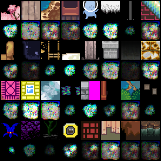

# autoencoder with histogram loss

Stupid experiment, just to get a feeling for the parameters.

Basically a simple autoencoder but the loss only considers the histogram
using the *soft histogram* mentioned by Tony-Y in the 
[pytorch forum](https://discuss.pytorch.org/t/differentiable-torch-histc/25865/4).

```yaml
matrix:
  bins: [100, 200, 50]
  sigma: [100, 200, 50]
  norm: [False]
  loss: ["'l1'"]

experiment_name: ae/hist/hl-${matrix_slug}

trainer: experiments.ae.trainer.TrainAutoencoderSpecial

train_set: |
  rpg_tile_dataset_3x32x32(SHAPE, validation=False)

validation_set: |
  rpg_tile_dataset_3x32x32(SHAPE, validation=True)

batch_size: 64
learnrate: 0.0003
optimizer: AdamW
scheduler: CosineAnnealingLR
loss_function: |
  HistogramLoss(${bins}, 0., 1., sigma=${sigma}, loss=${loss}, normalize=${norm})
max_inputs: 500_000

globals:
  SHAPE: (3, 32, 32)
  CODE_SIZE: 128

model: |
  encoder = EncoderConv2d(SHAPE, code_size=CODE_SIZE, channels=(24, 32, 48), kernel_size=5)

  encoded_shape = encoder.convolution.get_output_shape(SHAPE)
  decoder = nn.Sequential(
      nn.Linear(CODE_SIZE, math.prod(encoded_shape)),
      Reshape(encoded_shape),
      encoder.convolution.create_transposed(act_last_layer=False),
  )

  EncoderDecoder(encoder, decoder)
```


Normalizing the histograms before calculating the difference did not
converge well. And reproduction look terrible as could be expected: 

| green                                           | yellow                                          |
|-------------------------------------------------|-------------------------------------------------|
|   |  |

| purple                                          | gray                                            |
|-------------------------------------------------|-------------------------------------------------|
|  |    |

