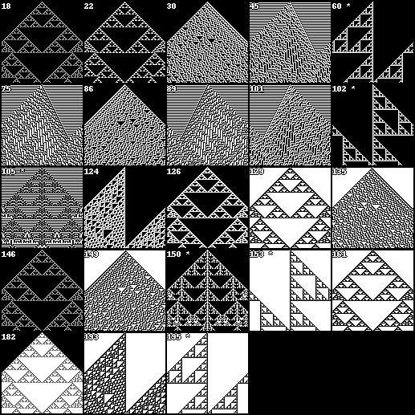

# Reproducing "Connectionist-Symbolic Machine Intelligence using Cellular Automata based Reservoir-Hyperdimensional Computing"

by Ozgur Yilmaz, [arxiv.org/abs/1503.00851](https://arxiv.org/abs/1503.00851)

So, maybe i miss-read something but one experiment is supposed to input a
few binary values then run it few hundred iterations and feed a batch of 
the last CA states to a ridge linear readout to recover the inputs.
It's supposed to show that the CA can hold values over a longer period and
is therefore suitable as a computing *reservoir*.  

Initially i thought it interesting but then i realized that a lot of CA rules
would satisfy this without much computing going on. Imagine a rule that 
simply copies the alive cell in the middle and all input bits are placed
with a little distance to each other. Then the readout actually get's the
unmodified input as source to recover the input, which isn't a proof of anything.

So i probably misunderstood something. Anyways, i ran the following setup
to test the idea a bit:

The dataset consist of the 9-bit binary representations of numbers 0 - 511.
100 samples are randomly selected and moved to the validation set.

A single fixed random mapping of the input values to the CA state space is
used to spread the values across a **200 cell wide** input state such that no
input is closer than 5 cells to another input. The edges of the state are
toroid, e.g. they wrap around. Initial state is zero, except the input bits.

All 256 possible rules in the classic wolfram binary-state 3-neighbourhood CA
are run for 500 iterations and the last 200 iterations are fed to the
`sklearn.linear_model.Ridge` readout. The training-set is used to train
the readout.

When simply querying for the reproduction of the input values, in fact 
**169** rules have zero training error and **145** even generalize to 
have zero validation error. ([csv](data/ca1-repl-copy.csv))

### 5-bit xor

Next the readout was trained to produce the `xor` of the first and last 5 bits
of a 10-bit number. These sets have **924** and **100** samples for train and test.

Here are the top-50 rules:

(mae is mean absolute error, [csv](data/ca1-repl-xor.csv))

|   rule |   correct_train |   mae_train |   correct_test |   mae_test |
|-------:|----------------:|------------:|---------------:|-----------:|
|    153 |             924 |    0.000018 |            100 |   0.000153 |
|     60 |             924 |    0.000018 |            100 |   0.000153 |
|    195 |             924 |    0.000018 |            100 |   0.000153 |
|    102 |             924 |    0.000018 |            100 |   0.000153 |
|    150 |             924 |    0.000027 |            100 |   0.032076 |
|    105 |             924 |    0.000027 |            100 |   0.032076 |
|    146 |             924 |    0.000045 |             81 |   0.155052 |
|     18 |             924 |    0.000045 |             81 |   0.155052 |
|    161 |             924 |    0.000046 |             25 |   0.407795 |
|    129 |             924 |    0.000046 |             25 |   0.407795 |
|    126 |             924 |    0.000046 |             25 |   0.407795 |
|    149 |             924 |    0.000052 |              2 |   0.510267 |
|     86 |             924 |    0.000052 |              2 |   0.510204 |
|    135 |             924 |    0.000052 |              2 |   0.502302 |
|     30 |             924 |    0.000052 |              2 |   0.501841 |
|     89 |             924 |    0.000052 |              2 |   0.498935 |
|     45 |             924 |    0.000052 |              1 |   0.497252 |
|    101 |             924 |    0.000052 |              3 |   0.507690 |
|     75 |             924 |    0.000052 |              2 |   0.501961 |
|     22 |             924 |    0.000060 |              7 |   0.484349 |
|    182 |             924 |    0.000064 |             64 |   0.298419 |
|    124 |             924 |    0.000137 |              5 |   0.440620 |
|    193 |             924 |    0.000137 |              5 |   0.441169 |
|    110 |             920 |    0.001217 |             13 |   0.425420 |
|    137 |             920 |    0.001217 |             13 |   0.426449 |
|    109 |             835 |    0.025168 |             18 |   0.317240 |
|     73 |             818 |    0.033937 |             17 |   0.357383 |
|    147 |             653 |    0.114803 |             14 |   0.403177 |
|     54 |             653 |    0.114803 |             14 |   0.402360 |
|    169 |             471 |    0.195880 |             25 |   0.326195 |
|    225 |             417 |    0.222927 |             12 |   0.354916 |
|    210 |             390 |    0.211516 |             13 |   0.290926 |
|     82 |             390 |    0.211516 |             13 |   0.290926 |
|    181 |             390 |    0.211516 |             13 |   0.290991 |
|     26 |             366 |    0.220765 |              7 |   0.329513 |
|    154 |             366 |    0.220765 |              7 |   0.329513 |
|    167 |             366 |    0.220765 |              7 |   0.329575 |
|    122 |             327 |    0.197325 |              6 |   0.299221 |
|    218 |             175 |    0.352447 |              8 |   0.373356 |
|     90 |             160 |    0.297512 |              0 |   0.323019 |
|    165 |             160 |    0.297512 |              0 |   0.323019 |
|     57 |             115 |    0.395584 |              0 |   0.441891 |
|    230 |             113 |    0.415542 |              6 |   0.456920 |
|    188 |              99 |    0.414891 |              0 |   0.469630 |
|     99 |              96 |    0.407152 |              2 |   0.449875 |
|    145 |              87 |    0.434149 |              2 |   0.472446 |
|    158 |              87 |    0.450478 |              1 |   0.472240 |
|    118 |              86 |    0.435258 |              1 |   0.467948 |
|    214 |              86 |    0.443312 |              1 |   0.477272 |
|     62 |              84 |    0.435100 |              2 |   0.469588 |

Note that Steven Wolfram's favorite rule 30 is not able to generalize
to the validation data. Only **6** rules generalize completely and **23**
have zero training error.

### 8-bit square

Here, the 9-bit numbers are used again and the target values are 8-bit
binary representations of the result of `(n * n) mod 251`. 
Only **50** samples are moved to the validation set so the training
set has size **462**. 
Can the CA reservoir generalize to calculate the square of a number?

([csv](data/ca1-repl-square.csv))

|   rule |   correct_train |   mae_train |   correct_test |   mae_test |
|-------:|----------------:|------------:|---------------:|-----------:|
|     86 |             462 |    0.000050 |              0 |   0.496036 |
|    149 |             462 |    0.000050 |              0 |   0.496256 |
|     30 |             462 |    0.000050 |              0 |   0.487999 |
|    135 |             462 |    0.000050 |              0 |   0.487980 |
|    101 |             462 |    0.000050 |              0 |   0.481407 |
|     75 |             462 |    0.000050 |              2 |   0.480249 |
|     89 |             462 |    0.000051 |              0 |   0.487788 |
|     45 |             462 |    0.000051 |              0 |   0.488288 |
|    161 |             462 |    0.000054 |              1 |   0.490340 |
|    126 |             462 |    0.000054 |              1 |   0.490340 |
|    129 |             462 |    0.000054 |              1 |   0.490340 |
|     22 |             462 |    0.000063 |              1 |   0.490240 |
|    182 |             462 |    0.000113 |              0 |   0.479602 |
|    124 |             462 |    0.000125 |              0 |   0.486095 |
|    193 |             462 |    0.000125 |              0 |   0.486428 |
|     18 |             462 |    0.000155 |              0 |   0.510122 |
|    146 |             462 |    0.000155 |              0 |   0.510122 |
|    105 |             462 |    0.000372 |              0 |   0.658249 |
|    150 |             462 |    0.000372 |              0 |   0.658249 |
|    153 |             462 |    0.012338 |              1 |   2.193423 |
|    102 |             462 |    0.012338 |              1 |   2.193423 |
|    195 |             462 |    0.012338 |              1 |   2.193423 |
|     60 |             462 |    0.012338 |              1 |   2.193423 |
|    110 |             457 |    0.003107 |              0 |   0.493481 |
|    137 |             457 |    0.003107 |              0 |   0.493090 |
|    109 |             430 |    0.038524 |              0 |   0.530648 |
|     73 |             424 |    0.030511 |              0 |   0.514033 |
|     54 |             246 |    0.176413 |              0 |   0.523882 |
|    147 |             246 |    0.176414 |              0 |   0.523725 |
|    154 |             143 |    0.296260 |              0 |   0.581172 |
|     26 |             143 |    0.296260 |              0 |   0.581172 |
|    167 |             143 |    0.296260 |              0 |   0.581173 |
|    210 |             134 |    0.282733 |              0 |   0.550056 |
|     82 |             134 |    0.282733 |              0 |   0.550056 |
|    181 |             134 |    0.282733 |              0 |   0.550097 |
|    169 |             131 |    0.296666 |              0 |   0.581449 |
|    225 |             114 |    0.317405 |              0 |   0.528717 |
|    122 |              84 |    0.335783 |              1 |   0.501831 |
|    218 |              50 |    0.418594 |              0 |   0.496316 |
|    230 |              48 |    0.390327 |              1 |   0.495561 |
|    188 |              43 |    0.404201 |              0 |   0.501767 |
|    131 |              39 |    0.408533 |              1 |   0.499596 |
|    145 |              35 |    0.405773 |              0 |   0.502563 |
|    118 |              35 |    0.410958 |              0 |   0.502439 |
|     62 |              34 |    0.412358 |              0 |   0.504509 |
|    158 |              27 |    0.442094 |              0 |   0.502145 |
|    214 |              25 |    0.438685 |              0 |   0.491097 |
|    222 |              24 |    0.447798 |              0 |   0.494096 |
|    133 |              18 |    0.430502 |              0 |   0.500568 |
|     94 |              18 |    0.430502 |              0 |   0.500568 |

It seems, no. The top-most number of correct validation results is **2**
among all 256 rules. Again, **23** rules have zero training error. At least.

The well-performing rules are identical in both experiments:

     18,  22,  30,  45,  60,  75,  86,  89, 101, 102, 105, 124, 
    126, 129, 135, 146, 149, 150, 153, 161, 182, 193, 195

Shown as binary representation, which are the lookup values for 
the 3-neighbourhood (`*` marks rules that generalized perfectly in 
the xor experiment):

     18: [0, 1, 0, 0, 1, 0, 0, 0]
     22: [0, 1, 1, 0, 1, 0, 0, 0]
     30: [0, 1, 1, 1, 1, 0, 0, 0]
     45: [1, 0, 1, 1, 0, 1, 0, 0]
     60: [0, 0, 1, 1, 1, 1, 0, 0] *
     75: [1, 1, 0, 1, 0, 0, 1, 0]
     86: [0, 1, 1, 0, 1, 0, 1, 0]
     89: [1, 0, 0, 1, 1, 0, 1, 0]
    101: [1, 0, 1, 0, 0, 1, 1, 0]
    102: [0, 1, 1, 0, 0, 1, 1, 0] *
    105: [1, 0, 0, 1, 0, 1, 1, 0] *
    124: [0, 0, 1, 1, 1, 1, 1, 0]
    126: [0, 1, 1, 1, 1, 1, 1, 0]
    129: [1, 0, 0, 0, 0, 0, 0, 1]
    135: [1, 1, 1, 0, 0, 0, 0, 1]
    146: [0, 1, 0, 0, 1, 0, 0, 1]
    149: [1, 0, 1, 0, 1, 0, 0, 1]
    150: [0, 1, 1, 0, 1, 0, 0, 1] *
    153: [1, 0, 0, 1, 1, 0, 0, 1] *
    161: [1, 0, 0, 0, 0, 1, 0, 1]
    182: [0, 1, 1, 0, 1, 1, 0, 1]
    193: [1, 0, 0, 0, 0, 0, 1, 1]
    195: [1, 1, 0, 0, 0, 0, 1, 1] *
    
    the bits correspond to these neighbourhood states:

    000 100 010 110 001 101 011 111

Below are plots of the state history (100 iterations, toroid 101-cell state) 
for these particular rules, starting from a single seed cell:



### more tests

Tried a couple of things :rofl:

Among them is feeding the input data sequentially to the CA state. 
For the following table, the input sequence is placed in the first state slice
as above, then every `seq_input_stride` steps the input is inserted again to
the running CA state. Either a copy of the first input slice or sequentially:
every input bit one after another, at their respective fixed random positions.

Training objective was to reproduce the binary float representation of the
input number (0 to 511). Only tried the 23 *strong* rules from above and
`iterations` and `output_steps` where fixed after preliminary tests.


|   rule |   iterations |   output_steps | wrap   | seq_input   |   seq_input_stride |   readout_var |   correct_train |   mae_train |   correct_test |   mae_test |
|-------:|-------------:|---------------:|:-------|:------------|-------------------:|--------------:|----------------:|------------:|---------------:|-----------:|
|    105 |          200 |            100 | False  | none        |                  0 |      0.000482 |             412 |    0.000057 |             96 |   0.032667 |
|    105 |          200 |            100 | False  | sequential  |                  1 |      0.000482 |             412 |    0.000057 |             96 |   0.032667 |
|    105 |          200 |            100 | False  | repeat      |                  7 |      0.000482 |             412 |    0.000057 |             96 |   0.032667 |
|    105 |          200 |            100 | False  | sequential  |                  7 |      0.000482 |             412 |    0.000057 |             96 |   0.032667 |
|    150 |          200 |            100 | False  | repeat      |                  1 |      0.000482 |             412 |    0.000057 |             96 |   0.032667 |
|    150 |          200 |            100 | False  | sequential  |                  1 |      0.000482 |             412 |    0.000057 |             96 |   0.032667 |
|    105 |          200 |            100 | False  | repeat      |                  1 |      0.000482 |             412 |    0.000057 |             96 |   0.032667 |
|    150 |          200 |            100 | False  | repeat      |                  3 |      0.000482 |             412 |    0.000057 |             96 |   0.032667 |
|    105 |          200 |            100 | False  | repeat      |                  3 |      0.000482 |             412 |    0.000057 |             96 |   0.032667 |
|    150 |          200 |            100 | False  | repeat      |                  7 |      0.000482 |             412 |    0.000057 |             96 |   0.032667 |
|    150 |          200 |            100 | False  | sequential  |                  7 |      0.000482 |             412 |    0.000057 |             96 |   0.032667 |
|    150 |          200 |            100 | False  | none        |                  0 |      0.000482 |             412 |    0.000057 |             96 |   0.032667 |
|    150 |          200 |            100 | False  | sequential  |                  3 |      0.000482 |             412 |    0.000057 |             96 |   0.032667 |
|    105 |          200 |            100 | False  | sequential  |                  3 |      0.000482 |             412 |    0.000057 |             96 |   0.032667 |
|    105 |          200 |            100 | True   | sequential  |                  3 |      0.000511 |             412 |    0.000058 |             91 |   0.043323 |
|     18 |          200 |            100 | False  | repeat      |                  3 |      0.000642 |             412 |    0.000077 |             91 |   0.033158 |
|    150 |          200 |            100 | True   | sequential  |                  1 |      0.000511 |             412 |    0.000058 |             91 |   0.043323 |
|    150 |          200 |            100 | True   | repeat      |                  1 |      0.000511 |             412 |    0.000058 |             91 |   0.043323 |
|    150 |          200 |            100 | True   | sequential  |                  3 |      0.000511 |             412 |    0.000058 |             91 |   0.043323 |
|    146 |          200 |            100 | False  | none        |                  0 |      0.000642 |             412 |    0.000077 |             91 |   0.033158 |
|    150 |          200 |            100 | True   | sequential  |                  7 |      0.000511 |             412 |    0.000058 |             91 |   0.043323 |
|     18 |          200 |            100 | False  | none        |                  0 |      0.000642 |             412 |    0.000077 |             91 |   0.033158 |
|    105 |          200 |            100 | True   | repeat      |                  3 |      0.000511 |             412 |    0.000058 |             91 |   0.043323 |
|    146 |          200 |            100 | False  | repeat      |                  1 |      0.000642 |             412 |    0.000077 |             91 |   0.033158 |
|    150 |          200 |            100 | True   | repeat      |                  3 |      0.000511 |             412 |    0.000058 |             91 |   0.043323 |
|    105 |          200 |            100 | True   | repeat      |                  1 |      0.000511 |             412 |    0.000058 |             91 |   0.043323 |
|    105 |          200 |            100 | True   | sequential  |                  7 |      0.000511 |             412 |    0.000058 |             91 |   0.043323 |
|    105 |          200 |            100 | True   | sequential  |                  1 |      0.000511 |             412 |    0.000058 |             91 |   0.043323 |
|     18 |          200 |            100 | False  | sequential  |                  3 |      0.000642 |             412 |    0.000077 |             91 |   0.033158 |
|    146 |          200 |            100 | False  | repeat      |                  3 |      0.000642 |             412 |    0.000077 |             91 |   0.033158 |
|     18 |          200 |            100 | False  | repeat      |                  1 |      0.000642 |             412 |    0.000077 |             91 |   0.033158 |
|    105 |          200 |            100 | True   | repeat      |                  7 |      0.000511 |             412 |    0.000058 |             91 |   0.043323 |
|     18 |          200 |            100 | False  | sequential  |                  1 |      0.000642 |             412 |    0.000077 |             91 |   0.033158 |
|    146 |          200 |            100 | False  | sequential  |                  1 |      0.000642 |             412 |    0.000077 |             91 |   0.033158 |
|    146 |          200 |            100 | False  | sequential  |                  3 |      0.000642 |             412 |    0.000077 |             91 |   0.033158 |
|     18 |          200 |            100 | False  | repeat      |                  7 |      0.000642 |             412 |    0.000077 |             91 |   0.033158 |
|    105 |          200 |            100 | True   | none        |                  0 |      0.000511 |             412 |    0.000058 |             91 |   0.043323 |
|    150 |          200 |            100 | True   | none        |                  0 |      0.000511 |             412 |    0.000058 |             91 |   0.043323 |
|     18 |          200 |            100 | False  | sequential  |                  7 |      0.000642 |             412 |    0.000077 |             91 |   0.033158 |
|    146 |          200 |            100 | False  | sequential  |                  7 |      0.000642 |             412 |    0.000077 |             91 |   0.033158 |
|    150 |          200 |            100 | True   | repeat      |                  7 |      0.000511 |             412 |    0.000058 |             91 |   0.043323 |
|    146 |          200 |            100 | False  | repeat      |                  7 |      0.000642 |             412 |    0.000077 |             91 |   0.033158 |
|     60 |          200 |            100 | True   | sequential  |                  1 |      0.000764 |             412 |    0.016511 |             90 |   0.040892 |
|    102 |          200 |            100 | True   | sequential  |                  1 |      0.000764 |             412 |    0.016511 |             90 |   0.040892 |
|    102 |          200 |            100 | True   | none        |                  0 |      0.000764 |             412 |    0.016511 |             90 |   0.040892 |
|    153 |          200 |            100 | True   | repeat      |                  3 |      0.000764 |             412 |    0.016511 |             90 |   0.040892 |
|    153 |          200 |            100 | True   | repeat      |                  7 |      0.000764 |             412 |    0.016511 |             90 |   0.040892 |
|    195 |          200 |            100 | True   | repeat      |                  7 |      0.000764 |             412 |    0.016511 |             90 |   0.040892 |
|    102 |          200 |            100 | True   | sequential  |                  3 |      0.000764 |             412 |    0.016511 |             90 |   0.040892 |
|     60 |          200 |            100 | True   | sequential  |                  3 |      0.000764 |             412 |    0.016511 |             90 |   0.040892 |

(`readout_var` is the variance of the linear readout matrix)

It can generalize to a high degree in this task. Although all the 
sequential-input-or-not and even the different rules do not change the
numbers too much. For the *square of number* experiment above
this setup still does not get better than 6 correct validation samples out of 100.

Mhh, so what about higher order CAs? If we allow 3 states instead of 2, the
1D replacement CA suddenly has astonishing **3^3^3**, or **3^27** possible 
rules. A do-nothing python loop through that number already takes 300 hours:

```
for r in tqdm(range(7_625_597_484_987)):
    pass

0%|                  | 567,067,242/7,625,597,484,987 [01:24<314:10:54, 6,741,520.98it/s]
```
