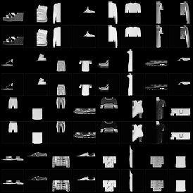
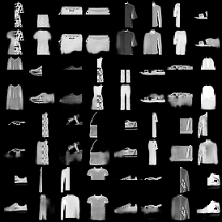
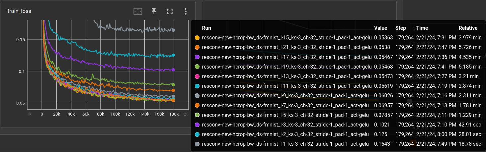

# Parameter tuning for a Residual Deep Image-to-Image CNN

This network design has the following features:
- simple and repetitive, makes programmer's life less troublesome
- supports any image size (above a certain threshold): put one image in, get the same size out
- supports the all-famous *deep*-ness, e.g. the training gradient does not vanish 
  after a lot of layers - and we all believe that many layers are good

Since this is a logbook, i might as well write down how the idea came along.
I was working like a mad person on a 
[new CLIPig implementation](../../src/clipig/), 
using OpenAI's [CLIP](https://github.com/openai/clip) network to massage
a mess of pixels into something matching a text prompt and looking good. 
There are much 
cooler things out there, my personal favorite being Stable Diffusion, 
but none of them can be put on my graphics card. So to wrap it short, 
i'm developing image generation tools that run on a, nowadays, average
graphics card with 6 GB of VRAM. For artistic reasons, i was interested
in some form of noise reduction to make the rendered images look more
pleasing and started with this simple design. 

While network trainings were running, i searched through  
[arxiv.org](https://arxiv.org) for image de-noising, quickly limiting 
results to before 2017, because i really don't understand all this
Diffusion stuff and its all high computational effort.

Found this paper: ["Generalized Deep Image to Image Regression"](https://arxiv.org/pdf/1612.03268.pdf)
which describes a *recursive branching* design 
and subsequently made a little [implementation](../../src/models/img2img/rbdn.py).
It works quite nice but is mostly too slow for my taste, also i don't like
the max-pooling layers for generative networks. After some playing around
with it i came back to the simpler CNNs but remembered a few of the
ideas and ways of thinking from the above and other papers.

Now that i have written most of the content below, i make a pause and
will read 
[Image Restoration Using Convolutional Auto-encoders with Symmetric Skip Connections](https://arxiv.org/abs/1606.08921) 
which seems to do the exact thing.

--

This simple CNN is composed of an encoder and a decoder, while the decoder is
the reverse of the encoder. The layout is (in pytorch style):

```
ResConv(
  (encoder): ModuleDict(
    (layer_1): ConvLayer(
      (bn): BatchNorm2d(1, eps=1e-05, momentum=0.1, affine=True, track_running_stats=True)
      (conv): Conv2d(1, 32, kernel_size=(3, 3), stride=(1, 1), padding=(1, 1))
      (act): GELU(approximate='none')
    )
    (layer_...): ConvLayer(
      (bn): BatchNorm2d(32, eps=1e-05, momentum=0.1, affine=True, track_running_stats=True)
      (conv): Conv2d(32, 32, kernel_size=(3, 3), stride=(1, 1), padding=(1, 1))
      (act): GELU(approximate='none')
    )
  )
  (decoder): ModuleDict(
    (layer_...): ConvLayer(
      (bn): BatchNorm2d(32, eps=1e-05, momentum=0.1, affine=True, track_running_stats=True)
      (conv): ConvTranspose2d(32, 32, kernel_size=(3, 3), stride=(1, 1), padding=(1, 1))
      (act): GELU(approximate='none')
    )
    (layer_15): ConvLayer(
      (bn): BatchNorm2d(32, eps=1e-05, momentum=0.1, affine=True, track_running_stats=True)
      (conv): ConvTranspose2d(32, 1, kernel_size=(3, 3), stride=(1, 1), padding=(1, 1))
      (act): Sigmoid()
    )
  )
)
```

In the forward pass each encoder layer stores it's result which is later 
added to the input of the inverse decoder layer. In the example above, result
of `layer_1` is added to the output of `layer_14` which is the input of `layer_15`.

I think this is basically a U-NET. In any case, we can add as much layers as we
want, while still being able to train the network. The residual connections 
will propagate the gradients through the whole thing, while demanding tasks
will utilize the deeper layers because they have a larger *receptive field*. 
For a little discussion of the receptive field, please check 
[Beyond a Gaussian Denoiser: Residual Learning of Deep CNN for Image Denoising (Zhang et al)](https://arxiv.org/abs/1608.03981).

All experiments, unless noted otherwise, 
- do 3 epochs (3 runs through the 60,000 training images)
- use `AdamW` optimizer 
  - with default deltas 0.9, 0.999
  - learn rate of 0.0003
- use `CosineAnnealingLR` scheduler (that decreases learn rate to zero using a 1/4 cosine curve over the full run)
- a mini batch size of 64
- use Mean Absolute Error (l1) between output and target image as the loss function 
  (The l2 or Mean Squared Error loss is much more common but i personally find the l1 numbers more readable)

To evaluate the abilities of the network, it's trained to
**restore the deleted top, bottom, left or right half of an image**. 
In this case, zalando's beloved
[Fashion-MNIST](https://arxiv.org/abs/1708.07747) dataset,
scaled to 32x32 pixels ([without interpolation](./2023-11-16-autoencoder-experiments.md#take-care-of-the-choice-of-interpolation)).

It's not completely ridiculous to expect the network to make up a complete half
since the images are all nicely centered and contain more or less the same
stuff (shirts, jackets, shoes, bags...).

Here are two examples (from the worst (first image) and the best network 
of the following experiment). Odd rows show the network input and even rows
the reconstruction from the network.

| worst | best |
|-------|------|
|  |  |

The first network only has one layer (one convolution and one de-convolution),
so it's receptive field is only 3x3 pixels (that of the one convolutional kernel).
It is therefore not able to generate the other half of the image.


## Compare number of layers

Comparing the performance of the number of layers.

experiment file: [experiments/denoise/resconv-test.yml @ 1a748720...](https://github.com/defgsus/nn-experiments/blob/1a74872040ad1062ee2a5f4a46f949b22aa8f08c/experiments/denoise/resconv-test.yml)



| layers |   ks |   ch |   stride |   pad | act   | validation loss | model params | train time (minutes) |
|-------:|-----:|-----:|---------:|------:|:------|----------------:|-------------:|---------------------:|
|     15 |    3 |   32 |        1 |     1 | gelu  |        0.054141 |      261,411 |                 4.17 |
|     19 |    3 |   32 |        1 |     1 | gelu  |        0.054439 |      335,907 |                 5.43 |
|     13 |    3 |   32 |        1 |     1 | gelu  |        0.054911 |      224,163 |                 3.39 |
|     21 |    3 |   32 |        1 |     1 | gelu  |        0.055190 |      373,155 |                 5.98 |
|     17 |    3 |   32 |        1 |     1 | gelu  |        0.055413 |      298,659 |                 4.74 |
|     11 |    3 |   32 |        1 |     1 | gelu  |        0.057229 |      186,915 |                 3.02 |
|      9 |    3 |   32 |        1 |     1 | gelu  |        0.061094 |      149,667 |                 2.43 |
|      7 |    3 |   32 |        1 |     1 | gelu  |        0.070167 |      112,419 |                 1.87 |
|      5 |    3 |   32 |        1 |     1 | gelu  |        0.079709 |       75,171 |                 1.30 |
|      3 |    3 |   32 |        1 |     1 | gelu  |        0.102242 |       37,923 |                 0.78 |
|      2 |    3 |   32 |        1 |     1 | gelu  |        0.124805 |       19,299 |                 0.52 |
|      1 |    3 |   32 |        1 |     1 | gelu  |        0.164834 |          675 |                 0.36 |

It's really nice to see such a distinguished parameter-performance scaling, once in a while. 
From 1 to 11 layers, performance increases steadily, then it get's a bit mixed-up. 
Most likely, 11 layers archive a receptive field that includes the whole input patch 
of 32x32. It's *kind of* proving that the deep layers are used despite the 
residual skip connections.

I'm not very patient in these regards, but i ran the same experiment on 
64x64 images. Note that the computation time is drastically increased. 
Because of the `padding` of 1, each layer processes a full 64x64 block on
32 channels. 

| layer | ks |   ch |   stride |   pad | act   | validation loss | model params |   train time (minutes) |
|------:|---:|-----:|---------:|------:|:------|----------------:|-------------:|-----------------------:|
|    21 |  3 |   32 |        1 |     1 | gelu  |       0.0610384 |      373,155 |                  25.13 |
|    30 |  3 |   32 |        1 |     1 | gelu  |       0.0646240 |      540,771 |                  35.27 |
|    17 |  3 |   32 |        1 |     1 | gelu  |       0.0652571 |      298,659 |                  19.57 |
|    19 |  3 |   32 |        1 |     1 | gelu  |       0.0661678 |      335,907 |                  19.95 |
|    15 |  3 |   32 |        1 |     1 | gelu  |       0.0694179 |      261,411 |                  17.27 |
|    13 |  3 |   32 |        1 |     1 | gelu  |       0.0728544 |      224,163 |                  22.02 |
|    11 |  3 |   32 |        1 |     1 | gelu  |       0.0752024 |      186,915 |                  18.75 |
|     9 |  3 |   32 |        1 |     1 | gelu  |       0.0809892 |      149,667 |                  15.87 |
|     7 |  3 |   32 |        1 |     1 | gelu  |       0.0889331 |      112,419 |                  11.31 |
|     5 |  3 |   32 |        1 |     1 | gelu  |       0.1045170 |       75,171 |                   7.49 |
|     3 |  3 |   32 |        1 |     1 | gelu  |       0.1328610 |       37,923 |                   3.79 |
|     1 |  3 |   32 |        1 |     1 | gelu  |       0.1641830 |          675 |                   0.47 |

The steady increase in precision per extra layer is a bit better than
with the 32x32 images, although it's not much.

**Note** that the 21-layer network has about the same validation loss as
the 9-layer network for 32x32 images. Another *provy* incidence that the
number of layers directly relates to the *receptive field size*. 
The 3x3 kernel CNN needs about 20 layers to see an area of about 40x40 pixels.

However, the 30 layer network does not improve performance. I'm currently unable
to explain that. It could be related to the
[residual weight factor](#compare-residual-weight-factor)
of **0.1** that i used up until the next experiment.

Anyway, it's actually quite interesting how a network with only a few hundred 
thousand parameters can be so slow. And memory hungry. And my laptop is
starting to burn through my lap. The 30 layer version runs with less than
a 100 inputs/sec, which is just terrible to bear (Not only because i'm 
inpatient but also because the task is purely academic and the input images 
are scaled from 28x28 to 64x64, so it's a waste of computation). Also
the batch size needed to be reduced for 21 and 30 layer network training
to make it fit in my available 6GB GPU RAM. 

For comparing the following parameters i will use the 11 layer network
on the original FMNIST resolution of 28x28 pixels:


## Compare residual weight factor

Should one scale the residual signal that comes from the encoder layers 
before adding it to the decoder layer input? It's denoted `RWF` in the 
following expression and experimental results.

    dec-layer input N = dec-layer output N-1 + RWF * enc-layer-output -N 

|   l |  RWF |   ks |   ch |   stride |   pad | act   | validation loss |  model params |   train time (minutes) |
|----:|-----:|-----:|-----:|---------:|------:|:------|----------------:|--------------:|-----------------------:|
|  11 | 1.00 |    3 |   32 |        1 |     1 | gelu  |       0.0537689 |       186,915 |                   2.38 |
|  11 | 0.50 |    3 |   32 |        1 |     1 | gelu  |       0.0539687 |       186,915 |                   2.33 |
|  11 | 2.00 |    3 |   32 |        1 |     1 | gelu  |       0.0557501 |       186,915 |                   2.38 |
|  11 | 0.05 |    3 |   32 |        1 |     1 | gelu  |       0.0560915 |       186,915 |                   2.26 |
|  11 | 0.10 |    3 |   32 |        1 |     1 | gelu  |       0.0568670 |       186,915 |                   2.29 |
|  11 | 0.01 |    3 |   32 |        1 |     1 | gelu  |       0.0595923 |       186,915 |                   2.13 |

It seems like: **no**, don't do it. Just keep it at **1.0**.


## Compare position of batch normalization?

In each layer, the batch norm was placed at the first position, more 
out of my intuition than actual knowledge.

    ConvLayer(
      (bn): BatchNorm2d(1, eps=1e-05, momentum=0.1, affine=True, track_running_stats=True)
      (conv): Conv2d(1, 32, kernel_size=(3, 3), stride=(1, 1), padding=(1, 1))
      (act): GELU(approximate='none')
    )

It could be placed as well after the convolution:

    ConvLayer(
      (conv): Conv2d(1, 32, kernel_size=(3, 3), stride=(1, 1), padding=(1, 1))
      (bn): BatchNorm2d(32, eps=1e-05, momentum=0.1, affine=True, track_running_stats=True)
      (act): GELU(approximate='none')
    )

or after the activation function

    ConvLayer(
      (conv): Conv2d(1, 32, kernel_size=(3, 3), stride=(1, 1), padding=(1, 1))
      (act): GELU(approximate='none')
      (bn): BatchNorm2d(32, eps=1e-05, momentum=0.1, affine=True, track_running_stats=True)
    )

The following table lists the results for the different 
batch-norm positions (`bnp`), separately for encoder (`bnp-e`) 
and decoder (`bnp-d`). 
- `0` is before convolution
- `1` is after convolution
- `2` is after the activation
- `-` means no batch normalization 

|   l |   ks |   ch |   stride |   pad | act   | bnp-e | bnp-d | validation loss | model params | train time (minutes) |
|----:|-----:|-----:|---------:|------:|:------|------:|------:|----------------:|-------------:|---------------------:|
|  11 |    3 |   32 |        1 |     1 | gelu  |     0 |     0 |       0.0509118 |      186,787 |                 2.07 |
|  11 |    3 |   32 |        1 |     1 | gelu  |     0 |     1 |       0.0509330 |      186,787 |                 2.22 |
|  11 |    3 |   32 |        1 |     1 | gelu  |     1 |     0 |       0.0523070 |      186,849 |                 2.31 |
|  11 |    3 |   32 |        1 |     1 | gelu  |     1 |     1 |       0.0524035 |      186,849 |                 2.32 |
|  11 |    3 |   32 |        1 |     1 | gelu  |     0 |     2 |       0.0533116 |      186,787 |                 2.25 |
|  11 |    3 |   32 |        1 |     1 | gelu  |     1 |     2 |       0.0537457 |      186,849 |                 2.32 |
|  11 |    3 |   32 |        1 |     1 | gelu  |     2 |     1 |       0.0544390 |      186,849 |                 2.33 |
|  11 |    3 |   32 |        1 |     1 | gelu  |     - |     0 |       0.0547576 |      186,209 |                 2.22 |
|  11 |    3 |   32 |        1 |     1 | gelu  |     2 |     2 |       0.0548645 |      186,849 |                 2.33 |
|  11 |    3 |   32 |        1 |     1 | gelu  |     - |     1 |       0.0550985 |      186,209 |                 2.21 |
|  11 |    3 |   32 |        1 |     1 | gelu  |     2 |     0 |       0.0552446 |      186,849 |                 2.33 |
|  11 |    3 |   32 |        1 |     1 | gelu  |     0 |     - |       0.0559730 |      186,147 |                 2.17 |
|  11 |    3 |   32 |        1 |     1 | gelu  |     1 |     - |       0.0576676 |      186,209 |                 2.22 |
|  11 |    3 |   32 |        1 |     1 | gelu  |     2 |     - |       0.0577886 |      186,209 |                 2.22 |
|  11 |    3 |   32 |        1 |     1 | gelu  |     - |     2 |       0.0587750 |      186,209 |                 2.21 |
|  11 |    3 |   32 |        1 |     1 | gelu  |     - |     - |       0.1163260 |      185,569 |                 2.10 |

**Note** that the best validation loss is actually better than in previous 
runs. After some tests, not shown here, the batch normalization 
was **removed from the final encoder and decoder layers**.

## Compare activation function

Let's take all the good parts from before and compare the standard 
activation functions [available in pytorch](https://pytorch.org/docs/stable/nn.html#non-linear-activations-weighted-sum-nonlinearity).
However, the final decoder layer is always using the `Sigmoid` activation
because everybody knows it's a good activation for generating images 
(everything is scaled to [0, 1] range).

|   l |   ks |   ch |   stride |   pad | act         | validation loss | model params | train time (minutes) |
|----:|-----:|-----:|---------:|------:|:------------|----------------:|-------------:|---------------------:|
|  11 |    3 |   32 |        1 |     1 | Mish        |       0.0512072 |      186,787 |                 2.52 |
|  11 |    3 |   32 |        1 |     1 | GELU        |       0.0512259 |      186,787 |                 2.29 |
|  11 |    3 |   32 |        1 |     1 | SiLU        |       0.0514479 |      186,787 |                 2.46 |
|  11 |    3 |   32 |        1 |     1 | Hardswish   |       0.0515750 |      186,787 |                 2.42 |
|  11 |    3 |   32 |        1 |     1 | LeakyReLU   |       0.0522968 |      186,787 |                 2.36 |
|  11 |    3 |   32 |        1 |     1 | ReLU6       |       0.0524871 |      186,787 |                 2.42 |
|  11 |    3 |   32 |        1 |     1 | ReLU        |       0.0530411 |      186,787 |                 2.42 |
|  11 |    3 |   32 |        1 |     1 | PReLU       |       0.0533523 |      186,807 |                 2.59 |
|  11 |    3 |   32 |        1 |     1 | Softplus    |       0.0544980 |      186,787 |                 2.42 |
|  11 |    3 |   32 |        1 |     1 | LogSigmoid  |       0.0547575 |      186,787 |                 2.54 |
|  11 |    3 |   32 |        1 |     1 | CELU        |       0.0551080 |      186,787 |                 2.10 |
|  11 |    3 |   32 |        1 |     1 | Tanh        |       0.0562118 |      186,787 |                 2.36 |
|  11 |    3 |   32 |        1 |     1 | RReLU       |       0.0566449 |      186,787 |                 2.45 |
|  11 |    3 |   32 |        1 |     1 | Hardtanh    |       0.0570635 |      186,787 |                 2.47 |
|  11 |    3 |   32 |        1 |     1 | Softsign    |       0.0571498 |      186,787 |                 2.95 |
|  11 |    3 |   32 |        1 |     1 | SELU        |       0.0601167 |      186,787 |                 2.47 |
|  11 |    3 |   32 |        1 |     1 | Sigmoid     |       0.0610033 |      186,787 |                 2.44 |
|  11 |    3 |   32 |        1 |     1 | Hardsigmoid |       0.0647689 |      186,787 |                 2.43 |
|  11 |    3 |   32 |        1 |     1 | Softshrink  |       0.0805768 |      186,787 |                 2.34 |
|  11 |    3 |   32 |        1 |     1 | Hardshrink  |       0.0974769 |      186,787 |                 2.24 |
|  11 |    3 |   32 |        1 |     1 | Tanhshrink  |       0.1122510 |      186,787 |                 2.60 |

Sometimes i wonder why there are so many activation functions when most
of the time, the same ones perform best. Anyway, this result is slightly
different to my [MNIST classification results](./2023-11-12-mnist.md#varying-activation-function)
but as usual, you are good to choose either 
[GELU](https://pytorch.org/docs/stable/generated/torch.nn.GELU.html), 
one of the [ReLU](https://pytorch.org/docs/stable/generated/torch.nn.ReLU.html)
variants or, as it turns out, the 
[MISH](https://pytorch.org/docs/stable/generated/torch.nn.Mish.html#torch.nn.Mish)
activation.


## Compare channel size

Currently all *hidden* convolutions have had 32 channels. In this experiment,
i will test 16, 32, 64 and 128 channels, but also vary the channel size
along the 11 layers.

For example `ch1 = 16` and `ch2 = 128` means, the encoder uses 16 
channels for the first layer and linearly increases the number to 
128 for the final layer. The decoder always has the reverse channel count, 
to make the skip connections fit.

|   l |   ks |   ch1 |   ch2 |   stride |   pad | act   | validation loss |    model params | train time (minutes) |
|----:|-----:|------:|------:|---------:|------:|:------|----------------:|----------------:|---------------------:|
|  11 |    3 |   128 |   128 |        1 |     1 | gelu  |       0.0443586 |       2,958,979 |                10.66 |
|  11 |    3 |   128 |    64 |        1 |     1 | gelu  |       0.0443985 |       1,712,091 |                 8.83 |
|  11 |    3 |   128 |    32 |        1 |     1 | gelu  |       0.0448816 |       1,280,341 |                 7.01 |
|  11 |    3 |   128 |    16 |        1 |     1 | gelu  |       0.0449165 |       1,109,285 |                 6.30 |
|  11 |    3 |    64 |   128 |        1 |     1 | gelu  |       0.0450236 |       1,710,773 |                 8.64 |
|  11 |    3 |    64 |    64 |        1 |     1 | gelu  |       0.0459730 |         742,211 |                 4.15 |
|  11 |    3 |    32 |   128 |        1 |     1 | gelu  |       0.0469918 |       1,278,363 |                 7.08 |
|  11 |    3 |    16 |   128 |        1 |     1 | gelu  |       0.0483264 |       1,106,979 |                 6.40 |
|  11 |    3 |    64 |    32 |        1 |     1 | gelu  |       0.0485725 |         426,357 |                 3.48 |
|  11 |    3 |    64 |    16 |        1 |     1 | gelu  |       0.0487565 |         319,347 |                 3.03 |
|  11 |    3 |    32 |    64 |        1 |     1 | gelu  |       0.0488293 |         425,699 |                 3.62 |
|  11 |    3 |    32 |    32 |        1 |     1 | gelu  |       0.0512699 |         186,787 |                 2.48 |
|  11 |    3 |    16 |    64 |        1 |     1 | gelu  |       0.0515703 |         318,357 |                 3.03 |
|  11 |    3 |    32 |    16 |        1 |     1 | gelu  |       0.0539735 |         105,925 |                 2.06 |
|  11 |    3 |    16 |    32 |        1 |     1 | gelu  |       0.0546895 |         105,595 |                 1.88 |
|  11 |    3 |    16 |    16 |        1 |     1 | gelu  |       0.0587657 |          47,315 |                 1.39 |

What can be learned from it?
- more channels (at least up until 64) improve performance (without considering the computational cost).
- increased channel count is more important for the first shallow layers than the later deep layers
- the difference in archived training loss between 64 and 128 channels is at the 4th digit after the comma, 
  so not really worth considering given the extra amount of required compute.

## Compare kernel size

Out of old-fashionedness only odd kernel sizes are considered. For a fair comparison, the padding is 
adjusted to the individual kernel sizes such that each layer still processes the same spatial block (28x28).

|   l |   ks |   ch |   stride |   pad | act   | validation loss | model params | train time (minutes) |
|----:|-----:|-----:|---------:|------:|:------|----------------:|-------------:|---------------------:|
|  11 |    5 |   32 |        1 |     2 | gelu  |       0.0466142 |      515,491 |                 2.10 |
|  11 |    7 |   32 |        1 |     3 | gelu  |       0.0468494 |    1,008,547 |                 5.12 |
|  11 |    9 |   32 |        1 |     4 | gelu  |       0.0486901 |    1,665,955 |                 7.29 |
|  11 |   11 |   32 |        1 |     5 | gelu  |       0.0501364 |    2,487,715 |                 9.44 |
|  11 |    3 |   32 |        1 |     1 | gelu  |       0.0513643 |      186,787 |                 2.16 |

Wow, there is a significant perfomance jump from 3 to 5, **and** the 5x5 kernel seems to run equally or
even faster on my hardware/lib/driver setup. It is very likely, though, that the performance of the 
kernel size must be re-evaluated for each particular task.

Similar to the channel size abve , the kernel size is varied layer-wise in the following experiment.
The top performing network with `ks1=3` and `ks2=9`, for example, has the following kernel sizes:

    [3, 3, 5, 5, 5, 7, 7, 7, 7, 9, 9]

|   l |   ks1 |   ks2 |   ch |   stride | act   | validation loss |  model params | train time (minutes) |
|----:|------:|------:|-----:|---------:|:------|----------------:|--------------:|---------------------:|
|  11 |     3 |     9 |   32 |        1 | gelu  |       0.0434004 |       907,683 |                 4.37 |
|  11 |     3 |    11 |   32 |        1 | gelu  |       0.0435886 |     1,251,747 |                 5.57 |
|  11 |     3 |     7 |   32 |        1 | gelu  |       0.0449416 |       596,387 |                 3.02 |
|  11 |     5 |     9 |   32 |        1 | gelu  |       0.0454906 |     1,105,315 |                 5.33 |
|  11 |     5 |     7 |   32 |        1 | gelu  |       0.0461697 |       810,403 |                 4.09 |
|  11 |     3 |     5 |   32 |        1 | gelu  |       0.0462298 |       383,395 |                 2.15 |
|  11 |     5 |    11 |   32 |        1 | gelu  |       0.0462772 |     1,514,915 |                 6.67 |
|  11 |     5 |     5 |   32 |        1 | gelu  |       0.0467664 |       515,491 |                 2.19 |
|  11 |     7 |     7 |   32 |        1 | gelu  |       0.0469873 |     1,008,547 |                 5.43 |
|  11 |     7 |     9 |   32 |        1 | gelu  |       0.0474498 |     1,401,763 |                 6.58 |
|  11 |     7 |     5 |   32 |        1 | gelu  |       0.0478909 |       762,787 |                 3.79 |
|  11 |     7 |    11 |   32 |        1 | gelu  |       0.0482104 |     1,778,595 |                 7.66 |
|  11 |     7 |     3 |   32 |        1 | gelu  |       0.0482650 |       517,027 |                 2.97 |
|  11 |     9 |     9 |   32 |        1 | gelu  |       0.0483184 |     1,665,955 |                 7.72 |
|  11 |     9 |     3 |   32 |        1 | gelu  |       0.0486722 |       764,835 |                 4.13 |
|  11 |     5 |     3 |   32 |        1 | gelu  |       0.0486834 |       351,651 |                 2.35 |
|  11 |     9 |     5 |   32 |        1 | gelu  |       0.0487206 |       994,211 |                 4.92 |
|  11 |     9 |     7 |   32 |        1 | gelu  |       0.0488068 |     1,338,275 |                 6.61 |
|  11 |     9 |    11 |   32 |        1 | gelu  |       0.0488103 |     2,157,475 |                 8.94 |
|  11 |    11 |    11 |   32 |        1 | gelu  |       0.0495152 |     2,487,715 |                 9.59 |
|  11 |    11 |     7 |   32 |        1 | gelu  |       0.0497081 |     1,635,747 |                 7.20 |
|  11 |    11 |     5 |   32 |        1 | gelu  |       0.0499655 |     1,324,451 |                 6.13 |
|  11 |    11 |     3 |   32 |        1 | gelu  |       0.0499719 |     1,029,539 |                 5.21 |
|  11 |    11 |     9 |   32 |        1 | gelu  |       0.0500542 |     2,078,115 |                 8.58 |
|  11 |     3 |     3 |   32 |        1 | gelu  |       0.0512497 |       186,787 |                 2.11 |

Wow, our little 3x3 kernel friend, that was used all the time, has the worst
performance again. Also the 5x5 from the above experiment is surpassed.
Generally, one can see: Small kernel size in shallow layers and larger kernel
size in deeper layers is a good thing.


TODO: 
  - compare 
    - conv groups

