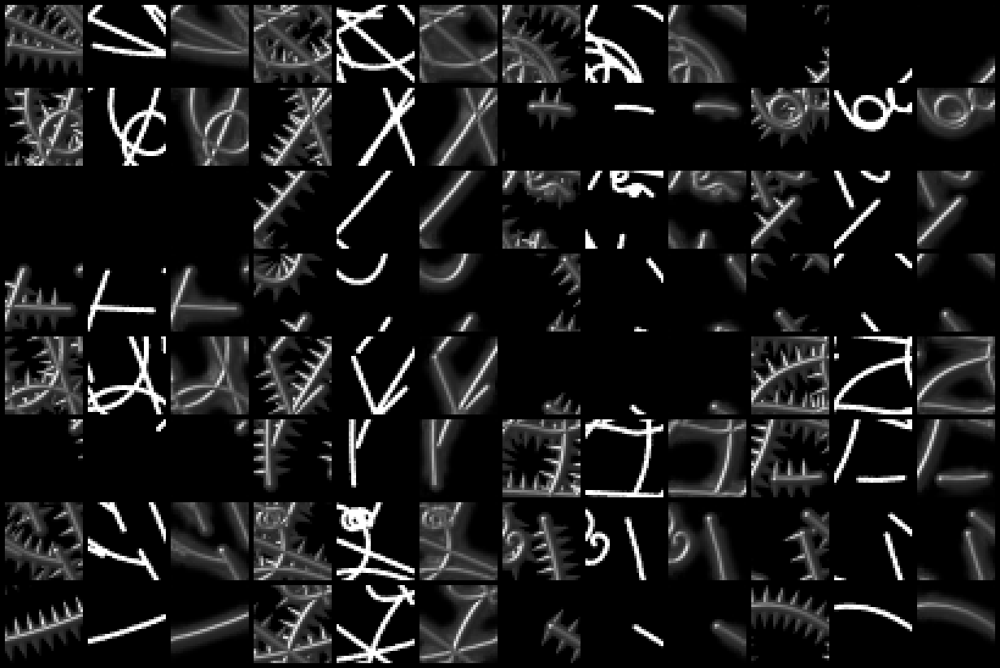

# "Shiny Tubes": increasing render quality with a UNet

I'm often thinking about creating a synthetic dataset with source and target images, 
while the source images are easy to render 
(for example some plain OpenGL without much shading, ambient lighting, aso..)
and the target images contain all the expensive hard-to-render details.
Then one can train a neural network to add those details to the plain images.

Here's a little experiment along those lines. Left is one source image and right is the target.

The task for the network is to render a shiny round tube from any stroke. The dataset was made
with the good old [POV-Ray](https://www.povray.org/) raytracer. To be precise, i created 12 different 1024x1024 
source & target image pairs and randomly cropped 32x32 blocks during training for one million steps. 
2000 crops of a different source/target image pair were used for validation. 
The images vary a bit in amount and curliness of the strokes.  

I trained a 5 layer, 32 channel convolutional UNet as described in [residual convolution](2024-02-24-residual-convolution.md)
and it turns out this particular task is quite easy. The l1 validation error went down to 0.0077. 
Here are a few samples from the validation set after training (zoomed-in for better seeing the details):

(first column: target, second column: source, third column: network output)

And now, one can take this network and apply it to anything that resembles strokes, like text:

or drawings:

Of course, this is more or less just a nice little convolutional kernel which is not too impressive.
So i tried to task the network to additionally add some spikes to the tubes. For example:

The source images are the same while the target images additonally have those spikes attached. 
Unfortunately, no network i tried could produce the spikes. When looking at the validation
samples after training it becomes kind of clear:

Along the source strokes, there is absolutely no hint when a spike should appear and when there should
be a gap in-between. I tried various enhancements to UNet, also a small transformer network but 
eventually all models just produced this blurry halo and nothing more. 

In the next experiment, there are some small thickenings in the source images where the target images 
contain the strokes:

The strokes are consecutive cylinders, while the thickenings are spheres with a 1.4x radius.
As can be seen from the validation samples after training, this helps the network to create the spikes
in almost all cases:

Applying this to the letters, it creates some spikes by chance but not much:

Adding some noise does not help much, either:

So i decreased the radius of the spheres in the source strokes to almost unnoticeable 1.2 times
the cylinder radius. The validation samples still look pretty good, although no human eye
can make out the thickenings any more:

Using the right stroke width for the font, it starts to look interesting:

