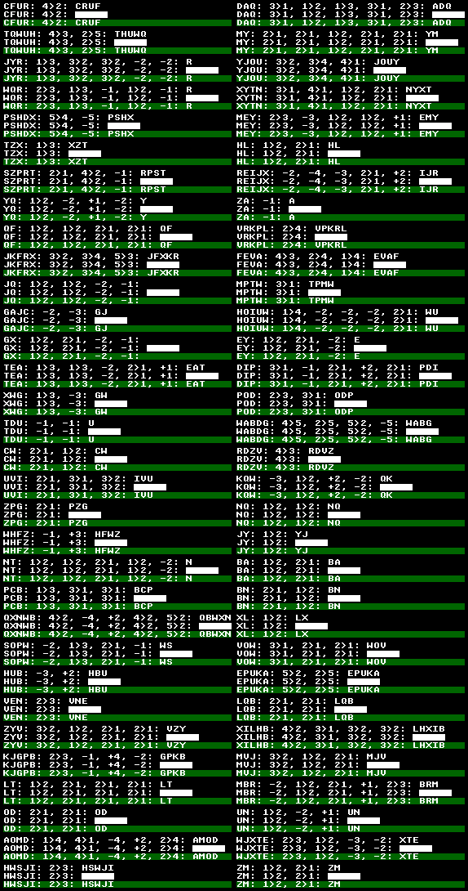
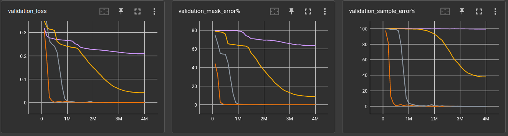
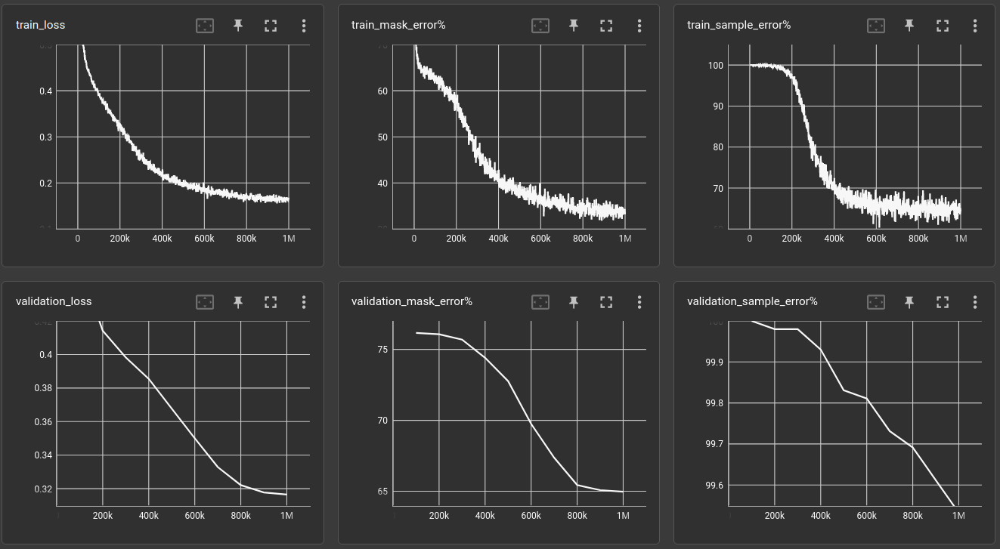
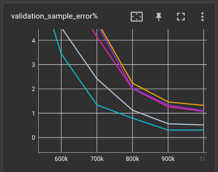

# Solving the "Very Selective Copying" problem with a Very Small Language Model

This is a very numeric continuation of a previous experiment.
To get a grip on the details, please check ["Selective Copying"](2024-12-14-selcopy.md) first.

Basically, it's a synthetic question-answer dataset that requires some *"computational"* skill.
See, if you can find out the rule by yourself:

```
NA: 2>1: AN   
DQ: -1: Q    
EJWHB: 3>5: EJBHW
ULHP: 3>4, 2>1: LUPH 
YNP: 3>1, -3, 2>1: NP   
EJACQ: 1>2, -1, +3: EAJCQ
YESBR: 3>5, 5>1, 1>5, 3>4: YEBRS
UXMP: -2, -3, 1>2, +2: MPU  
```

**Spoiler**: First few letters are the program input, the numbers and operators are the program 
and answer, after the second colon, is the result of the program. 
- `x>y` means: exchange `x`th item with `y`th item. 
- `-x` means: remove `x`th item from memory and put it onto the stack. 
- `+x` means: pop last item from stack and insert at position `x`

I argue, that this dataset
- requires a large enough *receptive field*
- requires some cognitional ability to build up a history and to use it subsequently. 
- should actually be called *Selective Swapping* 


### Preliminary tests

Just to get a feeling for the dataset, i took the best model from the 
["Selective Copying"](2024-12-14-selcopy.md) experiment with a few parameter variations 
and ran it on questions that have an input length of 2 to 5 items and 1 to 5 operations:


Training now takes 4 million steps, and could even be a bit longer. But generally, the loss curves
seem to converge at about there. 

|   nitem | len   | nops   |   l |   ch |   ks | dil                                 |  validation loss |   validation_mask_error% | model params | train time (minutes) |  throughput |
|--------:|:------|:-------|----:|-----:|-----:|:------------------------------------|-----------------:|-------------------------:|-------------:|---------------------:|------------:|
|      26 | 2,5   | 1,5    |   6 |   64 |    9 | 1,2,3,4,5,1                         |        0.0525558 |                  17.5876 |      237,952 |                15.30 |     4,358/s |
|      26 | 2,5   | 1,5    |   6 |  128 |    9 | 1,2,3,4,5,1                         |        0.0365154 |                  11.8352 |      918,272 |                10.76 |     6,195/s |
|      26 | 2,5   | 1,5    |  12 |   64 |    9 | 1,1,2,2,3,3,4,4,5,5,1,1             |        0.0076271 |                   2.0063 |      459,520 |                27.05 |     2,464/s |
|      26 | 2,5   | 1,5    |  18 |   64 |    9 | 1,1,1,2,2,2,3,3,3,4,4,4,5,5,5,1,1,1 |        0.0028902 |                   0.7583 |      681,088 |                39.80 |     1,675/s |
|      26 | 2,5   | 1,5    |  12 |  128 |    9 | 1,1,2,2,3,3,4,4,5,5,1,1             |        0.0028549 |                   0.7205 |    1,803,776 |                18.81 |     3,543/s |

I'm using dilation all the time, because 1.) it's required for the receptive field of the 
6-layer network and 2.) because it runs faster. For the 12 and 18-layer networks i just expanded the
dilation settings without much thinking about it. (Actually i did think quite a bit
about it but decided to evaluate good 12 or 18-layer dilation settings another time)

Here are examples from the validation set from the worst and the best performing network:

#### 6-layer/32-chan: validation mask error 17.6%


It is noticeable that long programs seem to be the problem for this network.

#### 12-layer/128-chan: validation mask error 0.7%



Wow! Everything correct, even the long ones!

### Number of operations versus number of layers

The above example is a bit messy because it has a variable number of operations and 
we don't know how many answers are fully correct, only how many characters.
So first, we add a new evaluation metric `validation_sample_error%`. While the mask error gives
the percentage of wrong characters within the mask area, the sample error gives the percentage
of wrong answers, even if only one character is wrong.

Further, to better evaluate the relationship between number of operations (length of the "program") 
and the number of layers in the network, i set a fixed number of operations.

I also dropped the stack operations (`+`/`-`) for now and made it all a bit tighter because 
i'm not interested in the influence of the receptive field in this experiment.
Example data with 5 operations looks like this:

    NPFKT:5>4 3>1 1>4 4>2 1>3:NFTPK
    UKLRM:5>1 4>2 1>4 2>4 3>2:KLMRU
    LCEWI:3>5 3>2 4>2 3>1 3>5:CWEIL
    LRUPX:1>4 3>2 5>4 1>3 2>1:URPXL
    UQJOR:5>4 2>5 5>4 4>3 2>5:URQJO
    BYGMJ:5>4 4>3 2>3 5>2 5>3:BMJGY
    PBNFM:3>5 5>1 1>3 2>3 5>3:MNPFB
    TNEOL:1>3 4>1 4>1 4>3 5>3:ENLTO
    ALEVT:1>2 2>1 2>1 4>2 4>3:LVAET
    UIZNQ:3>4 2>3 5>3 4>1 1>5:INQUZ

Running the networks on 2, 3, 4 and 5 operations per question:

#### 6-layer


#### 12-layer



#### 18-layer


And here is it all together in a table. The dilation settings are left out for readability.
They are `1,2,3,4,5,1` for the 6-layer, `1,2,3,4,5,1,2,3,4,5,1,1` for the 12-layer
and `1,2,3,4,5,1,2,3,4,5,1,2,3,4,5,1,1,1` for the 18-layer network.

|   nitem |   len |  nops |   l |   ch |   ks |   validation loss |   validation_mask_error% |   validation_sample_error% |   model params | train time (minutes) |  throughput |
|--------:|------:|------:|----:|-----:|-----:|------------------:|-------------------------:|---------------------------:|---------------:|---------------------:|------------:|
|      26 |     5 | **5** |   6 |   64 |    9 |           0.23663 |               71.9705    |                  99.9104   |        237,952 |                58.04 |     1,145/s |
|      26 |     5 | **5** |  12 |   64 |    9 |          0.208893 |               63.6883    |                  99.4327   |        459,520 |                 40.0 |     1,660/s |
|      26 |     5 | **5** |  18 |   64 |    9 |          0.163338 |               50.2667    |                  98.547    |        681,088 |                 99.0 |       670/s |
|      26 |     5 |     4 |   6 |   64 |    9 |          0.185987 |               48.7739    |                  98.5967   |        237,952 |                 15.1 |     4,413/s |
|      26 |     5 |     4 |  12 |   64 |    9 |         0.0415355 |                8.8953    |                  37.8682   |        459,520 |                26.03 |     2,561/s |
|      26 |     5 |     3 |   6 |   64 |    9 |        0.00458625 |                0.559315  |                   2.75677  |        237,952 |                 7.32 |     9,109/s |
|      26 |     5 |     4 |  18 |   64 |    9 |       0.000329348 |                0.0378185 |                   0.189092 |        681,088 |                37.13 |     1,795/s |
|      26 |     5 |     3 |  18 |   64 |    9 |       1.86865e-06 |                0         |                   0        |        681,088 |                 5.07 |    13,139/s |
|      26 |     5 |     3 |  12 |   64 |    9 |        3.1804e-06 |                0         |                   0        |        459,520 |                 11.5 |     5,796/s |
|      26 |     5 |     2 |  18 |   64 |    9 |       4.39884e-07 |                0         |                   0        |        681,088 |                 15.3 |     4,357/s |
|      26 |     5 |     2 |   6 |   64 |    9 |        5.3105e-07 |                0         |                   0        |        237,952 |                 7.15 |     9,319/s |
|      26 |     5 |     2 |  12 |   64 |    9 |        1.0319e-06 |                0         |                   0        |        459,520 |                 11.3 |     5,900/s |

Something is obviously very strange. None of the networks can handle 5 operations. 
But some of them just did in the last experiment??

What i really like about this neural net research is that one often gets along with intuition 
only. We simply don't know enough until all tests are made, which probably never happens. 
However, in this case, i would argue that a 5 operations sequence is
just too long for the network to learn the task in reasonable time. Put yourself into 
the eyes of the model. The training algorithm constantly tells you:

> If you see this: `PHMTW:5>3 2>3 5>4 5>3 1>3:?????`
> you should output that: `PHMTW:5>3 2>3 5>4 5>3 1>3:TWPMH`

on and on ... for millions of examples. Now, for a human, maybe a programmer even, this should
be solvable pretty quick. Once you have seen 10 examples, you can be sure what the
algorithm is. But for a neural network trained with *stochastic gradient descend* it is basically
a *brute-force* approach. It's like: Hey network, you gotta lot of parameters, that's fine,
now if you see this X, and you should output that Y, there is a chance that inreasing this one 
parameter while decreasing that other one would help you to output the correct answer, the 
next time you see the same question. And on and on...

Once again, reasoning from intuition, the network can probably learn the task much easier when it has
some easier examples in the dataset. Schools and such also don't teach children algebra by 
starting with: *What is the answer to 7 + 4 + 9 + 2 + 6 = ??*

Following, the training set contains questions with 2 to 5 operations, e.g.:

    HGOKX:3>1 5>4:OGHXK
    CXZMN:5>4 2>5:CMZNX
    RMYTC:2>1 4>5 4>2:MCYRT
    DNAHL:1>3 3>4 1>2 4>1 3>2:DHANL
    HSBQA:4>5 4>5:HSBQA
    DTFKS:4>5 3>2 4>5 5>1:SFTKD
    UXGJN:4>2 1>2 1>4 3>1 3>2:GXUJN

and the validation set still holds the same 5-operations-only questions for which all networks have
failed previously.

Here's the loss and error curves of the 18-layer network trained with 5 and 2-5 operations:


The bright one is the brighter one. Indeed, the 18-layer gets down to 2.5% sample error. It is
able to solve the task (to a degree), it could just not learn it from the previous dataset. One could argue,
though, that it would eventually learn the task just from the 5-operations examples but it would
probably take 10 to 100 times more computation / CO2-emissions / floodings / draughts / you-name-it.

|   nitem |   len | nops   | val-nops |   l |   ch |   ks |   validation loss |   validation_mask_error% |   validation_sample_error% | model params   |   train time (minutes) | throughput   |
|--------:|------:|:-------|---------:|----:|-----:|-----:|------------------:|-------------------------:|---------------------------:|:---------------|-----------------------:|:-------------|
|      26 |     5 | 2,5    |        5 |   6 |   64 |    9 |          0.208661 |                60.0816   |                    99.5123 | 237,952        |                  16.55 | 4,027/s      |
|      26 |     5 | 2,5    |        5 |  12 |   64 |    9 |         0.0322987 |                 6.74761  |                    27.3885 | 459,520        |                  27.59 | 2,416/s      |
|      26 |     5 | 2,5    |        5 |  18 |   64 |    9 |        0.00329394 |                 0.565287 |                     2.5577 | 681,088        |                  41.25 | 1,615/s      |

We can see from the table, that the 12 and especially the 6-layer networks are struggling. 
Looking at the plots of the 6-layer networks trained with 5 and 2-5 operations, we can 
see that the mask error decreases by a good amount but actual sample error stays roughly
the same. It learned to put some letters at the right place but still fails
for almost every validation sample:


- Quick takeaway: **Put also some easy examples in the training set!**

The curves suggest, however, that training has not yet converged. 
There are sure a few more per-mille to squeeze out.

This is a good point of origin for further experimentation. 
Can we get the 6-layer network to solve the *5-operations Very Selective Copying* problem,
- without adding so many modules that it actually resembles a 12-layer network
- without making it slower to execute than the 12-layer network
- ***bonus***: by keeping the number of model parameters equal or even lower

In other words, is there a trick, maybe to pass data around in a different way, 
that strongly increases the computational performance?

### Quick comparison with Mamba and LSTM

Just for another set of baselines, i tried the [state-spaces/Mamba](https://github.com/state-spaces/mamba)
(yet the [slow version](https://github.com/johnma2006/mamba-minimal) because the fast doesn't run on my system)
and the all-beloved LSTM (the [pytorch implementation](https://pytorch.org/docs/stable/generated/torch.nn.LSTM.html)). 


The yellow/brownish is the 6-layers model from above, green is Mamba and blue the LSTM. 
All of them have 6 layers

| nitem |   len | nops   | val-nops |   l | model                           |  validation loss | validation_mask_error% |  validation_sample_error% |  model params |   train time (minutes) | throughput |
|------:|------:|:-------|---------:|----:|:--------------------------------|-----------------:|-----------------------:|--------------------------:|--------------:|-----------------------:|-----------:|
|    26 |     5 | 2,5    |        5 |   6 | LSTM hidden_size=64             |         0.264829 |                79.9602 |                       100 |       216,064 |                   6.72 |    9,926/s |
|    26 |     5 | 2,5    |        5 |   6 | Conv1d channels=64 (from above) |         0.208661 |                60.0816 |                   99.5123 |       237,952 |                  16.55 |    4,027/s |
|    26 |     5 | 2,5    |        5 |   6 | MAMBA d_model=32 d_state=16     |         0.199433 |                55.8081 |                   99.1839 |        67,936 |                 126.56 |      526/s |

- None of these especially-crafted models reached a significant performance gain. 
- To be fair: The Mamba model is *very* small compared to the Conv1d, just 28% of parameters. 
  Though it manages to consume 7.8x more computation time. The first tiny drop in sample error 
  occurred after 1 hour of training and i do not have the patience today to train an 
  equally-sized Mamba for comparison. (The dynamics of the curves suggest, that it would not change much)
- The LSTM basically archived nothing (though equal-sized). It's about as bad as the 6-layer 
  Conv1d with only 5-operations questions in the training set. At least, it's blazinlgy fast!
- Disclaimer: I do not know any good practices about using or training LSTMs or Mambas and
  surely made some grave mistake..

Back to the residual CNN. To find some interesting method, quick,
i switched to 3 operations and 3-layer networks. The above condition holds as well. The 3-layer
network is not able to solve the 3-operations task in the validation set, but it only takes about
2 minutes to find out:



The validation sample error stays roughly at 100%.

I tried a couple of things, like adding cross-residual connections, e.g. from layer 1 to layer 3,
which did not noticeably improve performance. Also tried *learnable* weights, so that each layer
can use as input a weighted mix of all previous layers. Was not much help either, also not for the 
6-layer networks.


### Attention, please!

**UPDATE**: After revision of the used experiment files, i just painfully realized that 
some of the below findings are wrong.
In short, i forgot to put the **QKV** and the **attention activation** variables to the network
constructor and as such, the tables comparing these values show something completely different. 
There is obviously so much deviation between similar runs, that the results fooled me to make
conclusions about best parameters, although there was nothing to compare...

I'm leaving the manuscript below as it is, as a reminder how stupid the 
search for explanations was, without a scientific basis. 
However, the corrections are linked at the appropriate places.

---

Eventually i remembered that, in an age-old lecture by Geoff Hinton, he argued that for this 
particular case he showed, the network can not succeed without a cell-wise multiplication somewhere. 
Then there is this relatively recent Schlag, Irie & Schmidhuber paper 
([2102.11174](https://arxiv.org/abs/2102.11174))
"Linear Transformers Are Secretly Fast Weight Programmers", which states:
*Fast Weight Programmers (FWPs, 1991) program their fast weight memories through sequences of
outer products between self-invented key and value patterns.* I just like the *self-invented* notion.

To make it short, i plugged a `torch.nn.MultiheadAttention` module into the last layer, such that
the 1d-convolution, which normally outputs 64 channels, now outputs 128 channels, which are split
into 64 *query* and 64 *key* channels and the attention-*values* are the input of the layer. 
The pseudo-code looks like:

```python
qk = Conv1d(64, 128)(inp)
q, k = split(qk, 64)
outp = attention(q=q, k=k, v=inp)
```
Not shown is, that q, k and v (which are each of shape `[B, C, L]`) are transposed before the 
attention to move the channels (`C`) to the last dimension (`[B, L, C]`), and make it a 
channel-wise attention.

The pytorch `MultiheadAttention` has a predefined fixed length, because it adds bias and
a couple of other learnable parameters, so it has to be used channel-wise, since we don't
want to fix the sequence length that the network processes.

But wait, the *Fast Weight Programmers*-paper, said *self-invented **keys and values*** not
self-invented keys and queries. So, for completeness, let's test all the combinations

#### *self-invented* keys and values

```python
kv = Conv1d(64, 128)(inp)
k, v = split(kv, 64)
outp = attention(q=inp, k=k, v=v)
```
#### *self-invented* queries and values

```python
qv = Conv1d(64, 128)(inp)
q, v = split(qv, 64)
outp = attention(q=q, k=inp, v=v)
```

#### *self-invented* queries, keys and values

```python
qkv = Conv1d(64, 192)(inp)
q, k, v = split(qkv, 64)
outp = attention(q=q, k=k, v=v)
```

Unfortunately, the validation sample error varies quite a lot for each run of the same network:



So i'm doing 5 runs each and report the average. That's 80 runs for this messy plot and the table below!


Each run has the **same validation set** but different training sets and initial network weights.
(reproduce with [convtext-qa-program-3ops-attn-invent.yml @ 613064ad](https://github.com/defgsus/nn-experiments/blob/613064ad85c1baf0032febe159db800537728440/experiments/textmask/qa-program/convtext-qa-program-3ops-attn-invent.yml))

**UPDATE: Please check the [correction](2024-12-21-selcopy2-corrections.md#compare-attention-invention)!**

| qkv | attn     | validation loss | validation_mask_error% | validation_sample_error% | validation_sample_error% (std) |   model params |   train time (minutes) | throughput |
|:----|:---------|----------------:|-----------------------:|-------------------------:|-------------------------------:|---------------:|-----------------------:|-----------:|
|     | 0,0,0    |        0.316488 |                64.9682 |                  99.5322 |                                |        176,320 |                   2.24 |    7,434/s |
| QK  | 0,0,1    |        0.323012 |                63.3965 |                  99.4765 |                         0.8504 |        246,272 |                   1.77 |    9,437/s |
| QKV | 0,0,1    |        0.287839 |                56.5426 |                  93.1568 |                        14.4636 |        246,272 |                   1.86 |    8,950/s |
| KV  | 0,0,1    |        0.219660 |                41.3674 |                  86.0450 |                        16.6931 |        246,272 |                   1.88 |    8,884/s |
| QV  | 0,0,1    |        0.197362 |                38.2166 |                  75.5036 |                        29.8328 |        246,272 |                    2.1 |    7,963/s |
| QV  | 0,0,4    |        0.151719 |                29.0418 |                  61.0768 |                        47.2315 |        246,272 |                   1.93 |    8,661/s |
| QK  | 0,0,4    |        0.048829 |                 8.2794 |                  32.6791 |                        32.2507 |        246,272 |                   1.93 |    8,653/s |
| QKV | 0,0,4    |        0.051348 |                 8.4331 |                  31.2838 |                        42.0001 |        246,272 |                   1.88 |    8,863/s |
| KV  | 0,0,4    |        0.048607 |                 8.0497 |                  30.4976 |                        36.3580 |        246,272 |                   1.87 |    8,905/s |
| QK  | 0,0,8    |        0.050850 |                 8.9243 |                  25.5235 |                        40.7858 |        246,272 |                    1.9 |    8,771/s |
| QV  | 0,0,8    |        0.034589 |                 6.0991 |                  18.8754 |                        38.8027 |        246,272 |                   1.96 |    8,490/s |
| QKV | 0,0,8    |        0.024016 |                 3.6755 |                  15.4618 |                        27.0721 |        246,272 |                   1.92 |    8,698/s |
| KV  | 0,0,8    |        0.002678 |                 0.2691 |                   1.3395 |                         1.0593 |        246,272 |                   2.03 |    8,228/s |
| QV  | 0,0,True |        0.002325 |                 0.2683 |                   1.2997 |                         0.5423 |        229,632 |                   1.77 |    9,449/s |
| KV  | 0,0,True |        0.002089 |                 0.2316 |                   1.1504 |                         0.4276 |        229,632 |                   1.67 |    9,973/s |
| QKV | 0,0,True |        0.001974 |                 0.2157 |                   1.0648 |                         0.3161 |        229,632 |                   1.84 |    9,104/s |
| QK  | 0,0,True |        0.001686 |                 0.1755 |                   0.8638 |                         0.4294 |        229,632 |                   1.62 |   10,301/s |

- `qkv` is one of the *self-invented* methods above. e.g. `QK` means, `Q`uery and `K`ey come from convolution, `V`alue is unprocessed.
- `attn: 0,0,0` is no attention
- `attn: 0,0,X` is multi-head attention in final layer with `X` heads
- `attn: 0,0,True` is a self-built attention, loosely following **equation 6** in
  *Transformers are RNNs: Fast Autoregressive Transformers with Linear Attention* ([2006.16236](https://arxiv.org/abs/2006.16236)]).
  In contrast to the torch `MultiheadAttention`, The self-made function does not have any 
  parameters and works on sequences and channels of any length.

      def attn(q: torch.Tensor, k: torch.Tensor, v: torch.Tensor) -> torch.Tensor:
          q = F.elu(q) + 1.
          k = F.elu(k) + 1.
          return q @ (k.permute(0, 2, 1) @ v) / (v.shape[-1] * v.shape[-2])
- `(std)` is the standard variation given for the validation sample error

So,

- the **average validation sample error** is smallest for the **self-built, self-invented QK** attention, 
  followed by all the other self-built variants. 
- Best number-of-heads for pytorch attention seems to be 8, 
  - and the only performing *self-invented* combination seems to be **K**ey/**V**alue, 
    as stated in the FWP paper..
- The absolutely-prooven-to-not-working model is pytorch attention with QK and heads=1.
- Generally, the pytorch attention module is very unstable in this experiment. 
  Look at the error deviations! Occasionally, one of 5 runs produced a far better
  validation sample error than 0.8%. 

Admittedly, there is something about this so-called *Attention* that works pretty well.
Thinking in terms of the *receptive field*, these two dot-products in the attention formula
bring every point in the sequence in contact with every other point, in a way that makes some
sense. How exactly it makes sense, i can not tell. That's why i run these tests.

### Compare attention activation function

The above activation function in the self-built attention module, `elu(x) + 1`, is suggested
by the authors ([2006.16236](https://arxiv.org/abs/2006.16236)), mainly because it needs
to be >= 0 and the elu gives a smooth gradient (unlike relu). 

The *Fast Weight Programmers*-paper ([2102.11174](https://arxiv.org/abs/2102.11174)) suggests to 
replace this function with a more sparsity & orthogonality - aimed 
*Deterministic Parameter-Free Projection* (DPFP). Comparing the two activations
for the 3-operators, 3-layers, 1-million-steps setup, averaged over 5 runs each, gives:

**UPDATE: Check the [correction](2024-12-21-selcopy2-corrections.md#compare-attention-activation-function)!**

| qkv   | attn     | attnact   |   validation loss |   validation_mask_error% |   validation_sample_error% |   validation_sample_error% (std) |   model params |   train time (minutes) |   throughput |
|:------|:---------|:----------|------------------:|-------------------------:|---------------------------:|---------------------------------:|---------------:|-----------------------:|-------------:|
| QK    | 0,0,True | dpfp      |        0.00149588 |                 0.164013 |                    0.79816 |                         0.538314 |        229,632 |                   1.56 |     10,723/s |
| QK    | 0,0,True | elu+1     |        0.00110781 |                 0.091162 |                    0.44785 |                         0.211001 |        229,632 |                   1.52 |     10,981/s |

Well, there is certainly a more powerful activation to be found for this particular task..

### Compare position of self-attention in 3-layers network

Placing the best (most consistent) attention method from above into *all the layers*:

| qkv   | attn  |   validation loss |   validation_mask_error% |   validation_sample_error% |   validation_sample_error% (std) |   model params | train time (minutes) |   throughput |
|:------|:------|------------------:|-------------------------:|---------------------------:|---------------------------------:|---------------:|---------------------:|-------------:|
| QK    | T,0,0 |          0.292424 |                  54.8229 |                    99.1043 |                           0.0962 |        229,632 |                 2.88 |      5,788/s |
| QK    | T,T,0 |          0.196146 |                  39.6819 |                    95.0159 |                           0.6247 |        282,944 |                 2.93 |      5,681/s |
| QK    | T,T,T |          0.088230 |                  17.0322 |                    57.3487 |                          29.2807 |        336,256 |                 2.02 |      8,247/s |
| QK    | 0,T,0 |          0.053625 |                   8.9275 |                    38.6146 |                           8.3909 |        229,632 |                 2.77 |      6,011/s |
| QK    | 0,0,T |          0.001912 |                   0.2161 |                     1.0648 |                           0.5693 |        229,632 |                 1.54 |     10,827/s |
| QK    | 0,T,T |          0.001125 |                   0.1361 |                     0.6926 |                           1.2740 |        282,944 |                 1.80 |      9,275/s |
| QK    | T,0,T |          0.000185 |                   0.0079 |                     0.0437 |                           0.0341 |        282,944 |                 1.71 |      9,744/s |

Well, how can we explain that? 
It's very unfortunate that there is no obvious rule popping out, where to put the attention layers,
except that there should be one in the final layer.

Or do you instantly know how to setup a 5-layer network for the 5-operations task, now? 

### Compare position of self-attention in 5-layers network

For efficiency, keep the above dataset (and the 1 million steps of training), 
and use a 5-layer network with `dilation=[2, 3, 4, 5, 1]` to try all the attention-permutations.

| qkv   | attn      |  validation loss |   validation_mask_error% | validation_sample_error% |   model params |   train time (minutes) |   throughput |
|:------|:----------|-----------------:|-------------------------:|-------------------------:|---------------:|-----------------------:|-------------:|
| QK    | 0,0,0,0,0 |         0.226301 |                  50.4797 |                  98.7162 |        282,944 |                   2.92 |      5,705/s |
| QK    | T,T,T,T,T |         0.168785 |                  32.6393 |                  91.9686 |        549,504 |                   2.88 |      5,783/s |
| QK    | T,0,0,0,0 |         0.160457 |                  29.9224 |                  87.0521 |        336,256 |                   3.16 |      5,276/s |
| QK    | T,T,T,T,0 |         0.143025 |                  25.5971 |                  83.1111 |        496,192 |                   3.67 |      4,545/s |
| QK    | T,T,T,0,0 |         0.131017 |                  23.9471 |                  80.4638 |        442,880 |                   3.47 |      4,804/s |
| QK    | T,T,0,0,0 |         0.119354 |                  22.0004 |                  75.7564 |        389,568 |                    3.3 |      5,053/s |
| QK    | T,0,0,T,0 |         0.103017 |                  18.4912 |                  69.4068 |        389,568 |                   3.38 |      4,927/s |
| QK    | T,T,0,T,0 |        0.0981063 |                  17.9598 |                  66.9984 |        442,880 |                   3.49 |      4,769/s |
| QK    | T,0,T,0,0 |        0.0658464 |                  11.9805 |                  50.3881 |        389,568 |                   3.36 |      4,956/s |
| QK    | T,0,T,T,T |        0.0689705 |                  12.0979 |                  49.4128 |        496,192 |                   2.63 |      6,327/s |
| QK    | T,T,T,0,T |        0.0544455 |                  9.24164 |                  40.2170 |        496,192 |                   2.63 |      6,334/s |
| QK    | 0,T,0,0,0 |        0.0165344 |                  2.36266 |                  11.2162 |        336,256 |                   3.17 |      5,251/s |
| QK    | T,0,T,T,0 |        0.0127326 |                  1.93471 |                  9.40486 |        442,880 |                   3.57 |      4,674/s |
| QK    | 0,T,T,T,T |       0.00333168 |                 0.427946 |                  2.15963 |        496,192 |                   2.56 |      6,512/s |
| QK    | 0,T,0,T,0 |       0.00353792 |                 0.376194 |                  1.88097 |        389,568 |                   3.36 |      4,957/s |
| QK    | 0,T,T,0,0 |       0.00345656 |                 0.350318 |                  1.75159 |        389,568 |                   3.42 |      4,866/s |
| QK    | T,T,0,T,T |       0.00226949 |                 0.248806 |                  1.29379 |        496,192 |                   2.59 |      6,447/s |
| QK    | 0,0,T,0,0 |       0.00188953 |                 0.181131 |                 0.915605 |        336,256 |                   3.24 |      5,138/s |
| QK    | 0,T,T,T,0 |       0.00184384 |                 0.173169 |                 0.885748 |        442,880 |                   3.53 |      4,723/s |
| QK    | 0,0,T,T,0 |       0.00132653 |                 0.095541 |                 0.477707 |        389,568 |                   3.23 |      5,153/s |
| QK    | T,0,0,T,T |      0.000828459 |                 0.083598 |                 0.417994 |        442,880 |                   2.43 |      6,846/s |
| QK    | 0,T,0,T,T |      0.000377713 |                 0.035828 |                 0.189092 |        442,880 |                   2.46 |      6,767/s |
| QK    | 0,0,0,T,0 |      0.000290391 |                0.0199045 |                0.0995223 |        336,256 |                   3.11 |      5,354/s |
| QK    | 0,0,T,T,T |      0.000282769 |                0.0199045 |                0.0995223 |        442,880 |                   2.51 |      6,644/s |
| QK    | T,T,0,0,T |      0.000122952 |                0.0159236 |                0.0796178 |        442,880 |                   2.41 |      6,913/s |
| QK    | 0,0,T,0,T |      0.000144108 |                0.0119427 |                0.0696656 |        389,568 |                   2.31 |      7,203/s |
| QK    | T,0,T,0,T |      0.000167425 |               0.00796178 |                0.0398089 |        442,880 |                    2.5 |      6,664/s |
| QK    | 0,0,0,0,T |        6.164e-05 |               0.00398089 |                0.0199045 |        336,256 |                   2.04 |      8,179/s |
| QK    | 0,T,0,0,T |      6.42146e-05 |               0.00398089 |                0.0199045 |        389,568 |                   2.26 |      7,376/s |
| QK    | 0,T,T,0,T |       0.00010805 |               0.00398089 |                0.0199045 |        442,880 |                    2.5 |      6,675/s |
| QK    | T,0,0,0,T |      0.000154807 |               0.00398089 |                0.0199045 |        389,568 |                   2.33 |      7,141/s |
| QK    | 0,0,0,T,T |      2.67664e-05 |                        0 |               0.00995223 |        389,568 |                   2.24 |      7,453/s |

Okay okay, there is some slight pattern for arrangement of the self-attention modules emerging.

Now pick the best ones and train and test against 5-operations questions (at 4 million training steps):

| qkv   | attn      |  validation loss | validation_mask_error% |   validation_sample_error% |   model params |   train time (minutes) |   throughput |
|:------|:----------|-----------------:|-----------------------:|---------------------------:|---------------:|-----------------------:|-------------:|
| QK    | T,0,T,0,T |         0.107469 |                29.7174 |                    87.2711 |        442,880 |                  10.17 |      6,553/s |
| QK    | 0,T,T,0,T |        0.0795734 |                21.7874 |                    74.3432 |        442,880 |                  10.03 |      6,648/s |
| QK    | T,0,0,0,T |        0.0692764 |                18.6744 |                    68.2524 |        389,568 |                   9.57 |      6,965/s |
| QK    | 0,T,0,0,T |        0.0635093 |                16.5983 |                    61.6939 |        389,568 |                   9.63 |      6,926/s |
| QK    | 0,0,T,0,T |        0.0525193 |                14.9960 |                    58.0812 |        389,568 |                   9.37 |      7,117/s |
| QK    | 0,0,0,0,T |        0.0072723 |                1.72572 |                     8.1110 |        336,256 |                   8.09 |      8,245/s |

It's still not completely sufficient. Let's switch back to 6-layer networks, again copying the
best attention-settings, although, there is only *one* performing okay-ish, 
the others are worse than 50% error. 

### 6-layers

| qkv   | attn        |  validation loss |   validation_mask_error% |   validation_sample_error% |   model params |   train time (minutes) |   throughput |
|:------|:------------|-----------------:|-------------------------:|---------------------------:|---------------:|-----------------------:|-------------:|
| QK    | T,0,0,0,0,T |        0.0529652 |                  14.0844 |                    54.9562 |        442,880 |                  10.39 |      6,419/s |
| QK    | 0,T,0,0,0,T |        0.0196075 |                  4.79498 |                     21.666 |        442,880 |                   14.6 |      4,566/s |
| QK    | 0,0,0,T,0,T |        0.0143111 |                  3.58081 |                    16.5705 |        442,880 |                   14.5 |      4,599/s |
| QK    | 0,0,T,0,0,T |        0.0136107 |                  3.27826 |                    15.2767 |        442,880 |                  14.49 |      4,601/s |
| QK    | 0,0,0,0,T,T |       0.00143896 |                 0.254777 |                    1.27389 |        442,880 |                  14.59 |      4,569/s |
| QK    | 0,0,0,0,0,T |       6.6917e-05 |               0.00995223 |                  0.0597134 |        389,568 |                  13.82 |      4,823/s |

Well, i'm a bit tired of this topic right now. 

Let's wrap the findings up, quickly: 

- a 6-layer network can solve the 5-operations task, if we add self-attention to the last layer.
- The number of model parameters increased from 237,952 to 389,568 (because i still used
  the 13-kernels from the 3-layers experiments and the one 64-128 convolution for the *self-invented* QK) 
- The training time increased from 14 to 17 minutes. 
- Validation sample error decreased from 99% to 0.06%
- Is this a passable building block for a *Very Small Language Model*? 
  I might have said yes but right now i say: Don't know, have to test it...

A little graphical disorder at the end of the day:


