# Perceptual Distance and the "Generalized Mean Image Problem"

Reproducing the "Generalized Mean Image Problem" 
from section 1.2 *Unreasonable Effectiveness of Random Filters* in 

*Understanding and Simplifying Perceptual Distances* (Dan Amir and Yair Weiss, 
in [CVPR-2021](https://openaccess.thecvf.com/content/CVPR2021/html/Amir_Understanding_and_Simplifying_Perceptual_Distances_CVPR_2021_paper.html))

This is useful base research for everything that outputs images which need to be compared against
a target image, like, e.g., auto-encoders. 

I like the problem setup in the Generalized Mean Image experiment. 
For my own experiment i took an image
and made four crops at pixel offsets (0, 0), (3, 0), (0, 3) and (3, 3). The task is to find ONE
image that has the smallest distance to each of the four crops. 
Please check the [experiment setup](#experiment-setup) for details. 

I'm almost always using the **l1 loss** (mean absolute error) for my auto-encoder trainings,
mostly because i find the loss values more readable. Also, literature claims that 
**l2 loss** (mean squared error) creates rather blurry images, which can be clearly seen in below
table. 

Now, *Perceptual Distance* means to pass the source and target images through a neural network 
before comparing them. The authors do not specify, which loss function they are using 
for comparison so i'm trying both, l1 and l2. The models CNN1 and CNN2 are described below. 
The interesting part is, that these models do not have to be trained, 
they are just randomly initialized.

| original                                               | l1 loss | l2 loss                                        | l1 loss of CNN1                                         | l2 loss of CNN1                                         | l1 loss of CNN2                                         |
|--------------------------------------------------------|---------|------------------------------------------------|---------------------------------------------------------|---------------------------------------------------------|---------------------------------------------------------|
| 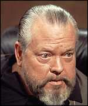   | 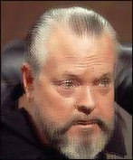 | 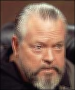 | 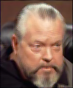   |    | 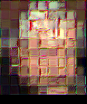   |
|  |  |  | 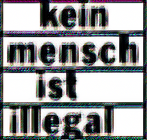 |  |  |
|     | 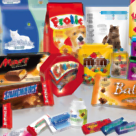 |  | 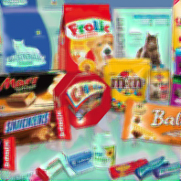 |  |  |


The CNN1 model is (in pytorch speak):

```python
nn.Sequential(
    nn.Conv2d(3, 32, kernel_size=3),
    nn.ReLU(),
    nn.Conv2d(32, 32, kernel_size=1),
    nn.ReLU(),
)
```

and CNN2 adds an average pooling layer, as suggested in the paper:

```python
nn.Sequential(
    nn.Conv2d(3, 32, kernel_size=3),
    nn.ReLU(),
    nn.Conv2d(32, 32, kernel_size=1),
    nn.ReLU(),
    nn.AvgPool2d(32, 16),
)
```

Below is the code used to create those images (in jupyter lab) followed by a [discussion](#discussion).


### Experiment setup

```python
def generalized_mean_image(
        target_images: torch.Tensor,  # B,C,H,W
        perceptual_model: nn.Module,
        loss_function: Callable,
        steps: int = 20000,
        batch_size: int = 32,
        learnrate: float = 0.005,
        device: torch.device = torch.device("cuda"),
):
    torch.cuda.empty_cache()
    
    if callable(getattr(perceptual_model, "to", None)):
        perceptual_model.to(device)
    
    source_image = nn.Parameter(torch.zeros(target_images.shape[1:]).to(device))
    optimizer = torch.optim.Adam([source_image], lr=learnrate)
    
    # create a batch with all target image crops and repeat until batch_size is reached
    target_batch = target_images.repeat(batch_size // target_images.shape[0], 1, 1, 1)[:batch_size].to(device)
    with torch.no_grad():
        p_target_batch = perceptual_model(target_batch)

    with tqdm(total=steps) as progress:
        for i in range(steps // batch_size):
            progress.update(batch_size)

            source_batch = source_image.unsqueeze(0).repeat(batch_size, 1, 1, 1)
            p_source_batch = perceptual_model(source_batch)

            loss = loss_function(p_source_batch, p_target_batch)
            
            optimizer.zero_grad()
            loss.backward()
            optimizer.step()
            
            progress.set_postfix({"loss": float(loss)})

    source_image = source_image.cpu().clamp(0, 1)
    display(VF.to_pil_image(source_image))
    torch.cuda.empty_cache()
    
    
def create_target_images(image: torch.Tensor, o: int = 3):
    h, w = image.shape[-2:]
    h -= o
    w -= o
    return torch.cat([
        image[None, :, :h, :w],
        image[None, :, o:h+o, :w],
        image[None, :, o:h+o, o:w+o],
        image[None, :, :h, o:w+o],
    ])
    
generalized_mean_image(
    create_target_images(some_image),
    nn.Identity(),  # model goes here
    loss_function=F.l1_loss,
)       
```

### Discussion

The authors originally suggest a model that looks like this (if i understood correctly):

```python
nn.Sequential(
    nn.Conv2d(3, 1024, kernel_size=3),
    nn.ReLU(),
    nn.Conv2d(1024, 1024, kernel_size=1),
    nn.ReLU(),
    nn.Conv2d(1024, 1024, kernel_size=1),
    nn.ReLU(),
    nn.Conv2d(1024, 1024, kernel_size=1),
    nn.ReLU(),
    nn.Conv2d(1024, 1024, kernel_size=1),
    nn.ReLU(),
    nn.Conv2d(1024, 1024, kernel_size=1),
    nn.ReLU(),
    nn.Conv2d(1024, 1024, kernel_size=1),
    nn.ReLU(),
    nn.AvgPool2d(32, 16),
)
```

This model is extremely slow and does not fit into my GPU RAM, when processing images larger
than, say 50x50 pixels. From my point of view, it does not make any sense to use a loss method
that is computationally orders of magnitudes more expensive than the actual auto-encoder 
that i'm training. The reason, however, that the authors used such an extreme model, 
is purely academic. It's used to approximate an infinite random CNN as discussed in *Theorem 2.1.* 

The average pooling at the end does not work in my experiment, as seen in above table. That was
my initial guess, when reading the paper and i wonder how it worked for the authors!? Surly, i got
something wrong. Later on in the paper, they are comparing images patch-wise (each patch with
each other target patch).

However, for untrained random CNNs, the number of channels is quite important. The more you 
can afford, the better. The color mismatch in above table is directly related to the number 
of channels.

### Influence of number of channels

Using the following CNN architecture (where `CH` is the number of channels in below table):

```python
nn.Sequential(
    nn.Conv2d(3, CH, kernel_size=1), 
    nn.GELU(),
    nn.Conv2d(CH, CH, kernel_size=1),
    nn.GELU(),
    nn.Conv2d(CH, CH, kernel_size=1),
    nn.GELU(),
)
```

| channels | result of 4 random CNNs                                |
|---------:|--------------------------------------------------------|
|        4 | 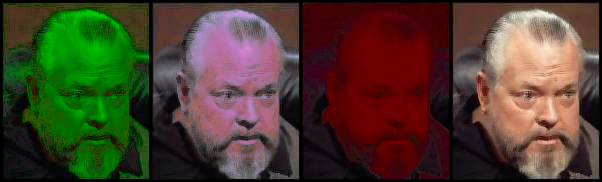   |
|        8 | 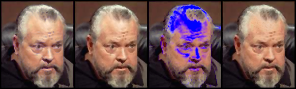   |
|       16 | 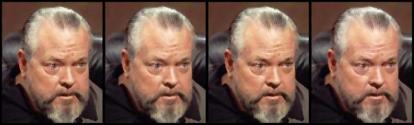  |
|       32 |   |
|       64 |   |
|      128 |  |

As can be seen, too few channels are very unreliable and even 128 channels might 
introduce some slight color differences. 

Unfortunately, that's the limit of my GPU RAM. Running the network with 256 channels 
on CPU would require about 15 minutes per image. And, of course, increasing the number 
of channels exponentially increases the training time. On my machine, 
training with 4 channels runs at about 5100 iterations/second and 128 channels 
archive only 215 iterations.  

### Influence of kernel size

Checking influence of kernel-size in random CNN. I'm just using one layer and no activation function.
`KS` is the kernel size:

```python
nn.Conv2d(3, 128, kernel_size=KS, padding=(KS - 1) // 2)
```

l1 loss without CNN is included for comparison:

| original | l1 loss | l1 of KS 1                                           | l1 of KS 3                                           | l1 of KS 5                                           | l1 of KS 7                                           | l1 of KS 9                                           |
|----|----|------------------------------------------------------|------------------------------------------------------|------------------------------------------------------|------------------------------------------------------|------------------------------------------------------|
|  |  |  | 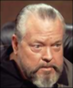 |  |  |  |
|  |  |  |  |  |  |  |
|  |  |  | 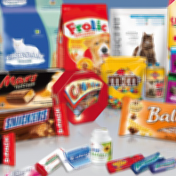 |  |  |  |

It's really hard to tell but, in my opinion, a kernel size of 1 yields the most sharp images and
everything above 3 does not produce a noticeable difference.

## Comparing the Fourier Transform

Instead of comparing the images or their representations of random CNNs, 
let's compare the frequency spectrum of the images. 

The previous l1 and l2 loss images are included for comparison:

| original                                               | l1 loss                                          | l2 loss                                        | l1 loss of FFT1                                      | l1 loss of FFT2                                       | l2 loss of FFT2                                       |
|--------------------------------------------------------|--------------------------------------------------|------------------------------------------------|------------------------------------------------------|-------------------------------------------------------|-------------------------------------------------------|
|    |    |  | 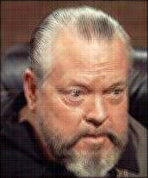   |    |    |
|  |  |  |  |  | 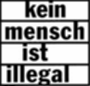 |
|     |  |  |  |  |  |

**FFT1** is the `torch.fft.fft2` (2-dimensional) function which transforms the image 
into complex numbers. Complex numbers are not supported by the l2 loss, so **FFT2** is an adaption:
```python
def fft_func(x):
    x = torch.fft.fft2(x)
    return torch.concat([x.real, x.imag], dim=-3)
```
It ignores if numbers are real or imaginary and simply concatenates the spectral images along the
channel (color) dimension. 

Using the Fourier Transform increases training time until convergence. **FFT1** a little and
**FFT2** needs at least **10 times the training time** for convergence and does not look very good
with l1 loss.

Using the l1 loss on the complex FFT numbers, however, does a really good job.

Since we have the frequency spectrum of the images, we can manipulate it in some way before 
comparison. I tried to multiply high frequency components to make them more effective in the
comparison but whatever i tried, it did not increase the resulting image quality compared to
the normal FFT.

Just for fun, let's look at the resulting images when only the low or high frequencies are compared
```python
def fft_func(x):
    x = torch.fft.fft2(x)
    return x[..., :10, :10]  # for low frequencies
    return x[..., 10:, 10:]  # or this for high frequencies
```
| original                                               | low                                                        | high                                                            |
|--------------------------------------------------------|------------------------------------------------------------|-----------------------------------------------------------------|
|    | 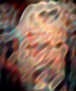   | 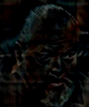   | 
|  | 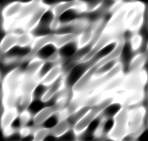 |  |
|     |  | 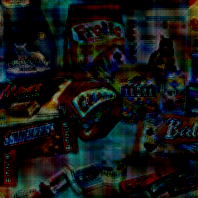 |

