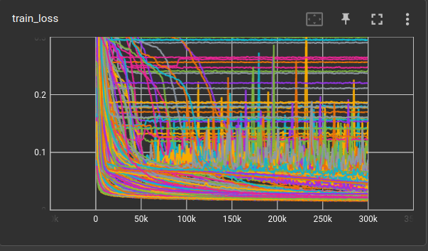

script: [experiments/ae/kae/cnn-kae-01.yml](../../experiments/ae/kae/cnn-kae-01.yml)

```shell
python exp.py experiments/ae/kae/cnn-kae.yml run
python exp.py experiments/ae/kae/cnn-kae.yml results \
    -ec matrix_id matrix_slug compression-ratio \
    -sc "validation loss (300,000 steps)-" \
    -ac trial -acs "validation loss (300,000 steps)"
```


```
CNNKAE(
  (encoder): Sequential(
    (0): Conv2d(1, 32, kernel_size=(7, 7), stride=(1, 1))
    (1): ReLU()
    (2): Flatten(start_dim=-3, end_dim=-1)
    (3): KAELayer(input_dim=15488, out_dim=16, order=3, addbias=True)
  )
  (decoder): Sequential(
    (0): Linear(in_features=16, out_features=15488, bias=True)
    (1): Reshape(shape=(32, 22, 22))
    (2): ConvTranspose2d(32, 1, kernel_size=(7, 7), stride=(1, 1))
    (3): Sigmoid()
  )
)
```


|   bs | opt   | ch   |   ks |   enckae |   deckae | act  | outact  | validation loss |       (std) |   model params | train time<br/>(minutes) |   throughput |
|-----:|:------|:-----|-----:|---------:|---------:|:-----|:--------|----------------:|------------:|---------------:|-------------------------:|-------------:|
|  128 | AdamW | 32   |    3 |        3 |        3 | relu | sigmoid |        0.292613 |    0.085971 |      2,791,153 |                     5.79 |        864/s |
|  128 | Adam  | 32   |    3 |        3 |        3 | relu | sigmoid |        0.261935 |    0.080504 |      2,791,153 |                     5.79 |        863/s |
|   64 | Adam  | 32   |    3 |        3 |        3 | relu | sigmoid |        0.237328 |    0.057804 |      2,791,153 |                     5.99 |        835/s |
|   64 | AdamW | 32   |    3 |        3 |        3 | relu | sigmoid |        0.230480 |    0.054289 |      2,791,153 |                     5.99 |        834/s |
|   64 | AdamW | 32   |    7 |        3 |        3 | relu | sigmoid |        0.222705 |    0.063864 |      2,001,137 |                     4.38 |      1,141/s |
|  128 | AdamW | 32   |    7 |        3 |        3 | relu | sigmoid |        0.197770 |    0.075377 |      2,001,137 |                     4.20 |      1,189/s |
|   64 | Adam  | 32   |    7 |        3 |        3 | relu | sigmoid |        0.158625 |    0.030353 |      2,001,137 |                     4.38 |      1,142/s |
|  128 | Adam  | 32   |    7 |        3 |        3 | relu | sigmoid |        0.147511 |    0.027205 |      2,001,137 |                     4.15 |      1,206/s |
|  128 | Adam  | 32   |    3 |        3 |          | relu |         |        0.095244 |    0.044834 |      1,752,817 |                     2.78 |      1,797/s |
|  128 | AdamW | 32   |    3 |        3 |          | relu |         |        0.090038 |    0.017911 |      1,752,817 |                     2.80 |      1,786/s |
|  128 | Adam  | 32   |    7 |        3 |          | relu |         |        0.077818 |    0.013928 |      1,257,713 |                     2.03 |      2,469/s |
|  128 | AdamW | 32   |    3 |        3 |        3 | relu |         |        0.064453 |    0.003195 |      2,791,153 |                     5.79 |        863/s |
|  128 | Adam  | 32   |    3 |        3 |        3 | relu |         |        0.063375 |    0.005283 |      2,791,153 |                     5.80 |        862/s |
|  128 | AdamW | 32   |    7 |        3 |          | relu |         |        0.062425 |    0.004276 |      1,257,713 |                     2.06 |      2,431/s |
|   64 | AdamW | 32   |    3 |        3 |          | relu |         |        0.058668 |    0.016882 |      1,752,817 |                     2.96 |      1,691/s |
|   64 | Adam  | 32   |    3 |        3 |          | relu |         |        0.053773 |    0.006384 |      1,752,817 |                     2.96 |      1,691/s |
|   64 | Adam  | 32   |    3 |        3 |        3 | relu |         |        0.047111 |    0.002302 |      2,791,153 |                     5.99 |        834/s |
|  128 | Adam  | 32   |    7 |        3 |        3 | relu |         |        0.044818 |    0.002094 |      2,001,137 |                     4.16 |      1,203/s |
|  128 | AdamW | 32   |    7 |        3 |        3 | relu |         |        0.041642 |    0.003972 |      2,001,137 |                     4.21 |      1,188/s |
|   64 | AdamW | 32   |    3 |        3 |        3 | relu |         |        0.040656 |    0.007717 |      2,791,153 |                     5.99 |        834/s |
|   64 | AdamW | 32   |    7 |        3 |          | relu |         |        0.038478 |    0.009330 |      1,257,713 |                     2.18 |      2,292/s |
|   64 | Adam  | 32   |    7 |        3 |          | relu |         |        0.037041 |    0.004939 |      1,257,713 |                     2.18 |      2,289/s |
|  128 | AdamW | 32   |    3 |          |          | relu |         |        0.028859 |    0.000982 |        714,481 |                     0.24 |     21,571/s |
|   64 | Adam  | 32   |    7 |        3 |        3 | relu |         |        0.028517 |    0.000484 |      2,001,137 |                     4.38 |      1,142/s |
|  128 | Adam  | 32   |    3 |          |          | relu |         |        0.028170 |    0.000478 |        714,481 |                     0.24 |     20,937/s |
|   64 | AdamW | 32   |    7 |        3 |        3 | relu |         |        0.028050 |    0.000771 |      2,001,137 |                     4.38 |      1,141/s |
|  128 | Adam  | 32   |    3 |        3 |          | relu | sigmoid |        0.027544 |    0.001772 |      1,752,817 |                     2.78 |      1,800/s |
|  128 | Adam  | 32   |    7 |          |          | relu |         |        0.027469 |    0.000088 |        514,289 |                     0.23 |     21,751/s |
|  128 | AdamW | 32   |    7 |          |          | relu |         |        0.027302 |    0.000115 |        514,289 |                     0.24 |     20,922/s |
|   64 | AdamW | 32   |    3 |          |          | relu |         |        0.027301 |    0.000150 |        714,481 |                     0.31 |     16,158/s |
|   64 | Adam  | 32   |    3 |          |          | relu |         |        0.027292 |    0.000124 |        714,481 |                     0.32 |     15,829/s |
|   64 | AdamW | 32   |    7 |          |          | relu |         |        0.027190 |    0.000048 |        514,289 |                     0.32 |     16,027/s |
|   64 | Adam  | 32   |    7 |          |          | relu |         |        0.027100 |    0.000010 |        514,289 |                     0.31 |     16,187/s |
|  128 | AdamW | 32   |    3 |        3 |          | relu | sigmoid |        0.024720 |    0.000637 |      1,752,817 |                     2.80 |      1,783/s |
|  128 | Adam  | 32   |    3 |          |        3 | relu |         |        0.022186 |    0.000260 |      1,752,817 |                     3.17 |      1,578/s |
|  128 | AdamW | 32   |    3 |          |        3 | relu |         |        0.021902 |    0.000178 |      1,752,817 |                     3.16 |      1,584/s |
|   64 | AdamW | 32   |    3 |          |        3 | relu |         |        0.021560 |    0.000209 |      1,752,817 |                     3.28 |      1,526/s |
|  128 | AdamW | 32   |    7 |        3 |          | relu | sigmoid |        0.021520 |    0.000517 |      1,257,713 |                     2.06 |      2,430/s |
|   64 | Adam  | 32   |    3 |          |        3 | relu |         |        0.021404 |    0.000081 |      1,752,817 |                     3.31 |      1,510/s |
|  128 | Adam  | 32   |    7 |        3 |          | relu | sigmoid |        0.021353 |    0.000728 |      1,257,713 |                     2.02 |      2,473/s |
|   64 | AdamW | 32   |    3 |        3 |          | relu | sigmoid |        0.021238 |    0.000508 |      1,752,817 |                     2.96 |      1,688/s |
|  128 | Adam  | 32   |    7 |          |        3 | relu |         |        0.021179 |    0.000160 |      1,257,713 |                     2.28 |      2,189/s |
|  128 | AdamW | 32   |    7 |          |        3 | relu |         |        0.021144 |    0.000062 |      1,257,713 |                     2.32 |      2,154/s |
|   64 | Adam  | 32   |    7 |          |        3 | relu |         |        0.020978 |    0.000311 |      1,257,713 |                     2.44 |      2,051/s |
|   64 | Adam  | 32   |    3 |        3 |          | relu | sigmoid |        0.020935 |    0.000587 |      1,752,817 |                     2.96 |      1,690/s |
|   64 | AdamW | 32   |    7 |          |        3 | relu |         |        0.020802 |    0.000180 |      1,257,713 |                     2.43 |      2,061/s |
|  128 | Adam  | 32   |    3 |          |          | relu | sigmoid |        0.019699 |    0.000181 |        714,481 |                     0.23 |     21,480/s |
|  128 | AdamW | 32   |    3 |          |          | relu | sigmoid |        0.019593 |    0.000223 |        714,481 |                     0.23 |     21,514/s |
|   64 | Adam  | 32   |    7 |        3 |          | relu | sigmoid |        0.019002 |    0.000362 |      1,257,713 |                     2.19 |      2,287/s |
|   64 | AdamW | 32   |    7 |        3 |          | relu | sigmoid |        0.018914 |    0.000303 |      1,257,713 |                     2.19 |      2,287/s |
|   64 | AdamW | 32   |    3 |          |          | relu | sigmoid |        0.018724 |    0.000100 |        714,481 |                     0.30 |     16,589/s |
|   64 | Adam  | 32   |    3 |          |          | relu | sigmoid |        0.018539 |    0.000207 |        714,481 |                     0.31 |     16,188/s |
|  128 | Adam  | 32   |    7 |          |          | relu | sigmoid |        0.018150 |    0.000114 |        514,289 |                     0.23 |     22,062/s |
|  128 | AdamW | 32   |    7 |          |          | relu | sigmoid |        0.018087 |    0.000250 |        514,289 |                     0.24 |     20,987/s |
|  128 | Adam  | 32   |    3 |          |        3 | relu | sigmoid |        0.017972 |    0.000681 |      1,752,817 |                     3.17 |      1,578/s |
|  128 | AdamW | 32   |    3 |          |        3 | relu | sigmoid |        0.017546 |    0.000348 |      1,752,817 |                     3.16 |      1,585/s |
|  128 | Adam  | 32   |    7 |          |        3 | relu | sigmoid |        0.017191 |    0.000302 |      1,257,713 |                     2.28 |      2,190/s |
|  128 | AdamW | 32   |    7 |          |        3 | relu | sigmoid |        0.017188 |    0.000268 |      1,257,713 |                     2.32 |      2,155/s |
|   64 | AdamW | 32   |    7 |          |          | relu | sigmoid |        0.017087 |    0.000154 |        514,289 |                     0.31 |     16,350/s |
|   64 | Adam  | 32   |    7 |          |          | relu | sigmoid |        0.017029 |    0.000140 |        514,289 |                     0.31 |     16,089/s |
|   64 | Adam  | 32   |    3 |          |        3 | relu | sigmoid |        0.015825 |    0.000447 |      1,752,817 |                     3.31 |      1,510/s |
|   64 | Adam  | 32   |    7 |          |        3 | relu | sigmoid |        0.015658 |    0.000419 |      1,257,713 |                     2.44 |      2,050/s |
|   64 | AdamW | 32   |    3 |          |        3 | relu | sigmoid |        0.015646 |    0.000365 |      1,752,817 |                     3.30 |      1,514/s |
|   64 | AdamW | 32   |    7 |          |        3 | relu | sigmoid |        0.015391 |    0.000306 |      1,257,713 |                     2.43 |      2,056/s |




| ch   |   ks |   enckae |   deckae | act     | latact   | outact   |   validation loss (300,000 steps) |   model params |   train time (minutes) |   throughput |
|:-----|-----:|---------:|---------:|:--------|:---------|:---------|----------------------------------:|---------------:|-----------------------:|-------------:|
| 32   |    7 |        3 |        3 | sigmoid | none     | sigmoid  |                          0.362272 |      2,001,137 |                   4.32 |      1,156/s |
| 32   |    7 |        3 |        3 | relu    | none     | sigmoid  |                          0.152193 |      2,001,137 |                   4.17 |      1,198/s |
| 32   |    7 |        3 |        0 | sigmoid | none     | sigmoid  |                          0.150881 |      1,257,713 |                   2.21 |      2,261/s |
| 32   |    7 |        3 |        3 | none    | none     | sigmoid  |                           0.14385 |      2,001,137 |                    4.3 |      1,161/s |
| 32   |    7 |        3 |        3 | none    | sigmoid  | none     |                         0.0678162 |      2,001,137 |                   4.23 |      1,181/s |
| 32   |    7 |        3 |        3 | sigmoid | sigmoid  | sigmoid  |                         0.0677947 |      2,001,137 |                   4.25 |      1,175/s |
| 32   |    7 |        3 |        3 | relu    | sigmoid  | none     |                         0.0677575 |      2,001,137 |                   4.27 |      1,170/s |
| 32   |    7 |        3 |        3 | relu    | sigmoid  | sigmoid  |                         0.0677459 |      2,001,137 |                   4.33 |      1,154/s |
| 32   |    7 |        3 |        3 | sigmoid | sigmoid  | none     |                         0.0677024 |      2,001,137 |                    4.3 |      1,161/s |
| 32   |    7 |        3 |        3 | none    | sigmoid  | sigmoid  |                         0.0676967 |      2,001,137 |                   4.23 |      1,182/s |
| 32   |    7 |        3 |        0 | none    | sigmoid  | sigmoid  |                         0.0676594 |      1,257,713 |                   2.12 |      2,353/s |
| 32   |    7 |        3 |        0 | sigmoid | sigmoid  | sigmoid  |                         0.0676261 |      1,257,713 |                   2.18 |      2,293/s |
| 32   |    7 |        3 |        0 | relu    | sigmoid  | sigmoid  |                         0.0676237 |      1,257,713 |                   2.12 |      2,355/s |
| 32   |    7 |        3 |        0 | sigmoid | sigmoid  | none     |                         0.0676033 |      1,257,713 |                   2.21 |      2,263/s |
| 32   |    7 |        0 |        0 | sigmoid | sigmoid  | none     |                         0.0675949 |        514,289 |                   0.27 |     18,296/s |
| 32   |    7 |        3 |        0 | none    | sigmoid  | none     |                         0.0675417 |      1,257,713 |                   2.12 |      2,361/s |
| 32   |    7 |        3 |        0 | relu    | sigmoid  | none     |                         0.0675406 |      1,257,713 |                    2.2 |      2,271/s |
| 32   |    7 |        3 |        3 | sigmoid | none     | none     |                          0.064173 |      2,001,137 |                   4.33 |      1,155/s |
| 32   |    7 |        0 |        3 | sigmoid | sigmoid  | sigmoid  |                         0.0597856 |      1,257,713 |                   2.38 |      2,104/s |
| 32   |    7 |        0 |        3 | sigmoid | sigmoid  | none     |                         0.0595756 |      1,257,713 |                   2.38 |      2,101/s |
| 32   |    7 |        0 |        0 | sigmoid | sigmoid  | sigmoid  |                         0.0561915 |        514,289 |                   0.27 |     18,196/s |
| 32   |    7 |        3 |        0 | sigmoid | none     | none     |                         0.0460724 |      1,257,713 |                   2.15 |      2,326/s |
| 32   |    7 |        3 |        0 | none    | none     | none     |                         0.0385109 |      1,257,713 |                   2.12 |      2,354/s |
| 32   |    7 |        3 |        0 | relu    | none     | none     |                         0.0338134 |      1,257,713 |                   2.17 |      2,308/s |
| 32   |    7 |        0 |        0 | sigmoid | none     | none     |                         0.0310357 |        514,289 |                   0.26 |     19,552/s |
| 32   |    7 |        3 |        3 | relu    | none     | none     |                         0.0288819 |      2,001,137 |                   4.15 |      1,205/s |
| 32   |    7 |        3 |        3 | none    | none     | none     |                         0.0281923 |      2,001,137 |                   4.26 |      1,172/s |
| 32   |    7 |        0 |        0 | none    | sigmoid  | none     |                         0.0274841 |        514,289 |                   0.29 |     17,458/s |
| 32   |    7 |        0 |        0 | relu    | sigmoid  | none     |                         0.0274371 |        514,289 |                   0.27 |     18,803/s |
| 32   |    7 |        0 |        0 | none    | none     | none     |                         0.0270941 |        514,289 |                   0.29 |     17,468/s |
| 32   |    7 |        0 |        0 | relu    | none     | none     |                         0.0270918 |        514,289 |                   0.26 |     19,002/s |
| 32   |    7 |        0 |        3 | none    | sigmoid  | none     |                         0.0248853 |      1,257,713 |                    2.4 |      2,080/s |
| 32   |    7 |        0 |        3 | relu    | sigmoid  | none     |                          0.024046 |      1,257,713 |                   2.39 |      2,089/s |
| 32   |    7 |        0 |        3 | sigmoid | none     | none     |                         0.0240416 |      1,257,713 |                   2.37 |      2,107/s |
| 32   |    7 |        0 |        3 | none    | none     | none     |                         0.0223634 |      1,257,713 |                   2.31 |      2,162/s |
| 32   |    7 |        0 |        0 | none    | none     | sigmoid  |                         0.0208692 |        514,289 |                   0.29 |     17,068/s |
| 32   |    7 |        0 |        3 | relu    | none     | none     |                         0.0208419 |      1,257,713 |                   2.38 |      2,103/s |
| 32   |    7 |        0 |        0 | none    | sigmoid  | sigmoid  |                         0.0208061 |        514,289 |                   0.29 |     17,161/s |
| 32   |    7 |        0 |        3 | none    | sigmoid  | sigmoid  |                         0.0202934 |      1,257,713 |                   2.35 |      2,129/s |
| 32   |    7 |        0 |        0 | sigmoid | none     | sigmoid  |                         0.0195643 |        514,289 |                   0.26 |     19,099/s |
| 32   |    7 |        3 |        0 | relu    | none     | sigmoid  |                         0.0195487 |      1,257,713 |                   2.18 |      2,298/s |
| 32   |    7 |        3 |        0 | none    | none     | sigmoid  |                         0.0194039 |      1,257,713 |                   2.12 |      2,358/s |
| 32   |    7 |        0 |        3 | sigmoid | none     | sigmoid  |                          0.018438 |      1,257,713 |                   2.38 |      2,105/s |
| 32   |    7 |        0 |        3 | relu    | sigmoid  | sigmoid  |                         0.0178167 |      1,257,713 |                   2.32 |      2,150/s |
| 32   |    7 |        0 |        0 | relu    | sigmoid  | sigmoid  |                         0.0176704 |        514,289 |                   0.28 |     17,863/s |
| 32   |    7 |        0 |        3 | none    | none     | sigmoid  |                         0.0172048 |      1,257,713 |                   2.31 |      2,162/s |
| 32   |    7 |        0 |        0 | relu    | none     | sigmoid  |                         0.0170206 |        514,289 |                   0.27 |     18,189/s |
| 32   |    7 |        0 |        3 | relu    | none     | sigmoid  |                         0.0151704 |      1,257,713 |                   2.35 |      2,124/s |

