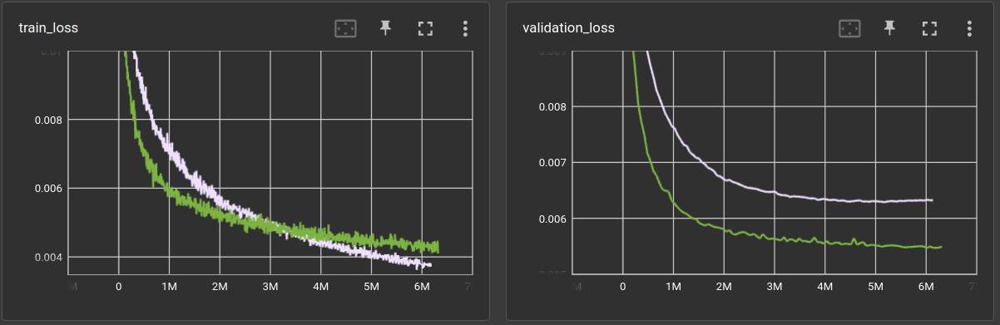

# MLP-Mixer re-invented for auto-encoding

Recently read this paper *"MLP-Mixer: An all-MLP Architecture for Vision"* [2105.01601](https://arxiv.org/abs/2105.01601),
which i found quite inspiring but also left me with some regret of not having come up with it myself. 

Anyways, after some weeks, i set out to program a network based on the ideas but without looking
at the paper for reference. At least before i have a well performing implementation.
*Of course*, i used it to setup an auto-encoder.

Setup is as follows:

First split the input image into equal sized patches. I'm using pytorch's `unfold` method for this.
For the MNIST digits dataset this yield 4x4 7x7 patches for each 28x28 image. 

Then they are flattened to 16 1-D vectors of size 49. Those vectors are moved to the batch-dimension
(the first one) of the vector that the linear layers ought to process. For example, when passing
in a batch-size of 64:

    input:                      (64, 1, 28, 28)
    patches:                    (64, 4, 4, 1, 7, 7)
    flatten:                    (64, 16, 49)
    move to batch dimension:    (1024, 49)

Now these 1024 49-D vectors can be processed by a stack of linear layers (MLP). Each vector is 
processed by the same layer and since it's only one little patch, the linear layer can be very 
small. However, there is no information shared between those patches. Each patch is processed
individually. To apply the "mixing" strategy, i first tried a 1-D convolutional layer

    input:                      (1024, 49)
    reverse batch-flattening:   (64, 16, 49)
    apply Conv1d(16, 16, 1):    (64, 16, 49)
    move to batch dimension:    (1024, 49)
    process further with MLP:   (1024, 49)

The convolution is applied channel-wise and is able to mix information from the different patches.

Note that the `49` is the depth of each layer and does not have to stay like this. Each linear
layer can make it larger or smaller. In the following experiment, i resized the 49 to 64 in the
first layer and kept it like this until the final linear layer, which resizes it to 16 which yields
a compression ratio of 49 (28x28 -> 49) for the auto-encoder.

Also, whenever a layer has the same input and output dimension, a residual connection is added
(after the activation function).

The whole auto-encoder is built *symmetrically*, so the decoder stack is the reverse of the 
encoder stack. Here is one example in pytorch speak:

```
MixerMLP(
  (patchify): Patchify(patch_size=7)
  (encoder): ModuleList(
    (0): MLPLayer(
      residual=False
      (module): Linear(in_features=49, out_features=64, bias=True)
      (act): GELU(approximate='none')
    )
    (1): MLPLayer(
      residual=True
      (module): Linear(in_features=64, out_features=64, bias=True)
      (act): GELU(approximate='none')
    )
    (2): MLPMixerLayer(
      residual=True
      (module): Conv1d(16, 16, kernel_size=(1,), stride=(1,))
    )
    (3): MLPLayer(
      residual=True
      (module): Linear(in_features=64, out_features=64, bias=True)
      (act): GELU(approximate='none')
    )
    (4): MLPMixerLayer(
      residual=True
      (module): Conv1d(16, 16, kernel_size=(1,), stride=(1,))
    )
    (5): MLPLayer(
      residual=False
      (module): Linear(in_features=64, out_features=16, bias=True)
      (act): GELU(approximate='none')
    )
    (6): MLPMixerLayer(
      residual=True
      (module): Conv1d(16, 16, kernel_size=(1,), stride=(1,))
    )
    (7): MLPLayer(
      residual=False
      (module): Linear(in_features=256, out_features=16, bias=True)
    )
  )
  (decoder): ModuleList(
    (0): MLPLayer(
      residual=False
      (module): Linear(in_features=16, out_features=256, bias=True)
    )
    (1): MLPMixerLayer(
      residual=True
      (module): Conv1d(16, 16, kernel_size=(1,), stride=(1,))
      (act): GELU(approximate='none')
    )
    (2): MLPLayer(
      residual=False
      (module): Linear(in_features=16, out_features=64, bias=True)
      (act): GELU(approximate='none')
    )
    (3): MLPMixerLayer(
      residual=True
      (module): Conv1d(16, 16, kernel_size=(1,), stride=(1,))
      (act): GELU(approximate='none')
    )
    (4): MLPLayer(
      residual=True
      (module): Linear(in_features=64, out_features=64, bias=True)
      (act): GELU(approximate='none')
    )
    (5): MLPMixerLayer(
      residual=True
      (module): Conv1d(16, 16, kernel_size=(1,), stride=(1,))
      (act): GELU(approximate='none')
    )
    (6): MLPLayer(
      residual=True
      (module): Linear(in_features=64, out_features=64, bias=True)
      (act): GELU(approximate='none')
    )
    (7): MLPLayer(
      residual=False
      (module): Linear(in_features=64, out_features=49, bias=True)
    )
  )
  (unpatchify): Unpatchify(patch_size=7)
)
```

Note that, in the encoder, layer 5 compresses each patch from 64 to 16 dimensions, then there
is another mixing layer, and layer 7 processes all 16 patches at once and outputs 
a final 16-dim vector (256 -> 16).


In the following table `bs` = batch size, `lr` = learnrate, `ds` is the dataset, `ps` is the patch size,
`mix` means at which layer a mixing-layer is added (1-indexed). Optimizer is `AdamW` and loss function
is mean-squared error. Scheduler is cosine-annealing with warmup.

Experiment file: [experiments/ae/mixer/mixer02.yml @ 18e32d81](https://github.com/defgsus/blob/18e32d81a49aecc6d92a21c346c8a47edbed472c/experiments/ae/mixer/mixer02.yml)

|   bs |    lr | ds    |   ps | ch          | mix       | act   | validation loss<br>(1,000,000 steps) |   model params |   train time (minutes) |   throughput |
|-----:|------:|:------|-----:|:------------|:----------|:------|-------------------------------------:|---------------:|-----------------------:|-------------:|
|   64 | 0.003 | mnist |    7 | 64,64,64,16 |           | gelu  |                             0.011366 |         33,617 |                   1.03 |     16,126/s |
|   64 | 0.003 | mnist |    7 | 64,64,64,16 | 4         | gelu  |                             0.011248 |         34,161 |                   1.25 |     13,335/s |
|   64 | 0.003 | mnist |    7 | 64,64,64,16 | 3         | gelu  |                             0.010779 |         34,161 |                   1.21 |     13,779/s |
|   64 | 0.003 | mnist |    7 | 64,64,64,16 | 2         | gelu  |                             0.010677 |         34,161 |                    1.2 |     13,865/s |
|   64 | 0.003 | mnist |    7 | 64,64,64,16 | 1         | gelu  |                             0.010659 |         34,161 |                   1.21 |     13,748/s |
|   64 | 0.003 | mnist |    7 | 64,64,64,16 | 1,2       | gelu  |                             0.010418 |         34,705 |                   1.29 |     12,883/s |
|   64 | 0.003 | mnist |    7 | 64,64,64,16 | 1,2,3     | gelu  |                             0.010398 |         35,249 |                   1.46 |     11,384/s |
|   64 | 0.003 | mnist |    7 | 64,64,64,16 | 1,2,3,4   | gelu  |                             0.010208 |         35,793 |                   1.61 |     10,323/s |

Validation loss performance is not actually super good and the mixing only helps a little. 
But it's not so bad either for such a small network.

### Linear layer as mixer

So let's try a linear layer for mixing between patches.

    input:                      (1024, 49)
    reverse batch-flattening:   (64, 16, 49)
    flatten 2nd dimension:      (64, 784)
    apply Linear(784, 784):     (64, 784)
    unflatten 2nd dimension:    (64, 16, 49)
    and move to batch dim:      (1024, 49)
    process further with MLP:   (1024, 49)

Obviously, the linear mixing layer increases the network size considerably. The benefit is, that
each pixel in each patch can be compared/processed against each other.

I guess, this is kind of what the MLP-Mixer paper suggests, only i can not confidentially read
[their jax code](https://github.com/google-research/vision_transformer/blob/main/vit_jax/models_mixer.py) 
to confirm.


|   bs |    lr | ds    |   ps | ch          | mix     | act   | validation loss<br>(1,000,000 steps) |   model params |   train time (minutes) |   throughput |
|-----:|------:|:------|-----:|:------------|:--------|:------|-------------------------------------:|---------------:|-----------------------:|-------------:|
|   64 | 0.003 | mnist |    7 | 64,64,64,16 | 4       | gelu  |                            0.0105164 |        165,201 |                   1.16 |     14,418/s |
|   64 | 0.003 | mnist |    7 | 64,64,64,16 | 1       | gelu  |                            0.0078778 |      2,132,817 |                   1.17 |     14,292/s |
|   64 | 0.003 | mnist |    7 | 64,64,64,16 | 2       | gelu  |                            0.0072450 |      2,132,817 |                   1.16 |     14,345/s |
|   64 | 0.003 | mnist |    7 | 64,64,64,16 | 3       | gelu  |                            0.0071680 |      2,132,817 |                   1.21 |     13,793/s |
|   64 | 0.003 | mnist |    7 | 64,64,64,16 | 3,4     | gelu  |                            0.0069653 |      2,264,401 |                   1.41 |     11,778/s |
|   64 | 0.003 | mnist |    7 | 64,64,64,16 | 1,2     | gelu  |                            0.0068538 |      4,232,017 |                   1.58 |     10,559/s |
|   64 | 0.003 | mnist |    7 | 64,64,64,16 | 1,2,3,4 | gelu  |                            0.0066289 |      6,462,801 |                   2.06 |      8,083/s |
|   64 | 0.003 | mnist |    7 | 64,64,64,16 | 1,2,3   | gelu  |                            0.0065175 |      6,331,217 |                   1.87 |      8,894/s |
|   64 | 0.003 | mnist |    7 | 64,64,64,16 | 2,3,4   | gelu  |                            0.0065056 |      4,363,601 |                   1.62 |     10,303/s |

Here's a plot of the loss curves for both mixing methods:


Performance is much better but the number of model parameters is much larger as well.

### Comparison with baseline CNN

How well does it perform against my baseline CNN with a final linear layer?

```
EncoderDecoder(
  (encoder): EncoderConv2d(
    (convolution): Conv2dBlock(
      (layers): Sequential(
        (0): Conv2d(1, 24, kernel_size=(5, 5), stride=(1, 1))
        (1): ReLU()
        (2): Conv2d(24, 32, kernel_size=(5, 5), stride=(1, 1))
        (3): ReLU()
        (4): Conv2d(32, 48, kernel_size=(5, 5), stride=(1, 1))
        (5): ReLU()
      )
    )
    (linear): Linear(in_features=12288, out_features=16, bias=True)
  )
  (decoder): Sequential(
    (0): Linear(in_features=16, out_features=12288, bias=True)
    (1): Reshape(shape=(48, 16, 16))
    (2): Conv2dBlock(
      (layers): Sequential(
        (0): ConvTranspose2d(48, 32, kernel_size=(5, 5), stride=(1, 1))
        (1): ReLU()
        (2): ConvTranspose2d(32, 24, kernel_size=(5, 5), stride=(1, 1))
        (3): ReLU()
        (4): ConvTranspose2d(24, 1, kernel_size=(5, 5), stride=(1, 1))
      )
    )
  )
)
```

`ks` is kernel size

| ch       |   ks | validation loss<br>(1,000,000 steps) |   model params |   train time (minutes) |   throughput |
|:---------|-----:|-------------------------------------:|---------------:|-----------------------:|-------------:|
| 24,32,48 |    9 |                           0.00780634 |        402,657 |                   1.87 |      8,914/s |
| 24,32,48 |    7 |                           0.00710207 |        386,721 |                   1.44 |     11,557/s |
| 24,32,48 |    3 |                           0.00718373 |        808,737 |                   2.11 |      7,908/s |
| 24,32,48 |    5 |                           0.00655708 |        522,081 |                   1.93 |      8,643/s |

Seems to be equally good at first glance. However, training both networks a bit longer reveals that
the CNN is able to squeeze out some more performance:



After 6 million steps (or 100 epochs), the best performing Mixer-MLP from above archives a 
validation loss of **0.0063** vs. **0.0055** for the CNN model. 

The Mixer-MLP is 4 times larger than the CNN model (because of the 3 linear mixing stages) and
we can see from the loss curves that it actually overfitted the training set. It's validation
performance starts to get worse after 5 million steps. 
 
However, since it seems to behave quite differently to the baseline CNN, it's certainly a nice
new tool to try things on.

It would be interesting to see if the mixing stages implemented with a convolution,
can--somehow--reach the performance of the linear mixers. 
That would make it very small **and** powerful.
