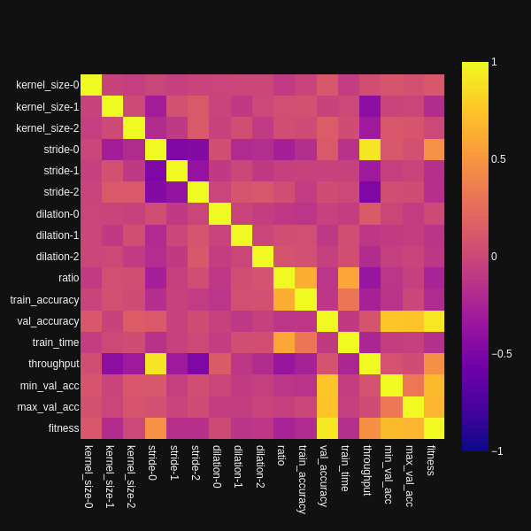

# Exploring classification accuracy of convolutional neural network architectures with random weights

The most prominent settings in a convolutional layer are **kernel size**, **stride** and **dilation**.
I've tested all (sensible) permutations of those settings for a 3-layer network and measured 
image classification accuracy with a linear classifier on top. There are a few architectures that 
stand out considerably!

The little convolutional networks all look like this:

    nn.Sequential(
        nn.Conv2d(in_channels=3, out_channels=32, kernel_size=3|5|7|9, stride=1|2|3, dilation=1|2|3),
        nn.ReLU(),
        nn.Conv2d(in_channels=32, out_channels=32, kernel_size=3|5|7|9, stride=1|2|3, dilation=1|2|3),
        nn.ReLU(),
        nn.Conv2d(in_channels=32, out_channels=32, kernel_size=3|5|7|9, stride=1|2|3, dilation=1|2|3),
        nn.ReLU(),
    )

The `|` symbol means that **one** of the separated numbers is used for each parameter. So each layer
has `4 * 3 * 3 = 36` possible permutations which leads to `36 ^ 3 = 46,656` possible 3-layer networks
to test. 

Testing procedure is as follows and the code is available 
[here](https://github.com/defgsus/nn-experiments/blob/599b4f6512234ab5b9890f05a4144c2600a60ecc/scripts/test_random_conv.py):
- create a network with random weights and pass a 3x96x96 image through. If that fails, e.g., 
  because the kernel size of the last layer is larger than it's input, 
  or because the output of the network is larger than the input, the architecture is ignored. 
- `32,629` networks pass this test.
- Pass the first 500 images of the [STL10](https://cs.stanford.edu/~acoates/stl10/) training dataset through
  the network and fit a scikit-learn [LinearRidge](https://scikit-learn.org/stable/modules/generated/sklearn.linear_model.RidgeClassifier.html)
  classifier.
- Pass the first 500 validation images from the dataset through the network and the fitted classifier and 
  calculate the *accuracy* (the percentage of correctly labeled images).
- If the *accuracy* is below 25% or the *throughput* (the number of 3x96x96 images the model can process per second)
  is below 200, ignore the model.
- Otherwise, repeat this test 5 times, each with new random weights.
- `1,760` networks pass the test and are evaluated 5 times and the average of *accuracy* and *throughput* is reported.

The reason for only using 32 channels and only 500 images, obviously, is to make things fast. One test pass 
takes only about a second.

Here is a plot of all the 5-trial networks. X-axis is *throughput*, y-axis is *accuracy* and the color is 
related to the *ratio*, the factor by which the input size is reduced by the network.   

The *accuracy* is not very high but that is to be expected when only training on 500 images. I believe that
it's still a meaningful measurement for comparing the different architectures. Remember that we only fitted
a linear classifier and the CNN weights are completely random.

The top-right architectures in above plot are the interesting ones. They have high accuracy (in comparison)
and run fast on my GPU. Here is a hand-picked list:

| kernel size |  stride | dilation | throughput |   accuracy |     ratio |
|------------:|--------:|---------:|-----------:|-----------:|----------:|
|     7, 3, 5 | 2, 1, 2 |  1, 3, 1 |       1850 |     31.24% | 0.3750000 |
|     7, 3, 9 | 2, 1, 2 |  3, 1, 1 |       2300 | **31.28%** | 0.2604166 |
|     9, 3, 7 | 3, 1, 1 |  1, 1, 1 |       2900 |     31.20% | 0.5601852 |
|     9, 3, 7 | 3, 1, 1 |  2, 1, 1 |       3500 |     30.92% | 0.4178241 |
|     9, 3, 5 | 3, 1, 1 |  1, 1, 1 |       2850 |     30.84% | 0.6666666 |
|     5, 5, 3 | 3, 1, 1 |  3, 1, 3 |       3000 |     31.04% | 0.3750000 |
|     7, 3, 3 | 3, 1, 1 |  3, 3, 1 |       5150 |     29.96% | 0.3750000 |
|     7, 3, 3 | 3, 1, 2 |  3, 1, 1 |       6350 |     30.16% | 0.1400463 |
|     5, 3, 5 | 3, 2, 1 |  2, 1, 1 |   **6450** |     30.00% | 0.1157407 |

Training these architectures with actual gradient descent, after adding a fully-connected linear layer, 
on the whole STL10 training set for a hundred epochs, with 
[TrivialAugmentWide](https://docs.pytorch.org/vision/main/generated/torchvision.transforms.TrivialAugmentWide.html) 
augmentation and cross-entropy loss, yields:

| kernel size |  stride | dilation | validation loss | val. accuracy | model params | train time (minutes) | throughput\* |
|------------:|--------:|---------:|----------------:|--------------:|-------------:|---------------------:|-------------:|
|     7, 3, 5 | 2, 1, 2 |  1, 3, 1 |     **1.20086** |        57.57% |      143,306 |                 6.90 |      1,207/s |
|     7, 3, 9 | 2, 1, 2 |  3, 1, 1 |         1.27710 |        54.09% |      168,970 |                 6.72 |      1,239/s |
|     9, 3, 7 | 3, 1, 1 |  1, 1, 1 |         1.21700 |    **58.59%** |      222,154 |                 6.02 |      1,383/s |
|     9, 3, 7 | 3, 1, 1 |  2, 1, 1 |         1.26847 |        54.88% |      182,794 |             **5.08** |  **1,639/s** |
|     9, 3, 5 | 3, 1, 1 |  1, 1, 1 |         1.26713 |        56.65% |      227,018 |                 5.15 |      1,617/s |
|     5, 5, 3 | 3, 1, 1 |  3, 1, 3 |         1.24014 |        55.70% |      141,002 |                 6.24 |      1,334/s |
|     7, 3, 3 | 3, 1, 1 |  3, 3, 1 |         1.30604 |        52.73% |      126,922 |                 6.04 |      1,378/s |
|     7, 3, 3 | 3, 1, 2 |  3, 1, 1 |         1.30700 |        52.63% |   **61,962** |                 5.93 |      1,406/s |
|     5, 3, 5 | 3, 2, 1 |  2, 1, 1 |         1.20183 |        56.75% |       69,322 |                 5.59 |      1,492/s |
|     9, 9, 7 | 2, 2, 1 |  2, 1, 1 |         1.26590 |        54.44% |      173,002 |                 5.48 |      1,520/s |

And with 128 instead of 32 convolutional channels:

| kernel size |  stride | dilation | validation loss | val. accuracy | model params | train time (minutes) |  throughput |
|------------:|--------:|---------:|----------------:|--------------:|-------------:|---------------------:|------------:|
|     7, 3, 5 | 2, 1, 2 |  1, 3, 1 |     **1.08960** |    **63.91%** |      990,986 |                11.91 |       699/s |
|     7, 3, 9 | 2, 1, 2 |  3, 1, 1 |         1.20499 |        59.97% |    1,781,770 |                14.67 |       568/s |
|     9, 3, 7 | 3, 1, 1 |  1, 1, 1 |         1.12620 |        62.67% |    1,601,290 |                 6.85 |     1,217/s |
|     9, 3, 7 | 3, 1, 1 |  2, 1, 1 |         1.23929 |        59.92% |    1,443,850 |                 7.55 |     1,103/s |
|     9, 3, 5 | 3, 1, 1 |  1, 1, 1 |         1.13976 |        62.14% |    1,325,834 |                 7.11 |     1,172/s |
|     5, 5, 3 | 3, 1, 1 |  3, 1, 3 |         1.22916 |        59.92% |      981,770 |                 7.11 |     1,172/s |
|     7, 3, 3 | 3, 1, 1 |  3, 3, 1 |         1.24541 |        58.24% |      728,842 |                 6.85 |     1,216/s |
|     7, 3, 3 | 3, 1, 2 |  3, 1, 1 |         1.27375 |        56.62% |  **469,002** |                 6.71 |     1,242/s |
|     5, 3, 5 | 3, 2, 1 |  2, 1, 1 |         1.10181 |        63.36% |      695,050 |             **6.14** | **1,356/s** |
|     9, 9, 7 | 2, 2, 1 |  2, 1, 1 |         1.33770 |        57.35% |    2,289,418 |                10.91 |       763/s |

`*`: The throughput is severely limited by the image augmentation stage!

The state-of-the-art accuracy for the STL10 validation set when only training on the STL10 
data is **87.3%** ([arxiv:1708.04552](https://arxiv.org/abs/1708.04552)). My little networks are
far from this result but they are also pretty small. 
The [original STL10 paper](https://cs.stanford.edu/~acoates/papers/coatesleeng_aistats_2011.pdf) 
archived **51.5%** accuracy with a single layer network (section 4.6).

The `9,3,5 - 3,1,1 - 1,1,1` architecture archived the best convergence speed during training. The loss was 
immediately and unusually shooting downwards.

Without the augmentation, all models were overfitting pretty fast and the validation accuracy decreased a lot. 

The `9,9,7 - 2,2,1 - 2,1,1` architecture was added for comparison because it had the worst accuracy in the selection experiment before (25.72%).
However, when trained with gradient descent, the 32-channel version gets into the same performance range as the other ones.
That is not true for the 128-channel version. Although it is the largest network, it has the 2nd-worst performance.

## Conclusion

I don't know, really. The test is just for classification and results might be quite different for other
problems. However, the *good* architectures above do probably behave well in many setups and i will try them
whenever i need a little CNN block. Identifying the best
performing architectures (using only random weights and fast linear probes) 
while considering the throughput (which is one of the most important properties for impatient people like me) 
seems worth the trouble of running this exhaustive experiment. 

Is there some rule-of-thumb for setting up the CNN parameters? 

Not really, it seems. 
Larger kernel-size, stride and dilation values should be in the first layers rather than the last ones, 
but there are exceptions.

Looking at the correlation-plot of parameters and test result values among those 1,760 networks, one can 
see a few significant correlations. In below plot, `kernel_size-0` means, kernel size of first layer, aso.
`train_time` is the time it took to fit the linear regression, `min_val_acc` and `max_val_acc` are the minimum
and maximum archived validation accuracies among the 5 trials and `fitness` is some subjective measure
calculated by `normalized(accuracy) + 0.3 * normalized(throughput)`.

- *validation accuracy* does not seem to correlate to specific parameters. The largest correlation value is 0.15
  with the kernel size of the last layer, followed by 0.12 for the stride of the first layer. 
  Both numbers are well below statistical significance.
- *throughput* is largely influenced by the size of the *stride* in the first layer (correlation: 0.9)
- Surprisingly, *throughput* is negatively influenced by larger *stride* values in the second and third layer (-0.32, -0.5)
- Not so surprising, *throughput* is also negatively influenced by larger kernel sizes in second and third layer (-0.42, -0.32)
