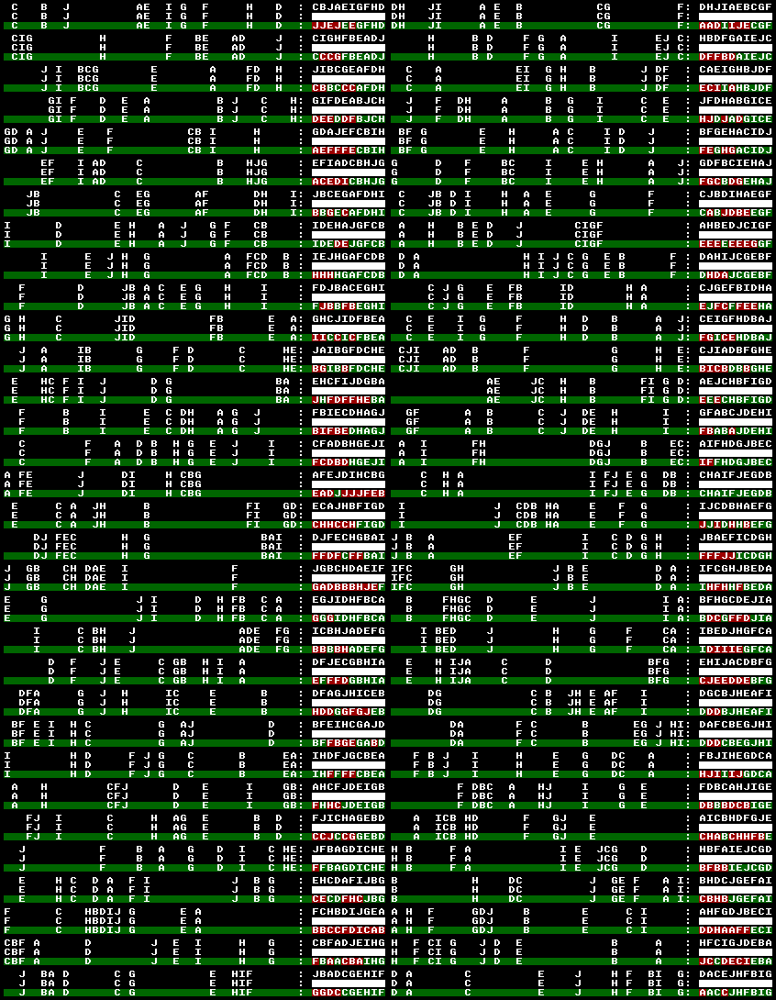
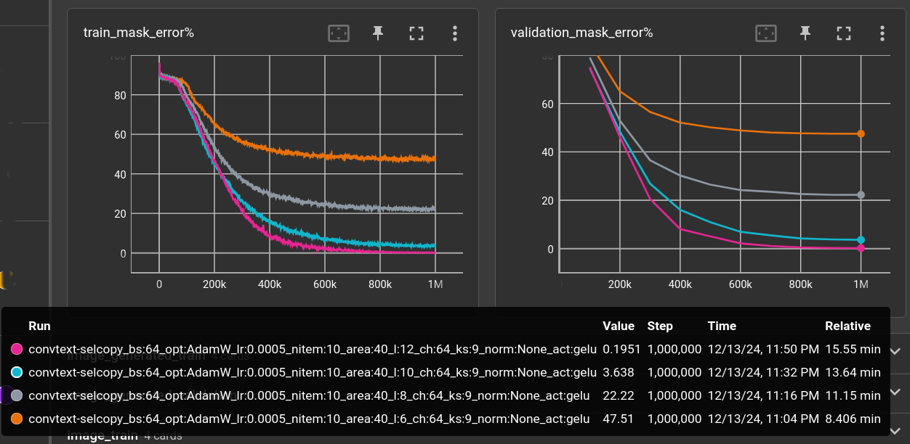
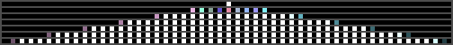
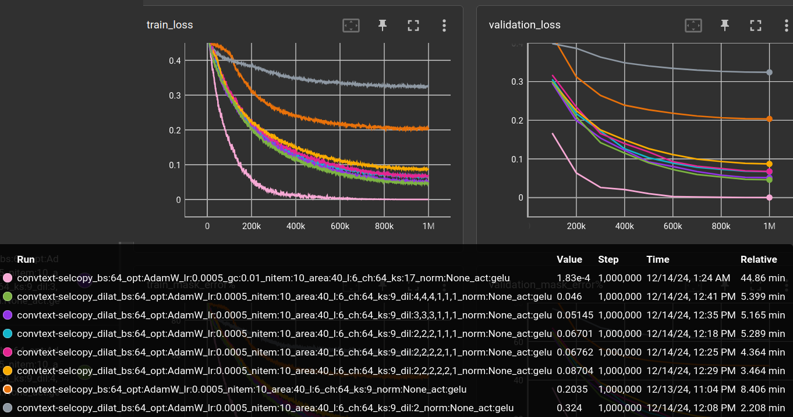
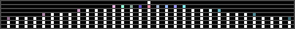

# 2024-12-14 Efficiently solving the Selective Copying Problem with a Very Small Language Model

Recently, i tried to understand the original [Mamba paper](https://arxiv.org/abs/2312.00752).
It's definitely worth reading. In there, the authors mention the *Selective Copying* as a toy example
that is supposedly better handled by time-varying models instead of
*conventional convolutional* models.

I tried the Mamba model, not from the [original authors](https://github.com/state-spaces/mamba),
because i couldn't bring it to run on my current system,
but using [mamba minimal](https://github.com/johnma2006/mamba-minimal/blob/master/model.py).

The readable re-implementation lacks all the (unreadable) speed optimization stuff and is indeed
pretty slow, compared to a simple CNN.
So i quickly switched back to 1D-convolutions for today's experiment and tried to solve the
*Selective Copying* problem with a very very small, fast and general network.

The model has an input-embedding which is fed by raw byte values of texts.
It's nasty regarding UTF-8 when reversing the model's output put keeps
things otherwise simple and easy.

The *Selective Copying* Dataset is the (almost) endless stream of combinations of letters,
arranged in a free space. The task is to pick the letters and concatenate them, e.g.:

    A....D.C..B.. -> ADCB
    C..A....BD... -> CABD

I was previously trying stuff with masking, where parts of a text are hidden and the model learns
to reproduce the parts, so i used this framework for the *Selective Copying* dataset,
which looks like this:

    B..C....A.D.. -> ????

Instead of a `?`, the mask byte value is actually zero. So, the model get's this sequence of
text in and produces the same sequence of text, but the masked bytes replaced by the original
content.

Here's a typical model:

    ConvTextModel(
      (embedding): Embedding(256, 64)
      (layers): ModuleList(
        (0-5): 6 x ConvTextLayer(
          (conv): Conv1d(64, 64, kernel_size=(9,), stride=(1,), padding=(3,))
          (act): GELU(approximate='none')
        )
      )
      (lm_head): Linear(in_features=64, out_features=256, bias=False)
    )

Feed any number (say L) of text bytes into the embedding, pass 64 x L matrices through
the stack of 1D convolutions, which keep the resolution (via padding) and add a residual
short-cut from each layer-input to layer-output. Finally transform the 64-dim *latent space*
into L x 256 class logits for the 256 possible byte values.

Whole thing is trained as usual, with AdamW, lr=0.0005, Cosine Annealing with Warmup,
batch-size 64, cross-entropy loss on the class logits, for 1 million steps.

The dataset is in this experiment places 10 letters in a 40-letter space.
The validation set contains 5000 positions,
which are excluded from the (otherwise almost infinite) training set.

### Comparing number of layers

(experiment done with [experiments/textmask/convtext-selcopy-layers.yml @ b2aaaf43](https://github.com/defgsus/nn-experiments/blob/b2aaaf4323dd0bb70127fa265d942ec292ce53dc/experiments/textmask/convtext-selcopy-layers.yml))

This is again a topic of *receptive fields* in CNNs. With an area of 40, some delimiter and
10 letters for the answer the model has to *see* 50 cells apart. Or in other words,
the convolutional layers need to pass information from one cell to as much as 50 cells
across, to be able to solve the task.

#### 6 layers

The model show above with 6 layers and kernel size 9 can see about 24 cells (6 * floor(9 / 2))
in each direction, which is not enough to solve the puzzle. After 1M steps, the error on
the validation set looks like this:

(It's 64 examples, arranged in two columns. The first row is the original text, the second
row is the masked input to the model and the third row is the model's reproduction,
with green background marking a fit and red marking an error.)

It fails all over the place but predominantly at the beginning of the answer, because
the information needed for it is too far apart.

And yes, increasing the number of layers helps a lot:

The plots show the error percentage (how many letters are wrong) inside the masked area.
Text outside the mask must also be reproduced by the model but is not considered in this plot.

|   nitem |   area |   l |   ch |   ks |  validation loss | model params   |   train time (minutes) | throughput   |
|--------:|-------:|----:|-----:|-----:|-----------------:|:---------------|-----------------------:|:-------------|
|      10 |     40 |   6 |   64 |    9 |         0.203547 | 237,952        |                   8.71 | 1,913/s      |
|      10 |     40 |   8 |   64 |    9 |         0.088512 | 311,808        |                  11.75 | 1,418/s      |
|      10 |     40 |  10 |   64 |    9 |        0.0164525 | 385,664        |                  14.51 | 1,148/s      |
|      10 |     40 |  12 |   64 |    9 |       0.00128227 | 459,520        |                  16.5  | 1,009/s      |

##### 12 layers

The 12-layer network gets down to an error of 0.02%. It can *see* about 48 cells in each direction,
which should be just enough to solve this task.

This is a nice little experiment setup.
The 12-layer model's performance can be viewed as the baseline.  
The 6-layer model performs terrible (47% error) but at least at twice the speed. Can we
somehow get to equal performance with only 6 layers?

### Increasing kernel size

The most obvious thing!

Here's a little demonstration. The first layer is the input and there are 6 layers of the
output of each convolution. Size is 50. With a kernel size of 3, the information can
only travel 6 cells in each direction:

Kernel size of 9 allows information to travel 24 cells in each direction:

But since the beginning of the answer needs information of cells that are more than
40 cells to the left, the network can not learn the task. See how the first cell only
transmits information along those 24 cells:

Indeed, with 12 layers, the first cells transmits roughly to the end of the sequence:

Now, in 2D image recognition, there seems to be a limit at a kernel size of about 7x7
after which performance grows marginal compared to the exponentially increased compute demand
(from a paper i can't remember right now). For this 1D experiment, a kernel size of **17**
in the 6-layer network performs even better than the 12-layer network.

Although, more than 5 times slower:

For some reason, the 15 and 17 kernels are unbearably slow.
Or in other words (maybe because of some nifty specialized Cuda implementations)
up until kernel size 13, the convolutions are blazingly fast.

|   nitem |   area |   l |   ch |   ks |   validation loss | model params   | train time (minutes) | throughput |
|--------:|-------:|----:|-----:|-----:|------------------:|:---------------|---------------------:|:-----------|
|      10 |     40 |   6 |   64 |    9 |          0.203547 | 237,952        |                 8.71 | 1,913/s    |
|      10 |     40 |   6 |   64 |   11 |           0.12667 | 287,104        |                 8.85 | 1,882/s    |
|      10 |     40 |   6 |   64 |   13 |         0.0355833 | 336,256        |                 9.44 | 1,764/s    |
|      10 |     40 |   6 |   64 |   15 |        0.00105004 | 385,408        |                58.02 | 286/s      |
|      10 |     40 |   6 |   64 |   17 |       0.000182635 | 434,560        |                49.15 | 339/s      |

- **Kernel size 13 for 1D-convolutions has some nice properties**.
  It increases the receptive field a lot, while still being fast to compute.
- **After kernel size 13** the computational demand does not justify the increase in performance,
  at least, from my point of view.

### Increasing dilation

*Dilation* is like increasing the kernel size, without actually creating new weights or adding
compution. E.g. this example 3x3 kernel with dilation=2 theoretically becomes:

    1 2 3      1 0 2 0 3 0
    4 5 6  ->  0 0 0 0 0 0
    7 8 9      4 0 5 0 6 0
               0 0 0 0 0 0
               7 0 8 0 9 0
               0 0 0 0 0 0

In fact, the zero-multiplications are skipped and the convolution keeps it's pace.
The only thing that adds a bit of computation is the adjusted padding, to keep the output size
of the convolution the same as the input size. So the convolutions have to
process a bit more data, which is just empty at the borders (zero-padded).

It's comparable to convolutional *stride*. With dilation of 2, the network sees only every 2nd
pixel/cell/state. But different to *stride*, the output resolution is not reduced. And since
the kernel is applied at every position, *essentially* no information is lost.

A dilation of 2 in the 6-layer network has the same receptive field **size** as a 12 layer
network with dilation 1. Of course, it's not as detailed as a true increase of the kernel size:

Okay, let's plug it in and try some naive settings for dilation:

(The 6-layer, 12-layer and 17-kernel networks from above are included for comparison)

|   nitem |   area |   l |   ch |   ks | dilation           |  validation loss | model params   | train time (minutes) | throughput   |
|--------:|-------:|----:|-----:|-----:|:-------------------|-----------------:|:---------------|---------------------:|:-------------|
|      10 |     40 |   6 |   64 |    9 | 2                  |            0.324 | 237,952        |                 1.96 | 8,491/s      |
|      10 |     40 |   6 |   64 |    9 | 1                  |         0.203547 | 237,952        |                 8.71 | 1,913/s      |
|      10 |     40 |   6 |   64 |    9 | [2, 2, 2, 1, 1, 1] |        0.0670086 | 237,952        |                 5.26 | 3,171/s      |
|      10 |     40 |   6 |   64 |    9 | [2, 2, 2, 2, 1, 1] |        0.0676225 | 237,952        |                 4.24 | 3,935/s      |
|      10 |     40 |   6 |   64 |    9 | [2, 2, 2, 2, 2, 1] |        0.0870354 | 237,952        |                 3.28 | 5,085/s      |
|      10 |     40 |   6 |   64 |    9 | [3, 3, 3, 1, 1, 1] |        0.0514503 | 237,952        |                 5.17 | 3,223/s      |
|      10 |     40 |   6 |   64 |    9 | [4, 4, 4, 1, 1, 1] |        0.0460037 | 237,952        |                 5.37 | 3,101/s      |
|      10 |     40 |   6 |   64 |    9 | [5, 5, 5, 1, 1, 1] |         0.042369 | 237,952        |                 5.1  | 3,269/s      |
|      10 |     40 |   6 |   64 |    9 | [6, 6, 6, 1, 1, 1] |        0.0363355 | 237,952        |                 5.28 | 3,158/s      |
|      10 |     40 |  12 |   64 |    9 | 1                  |       0.00128227 | 459,520        |                 16.5 | 1,009/s      |
|      10 |     40 |   6 |   64 |   17 | 1                  |      0.000182635 | 434,560        |                49.15 | 339/s      |

- **Dilation of 2 in all layers decreases performance**. The last layer
  before the linear readout should probably not have a dilation. But note that my
  software/hardware runs it **4 times faster** than dilation 1!
- **Dilation of 2 for first 3 to 5 layers increases performance**. Although, all by the same amount.
  However, since dilation 2 is super fast, 5 layers of dilation=2 runs faster than 3 layers of dilation=2.
- **Dilation of more than 2 for the first 3 layers does only marginally increase performance**

  E.g., here's the dilation=`[6, 6, 6, 1, 1, 1]` case:

  

### Mixing different dilation values

Intuitively, one would think that the same dilation value on each layer creates conditions that
are sub-optimal for evaluating the whole state. E.g. every 2nd cell is the sum of every 2nd cell,
and so on. Here shown with dilation 3:

So lets mix different dilation sizes. For example, here, dilation for each layer is 2, 3, 2, 3, 2, 3:

And voila! Some combinations reach the performance of the 12 layer network
(up to the 3rd digit after the comma), while being super fast.
Even faster than the bad 6 layer baseline!

Again, the baselines are included, also the previous dilation experiments and a
couple of other dilation combinations not shown in the plot:

|   nitem |   area |   l |   ch |   ks | dil                 | validation loss | model params   | train time (minutes) | throughput |
|--------:|-------:|----:|-----:|-----:|:--------------------|----------------:|:---------------|---------------------:|:---------|
|      10 |     40 |   6 |   64 |    9 | 2                   |           0.324 | 237,952        |                 1.96 | 8,491/s  |
|      10 |     40 |   6 |   64 |    9 | 1                   |       0.2035470 | 237,952        |                 8.71 | 1,913/s  |
|      10 |     40 |   6 |   64 |    9 | [2, 2, 2, 2, 2, 1]  |       0.0870354 | 237,952        |                 3.28 | 5,085/s  |
|      10 |     40 |   6 |   64 |    9 | [2, 2, 2, 2, 1, 1]  |       0.0676225 | 237,952        |                 4.24 | 3,935/s  |
|      10 |     40 |   6 |   64 |    9 | [2, 2, 2, 1, 1, 1]  |       0.0670086 | 237,952        |                 5.26 | 3,171/s  |
|      10 |     40 |   6 |   64 |    9 | [3, 3, 3, 1, 1, 1]  |       0.0514503 | 237,952        |                 5.17 | 3,223/s  |
|      10 |     40 |   6 |   64 |    9 | [4, 4, 4, 1, 1, 1]  |       0.0460037 | 237,952        |                 5.37 | 3,101/s  |
|      10 |     40 |   6 |   64 |    9 | [5, 5, 5, 1, 1, 1]  |       0.0423690 | 237,952        |                  5.1 | 3,269/s  |
|      10 |     40 |   6 |   64 |    9 | [6, 6, 6, 1, 1, 1]  |       0.0363355 | 237,952        |                 5.28 | 3,158/s  |
|      10 |     40 |   6 |   64 |    9 | [2, 4, 6, 3, 5, 1]  |       0.0323526 | 237,952        |                 3.26 | 5,116/s  |
|      10 |     40 |   6 |   64 |    9 | [2, 6, 4, 5, 3, 1]  |       0.0212173 | 237,952        |                 3.07 | 5,428/s  |
|      10 |     40 |   6 |   64 |    9 | [3, 5, 7, 9, 11, 1] |       0.0096797 | 237,952        |                 3.08 | 5,407/s  |
|      10 |     40 |   6 |   64 |    9 | [5, 4, 3, 2, 1, 1]  |       0.0066358 | 237,952        |                  4.2 | 3,967/s  |
|      10 |     40 |   6 |   64 |    9 | [2, 3, 4, 5, 1, 1]  |       0.0021815 | 237,952        |                 4.35 | 3,828/s  |
|      10 |     40 |   6 |   64 |    9 | [2, 3, 4, 5, 6, 1]  |       0.0015734 | 237,952        |                 3.15 | 5,292/s  |
|      10 |     40 |  12 |   64 |    9 | 1                   |       0.0012822 | 459,520        |                 16.5 | 1,009/s  |
|      10 |     40 |   6 |   64 |    9 | [1, 2, 3, 4, 5, 1]  |       0.0002703 | 237,952        |                 4.03 | 4,137/s  |
|      10 |     40 |   6 |   64 |   17 | 1                   |       0.0001826 | 434,560        |                49.15 | 339/s    |

- **Larger dilation in later layers works better** than larger dilation in earlier layers.
- **The top 6 layer network beats the 12-layer network in validation loss**. Although it
  has a slightly worse validation error of 0.03% instead of 0.02%. Still fine for me ;)
  It's **4 times faster** than the 12-layer, 2 times faster than the original 6-layer with
  dilation 1 and 10 times faster than the 17-kernel version.

Pretty fine! Just imagine! You're setting up a LARGE experiment for your institution,
which will be using **400 years of GPU-time** during the next month (160,000 Watt-years)
and you could maybe have used a simple CNN with dilation instead of the quadratic
**Attention** and save 350 GPU-years!

I mean, really! A growing number of people is gaining, through their companies, access to LARGE
amounts of GPU time and presumably, a good part of it is wasted.

Anyways. Feels like there is not much more to gain with this particular dataset. I just *assume*,
that the 12-layer network is able to do more complicated computations, but they
are not required for the vanilla *Selective Copying* problem.

Continue reading at ["Very Selective Copying"](selcopy2.md)
