# Generating wang tile sets with CLIP

*Tile sets* in computer games are images containing a number of graphics that fit together at certain edges. 
With these one can draw nice minimal game maps and backgrounds. It would be awesome to create those via text prompts,
and i've been trying just long enough...

This is in the making since a couple of years. I played with the OpenAI CLIP model **a lot** and 
here's a few findings of how to create tilesets.

### 1. Use *Robust CLIP*

*Robust CLIP: Unsupervised Adversarial Fine-Tuning of Vision Embeddings for Robust Large Vision-Language Models,
Christian Schlarmann, Naman Deep Singh, Francesco Croce, Matthias Hein* ([arxiv:2402.12336](https://arxiv.org/abs/2402.12336))

(Thanks to [realfolkcode](https://github.com/realfolkcode) for pointing me there!)

To recapitulate quickly: CLIP (**C**ontrastive **L**anguage/**I**mage **P**reprocessing) is a framework to train an 
image encoder and a text encoder to output a similar stream of numbers (an encoding) for similar images and/or texts, and, of course, 
a dissimilar stream of numbers for dissimilar images and/or texts. The stream of numbers as such is not that important.
Important is, how close or far different encodings are. 

A trained model can immediately be used to search for images using a text prompt or a reference image. 
But it can also be used to change an image (e.g. noise) 
to match a certain text prompt or other image. This does not create images in the quality of Stable Diffusion but, in comparison, 
the process is very easy to control. One can use any specific initial conditions, apply a few steps of CLIP prompt-matching, 
make some adjustments, apply some transformations and a few more CLIP steps. All in the actual image space. It's much like kneading.

The original [OpenAI CLIP](https://arxiv.org/abs/2103.00020) model was trained on 200 million image/text pairs, 
if i remember that right, which was never heard of at the time. 
They released the model code and the weights, because, i guess, they thought it can not be used for evil circumstances. However,
the enormous dataset was kept closed but the paper explained pretty detailed, how it was created. 

Soon after, [LAION](https://laion.ai/) took the effort of creating similar datasets of image/text pairs and released it.
The largest of it containg 5 billion image/text pairs!
The [Open CLIP](https://github.com/mlfoundations/open_clip) project reimplemented the model **and** the training code
and researchers with access to a cluster of expensive GPUS trained and released new models.

In the following, i use the Robust CLIP model [chs20/FARE4-ViT-B-32-laion2B-s34B-b79K](https://huggingface.co/chs20/FARE4-ViT-B-32-laion2B-s34B-b79K), released on huggingface. As the name suggests, it was initially trained on 2 billion LAION image/text pairs
and then *adversarially fine-tuned* on the ImageNet dataset.

This fine-tuning makes the model much more usable to **create** images.  
Compare these renderings, 1000 steps each, run on a simple gray head template, with prompt: "the face of h.p. lovecraft"


OpenAI CLIP is left, Robust CLIP on the right.
They both do not really look like a photo of Lovecraft and the usual CLIP generation issues, like duplicate mouths and such,
are visible but robust CLIP produces much more pronounced renderings and less indefinite color gradients in general. 

### 2. Know your tiling

You need to have a convenient way of a) defining a tilesets, b) rendering the tile templates and c) rendering random maps.

I certainly recommend this resource **cr31.co.uk**, which is now gone but fortunately mirrored at
[boristhebrave.com](https://www.boristhebrave.com/permanent/24/06/cr31/stagecast/wang/intro.html)

There is ongoing research about optimal packings of larger tile sets. For the **edge-and-corner-tiles** shown below, i used
a variant released by user [caeles](https://opengameart.org/users/caeles) on opengameart.org

When `B`, `BL`, `BR` aso. are constants with exclusive bits, you can use this definition to represent the tileset:
```python
EDGE_AND_CORNER_TILESET = [
    [B|BL|BR|L|R|T|TL|TR, B|BL|BR|L|T|TL|TR, BL|T|TL|TR, T|TL|TR, BR|T|TL|TR, BL|BR|R|T|TL|TR, B|BL|BR|L|R|T|TL|TR],
    [BL|BR|L|R|T|TL|TR, BL|BR|L|T|TL|TR, BL|BR|TL, BL, BR|R|TR, BL|BR|L|TL|TR, B|BL|BR|R|T|TL|TR],
    [BL|L|TL|TR, BR|TL|TR, BL|BR|TL|TR, B|BL|BR|TL, BL|TR, TL|TR, BR|R|T|TL|TR],
    [BL|L|TL, TR, BR|R|TL|TR, BL|L|T|TL|TR, TL, BR, BL|BR|R|TR],
    [BL|BR|L|TL, B|BL|BR, BL|BR|TR, BL|TL, 0, BR|TR, BL|BR|R|TL|TR],
    [B|BL|BR|L|TL|TR, BL|BR|T|TL|TR, BL|TL|TR, BR|TL, BL|BR, B|BL|BR|R|TR, BL|BR|L|R|TL|TR],
    [B|BL|BR|L|R|T|TL|TR, B|BL|BR|L|R|TL|TR, B|BL|BR|L|TL, B|BL|BR|TR, B|BL|BR|TL|TR, B|BL|BR|T|TL|TR, B|BL|BR|R|TL|TR],
]
```

To just run experiments without immediately falling back to using a painting application, let's have a little framework to 
render tile templates. They are useful for testing and as *suggestions* to the image generation pipeline.

Thanks to the articles by [iQ](https://iquilezles.org/articles/), every graphics programmer knows
about *Signed Distance Functions* (SDF). The implicit distance-based representation 
makes it easy to render smooth masks, boundaries or normal-maps for lighting. Just add some boxes and circles at the right places
and each possible tile template can be rendered without much effort.


A random map generator can compare the edges and corner settings of adjacent tiles, and generate endless, seemless random maps:


(The small image you can download and use as a tileset template. It's 7x7 tiles with 16x16 pixels each)

Playing with the objects used on the edges and corners creates quite versatile templates:

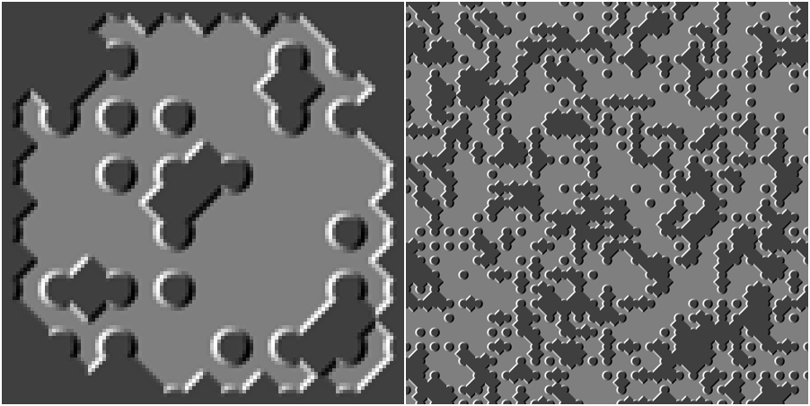

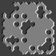

These endless random maps can then be fed into CLIP, and the gradient of the target error passes back to the tileset image.

I make this all look simple to boost your motivation. There are a couple of details that require fiddling with the values.
You can read more about it [here](https://defgsus.github.io/clipig/).

Starting from random noise with the prompt "rpg tile map", the algorithm yielded:


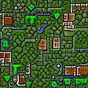

It's nice and smooth and tileable. But it's also pretty chaotic. 
Using the spiky lighting template from above as source (instead of noise) creates a tileset that better follows the inside/outside 
logic of the tiling:

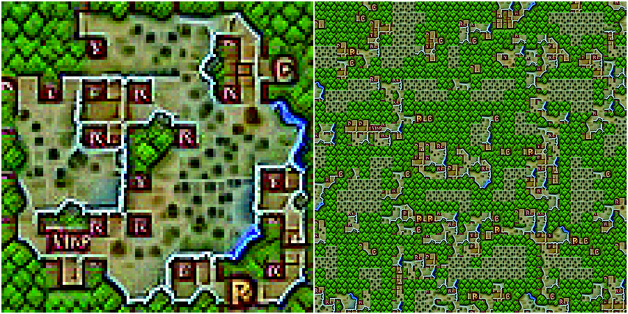


And to gain further control over the image generation, one can use a soft or hard mask to apply different prompts at
the inside and outside of the tiling. (The masking is described in more detail [here](https://github.com/BorisTheBrave/resynth-tiles/issues/3#issuecomment-3317364256))

In this case "desert wasteland" and "top-down view of an ancient castle":

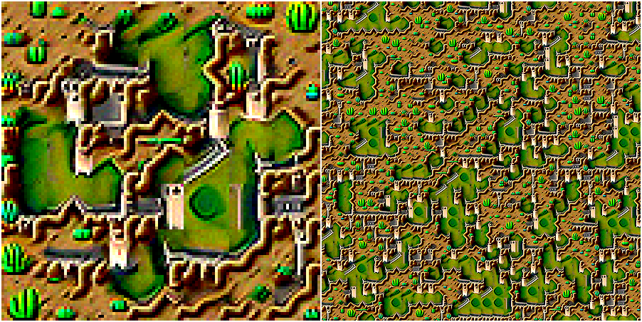


So, below are some cherry-picked generated tilesets for viewing pleasure. I experimented with different prompts, 
different masking strategies and different optimizers, learnrates, batch-sizes and transformations... There's a lot of parameters
to tweak.

Cthulhu's labyrinth:

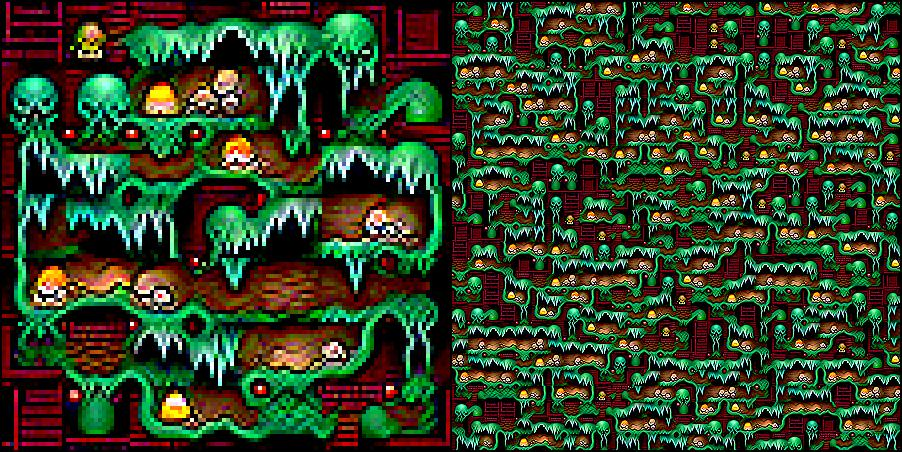


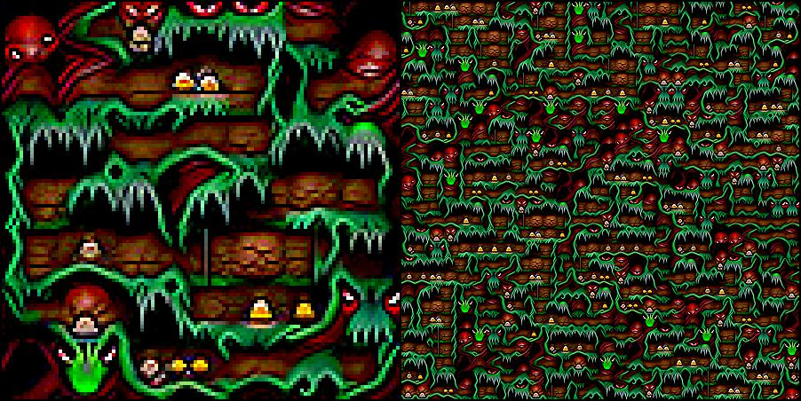


Cthulhu's dungeon:


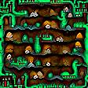

Cthulhu's oil platform:

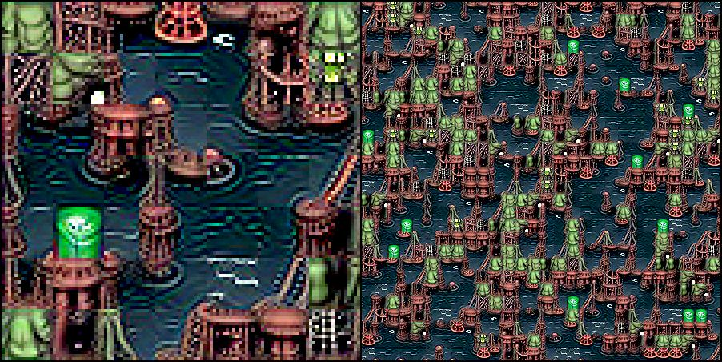


Cthulhu's funky temple:


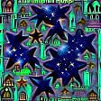

Forest and desert:

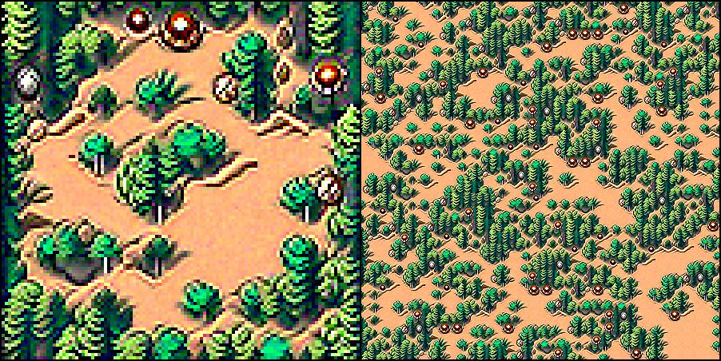


Jungle and sandy path:

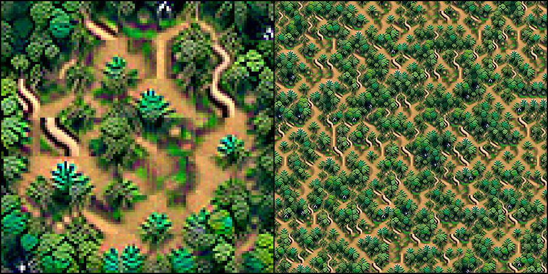


Dystopian city and wasteland:

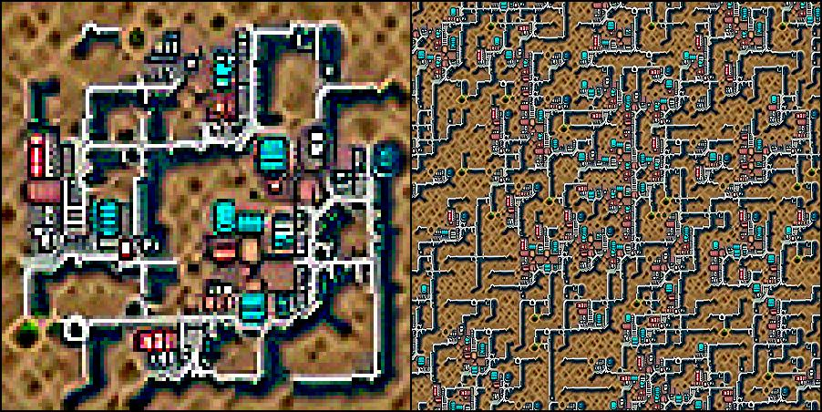


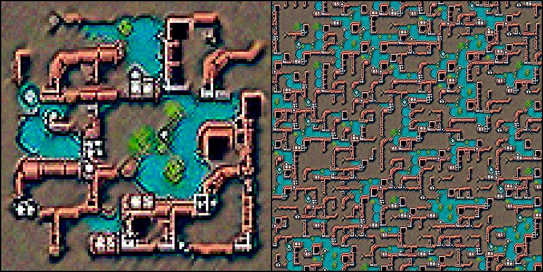

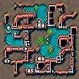


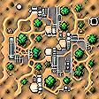


Here i spent some extra effort to render a nice template with the SDF functions, Mixing grass, dirt and water colors,
adding some perlin noise and some nice lighting:

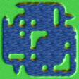

Then using the prompts "grassy meadow, pixelart" and "wavy water, pixelart" for outside and inside:


We can also use existing images as targets for CLIP. Here's one tileset that targets a famous printing by M.C. Escher:

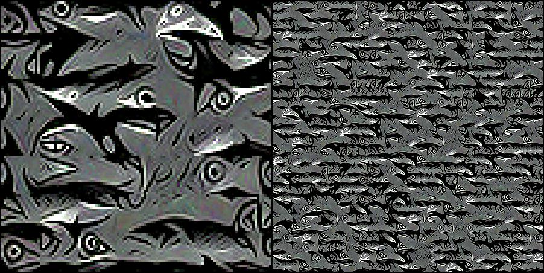


Image of corals:

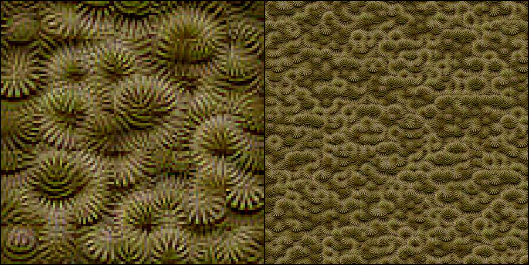


Image of a brain:


Image of Mulder and Scully from the X-Files:

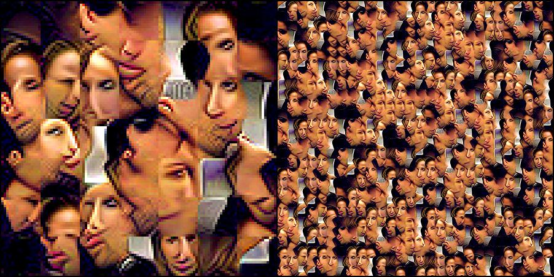


Why do they stick there tounges out? Well, the source image is a bit special. Don't know where i got this from:


There are images on the net that show more of Gillian Anderson's skin:

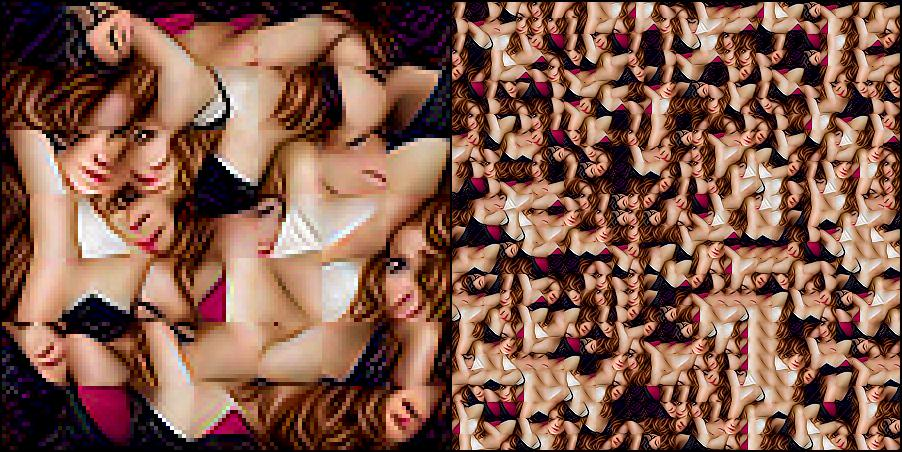


Police brutality can be a source, too:

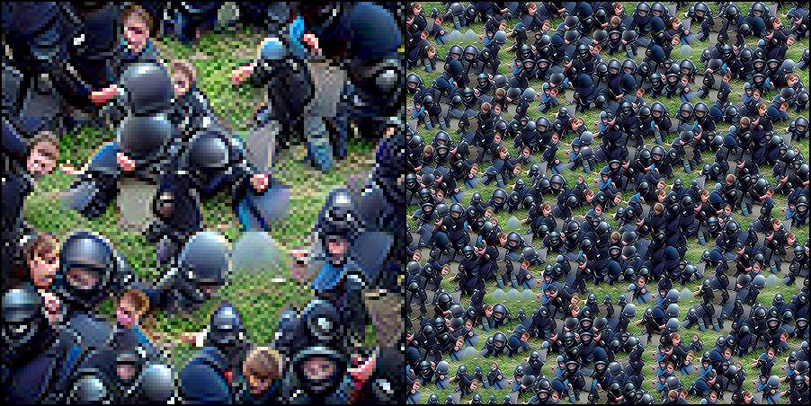

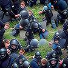

Or long dead soldiers at their duty:


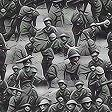

The target prompts and images can be differently weighted (by multiplying the cosine distance of the CLIP embeddings by a factor).

Below are different mixes of this target image:


and the prompt "cthulhu's labyrinth, pixelart".

No masking was applied and both the text prompt feature and the target image feature are applied
at the same time with different weights


image 1.0 / prompt 0.0

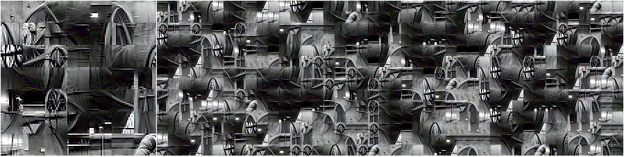


image 1.0 / prompt 0.5

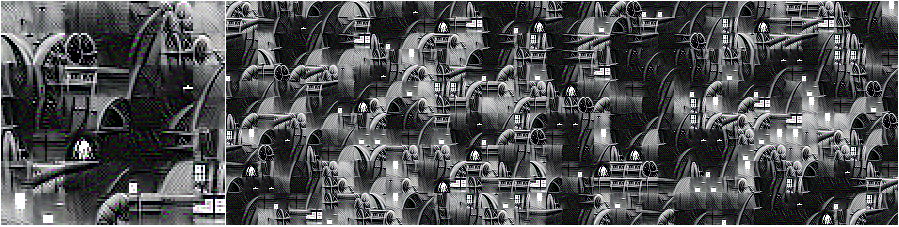


image 1.0 / prompt 1.0


image 0.7 / prompt 1.0

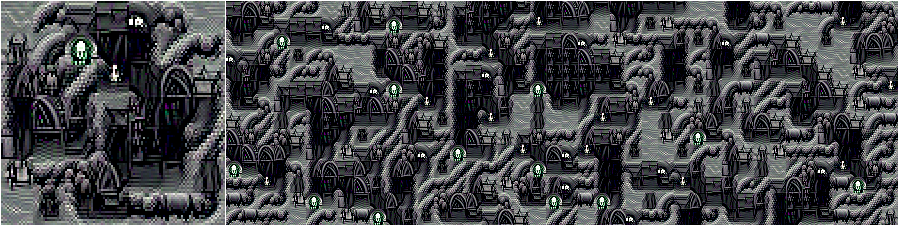


image 0.4 / prompt 1.0


image 0.37 / prompt 1.0


image 0.36 / prompt 1.0


image 0.35 / prompt 1.0

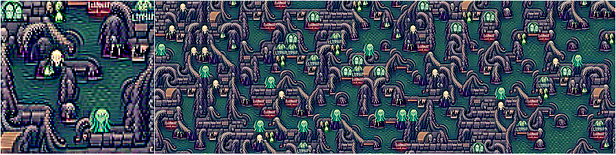


image 0.3 / prompt 1.0


image 0.2 / prompt 1.0

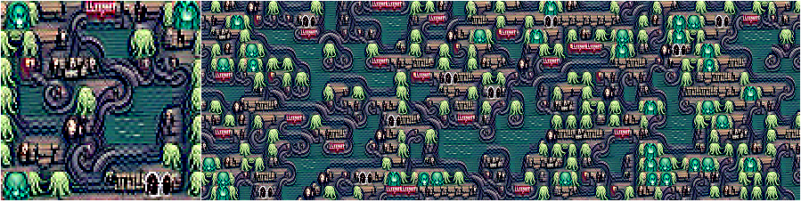


image 0.1 / prompt 1.0


image 0.0 / prompt 1.0


Image prompts are usually much stronger then text prompts. Using only image prompts, the tiling generally gets
less seamless. I think this is because CLIP wants to reproduce a particular spatial image composition but is only
seeing random tile-maps and cares less for smooth transitions of the particular tile edges but more for
the target image features. While text prompts often do not imply a particular spatial composition and 
CLIP can care more for correct tile transitions.

Mixing the prompt "fir trees on the hillside" with this target image

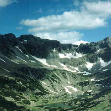

yields this quite astonishing tilest

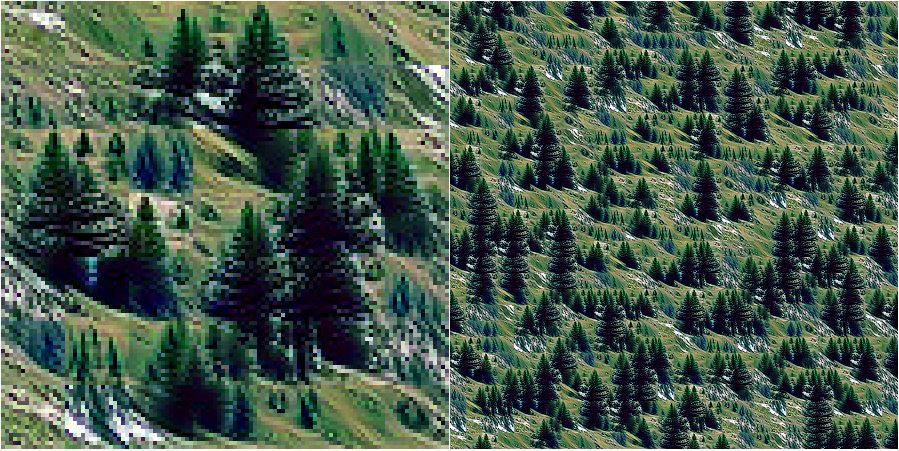


The above is created with the **RMSprop** optimizer and below with **AdamW**.

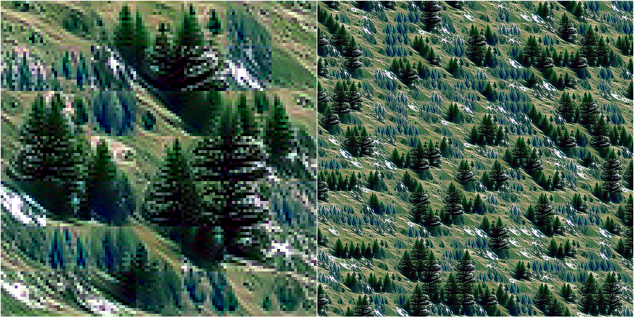


Both optimizers are fun to play with. And it's really hypnotic to watch a template gradually grow into a
CLIP-generated tileset. With **RMSprop** in particular, CLIP, over time, shifts attention from one set of objects 
to the next and it's hard to resist watching the process for minutes and minutes..

I did all the graphics with "CLIPig 2", found [here](https://github.com/defgsus/nn-experiments/?tab=readme-ov-file#clipig-2).
It's a Qt application, no scripting or coding required, but it's yet buggy and without documentation.

Integrating something like this as a GIMP plugin or directly into the [Tiled map editor](https://github.com/mapeditor/tiled)
would be really cool.

