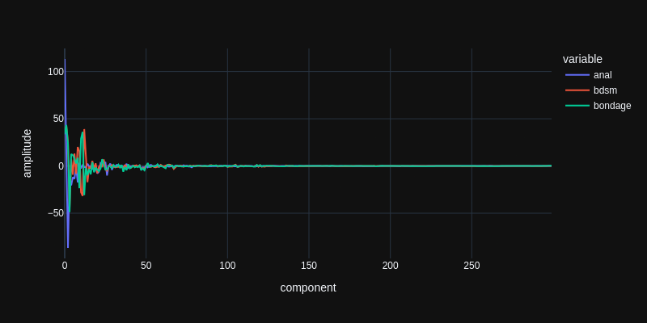

# Interest aggregation

This post might contain off-putting things, for two reasons: Firstly, it is investigating methods of user data aggregation, which can be an offending topic in itself and secondly, it investigates the interests of porn website users. For educational purposes only.

The data has been politely scraped over a couple of days from a free website that hosts images/videos, blogs and public user profiles. For this post i just looked at the "interests", which are zero or more words or groups of words, that each user can specify, to be found more easily on the profile search page, or to simply state the obvious. 

The data published in this blog post does not contain any direct user relations. Instead it is a point-cloud of interests, gathered by looking at patterns in about 116K profiles. Now dive into the realms of this little porn community or read the technical details below.

<noscript>

Enable javascript to browse through the different interests.
<a href="{{html.js[-1]}}">The script</a> fetches the json data from the static github page and manages the UI, nothing more.

</noscript>

    <input class="interest-graph-ui-input" value="love"/>
    <select class="interest-graph-ui-select"></select>
    <select class="interest-graph-ui-num"></select>
    

    <pre class="interest-graph-ui-info"></pre>

I do not usually scrape user profiles but this data is genuinely interesting. The particular website attracts and promotes all kinds of [kinkiness](#w=kinky) and [perversions](#w=perversion) as long as it's legal content. It's a safe place for people to freely admit they require [small penis humiliation](#w=small%20penis%20humiliation), [cum on food](#w=cum%20on%20food), [cock milking](#w=cock%20milking) and [showing off](#w=showing%20off) in general. And i wondered if i could produce a map of internet porn sexual interests.

## Graph/Network representation

Those interest strings are case-sensitive in the search page, i guess because in porn language, ANAL means something different than just anal. I lower-cased all strings, fixed a few encoding errors but otherwise left them as they are. [girl](#w=girl) is not [girls](#w=girls) and [mother/son](#w=mother/son) is not the same as [mother son](#w=mother%20son). The site only lists the first 5 pages for any search result and then repeats, which, i think, is a fair thing to do. I got about 147K profiles at all but included only the ones with at least 5 listed interests. That's still 116K profiles which create a graph of 137K interests and 3.2M interconnections - links between one interest and another.

It turned out that, as graph representation, this data is quite unusable because of the overwhelming number of interconnections. The 30 most often listed interests already have like 600 connections between each other. I tried a few graph/network programs and they would stop reacting within acceptable amounts of time when loading networks with a thousand interests. Not to mention that the layouting algorithms, just by looking at interconnectedness - even weighted, do not have much chance to find a visual arrangement that really helps to understand the interest topology. [anal](#w=anal) is used 23 thousand times and is connected 230 thousands times with almost every other major interest. To visualize a network, you actually need to exclude anal, bdsm and a few others. I also
filtered out edges by some criteria, just to be able to look at the rest of the network more conveniently.

You can download the file [interest-graph.json](interest-graph.json) and check it yourself. It has the list of interests in `vertices` and the list of connections in `edges`, each as `[index1, index2, count]`.
Note that there is nothing of the users left in this representation, except the sum of how often each interest
has been proclaimed together. You can sort the interests above by the [number of edges](#f=edge%20count) with your query interest but it's kind of boring. The top interests are spread everywhere. 

## Feature vector representation

There is a much richer approach. We can try to model some kind of user groups from the shared interests. First build a table like this:

|      | user0 | user1 | ... | userX |
|------|------:|------:|----:|------:|
| anal |     1 |     0 |   1 |     0 |
| bdsm |     0 |     0 |   1 |     1 |
| ...  |     1 |     1 |   0 |     0 |

Then fit a [Principal component analysis](https://en.wikipedia.org/wiki/Principal_component_analysis) (PCA) to the data. It will *squeeze* the vector of a 100K users into something smaller, say 300, while preserving a high 
explainability of the variances of the data. I used the [sklearn IncrementalPCA](https://scikit-learn.org/stable/modules/generated/sklearn.decomposition.IncrementalPCA.html) with a batch size of 300 and
constructed above table only for 300 interests at each step. Otherwise, you'd need a ton of RAM. 

The *components* of the PCA, after fitting, each represent, in decreasing order of variance explanation, an aspect or trade of a user group. The interests processed by the fitted PCA look like:

|      | component0 | component1 |       ... | component299 |
|-----:|-----------:|-----------:|----------:|-------------:|
| anal |    113.367 |    15.9827 |  -86.7374 |     -11.2764 |
| bdsm |    35.8675 |    42.4413 |   25.5585 |     -44.4781 | 
|  ... |    33.5606 |    43.3588 |   23.8518 |     -48.7887 |

This is an acceptable amount of data to process further, while preserving a high amount of the user associations.
To limit the size of the json data in this article, i only included interests that are stated at least 30 times, which are about 3 thousand.

To conceptually grasp the meaning of this compressed representation, here is a plot of the PCA features of the top-3 interests:

As mentioned above, the components are sorted by variance explanation. The first component explains the most variance
in the data. So the mean amplitude decreases from left to right in this plot. Here is a zoomed-in version as a bar plot:

We do not yet know what the components actually represent but we can see that each interest is mapped to a unique mixture of these components. For example, the amplitudes of components 10 and 11 are positive for 'bondage' and negative for 'bdsm' and then it flips in component 12. They are mutually exclusive, although bdsm and bondage are quite related interests. These components seem to explain different streams of interests within the general bondage group. 'anal' just has a small amplitude in these components so it's not about that. Probably both sub-group users like 'anal', like 23 thousand others.

To calculate these per-interest feature-vectors, the PCA is generating a user-sized vector for each component during training. Those are amplitudes of relations between each component and each user:

|            |       user0 |        user1 |          ... |        userX |
|-----------:|------------:|-------------:|-------------:|-------------:|
| component0 |  0.00208772 |   0.00158501 |   0.00215929 |   0.00246174 |
| component1 | -0.00518107 |   0.00306462 |  -0.00334413 |  -0.00128104 |
| component2 |  0.00365257 |    0.0017839 |   0.00269069 | -0.000469027 |
|        ... | -0.00235109 |   -0.0026599 | -0.000812727 |  -0.00101272 |

To calculate the amplitude of, e.g., component 10 for the interest 'friends', we create a vector of zeros or ones for each user, putting a one wherever the user has listed `friends` as interest and then calculate the dot-product of this vector and the component vector, which yields a single number; the amplitude of that component for the specified interest. There is also some mean-shifting and everything is done in big matrix operations but that's not relevant for understanding the concept.

As long as we have the internal PCA vectors available, we can map back and forth between interests and users. As an example, we can look at what users are weighted strongest (positively and negatively) by component 10.

| user                      | component10 user weight | this user's interests                                                                                                                                                                                              |
|:--------------------------|------------------------:|:-------------------------------------------------------------------------------------------------------------------------------------------------------------------------------------------------------------------|
| user with largest weight  |                 0.01943 | anal, big tits, bisexuals, blindfolds, blondes, blowjobs, bondage, brunettes, cock sucking, crossdressers, cum swapping, dildos, fucking, heels and nylons, incest, milfs, pussy licking, redheads, shemales, teen |
| user with smallest weight |              -0.0150111 | anal, bareback, bdsm, celebs, creampies, exposure, gangbang, girl girl, groupsex, humiliation, many more, mature, milf, objects, orgies, pee, public, teens, upskirts, voyeur                                      |

It kind of gives a hint of what this component 10 is about. Similarly we can look at the interests which have the highest or lowest amount of component 10 in their feature vectors.

| interest    | component10 amplitude |
|:------------|----------------------:|
| blondes     |               30.2440 |
| bondage     |               28.8093 |
| big tits    |               25.7385 |
| incest      |               24.9466 |
| bbw         |               21.9456 |
| brunettes   |               13.1667 |
| redheads    |               12.9880 |
| teen        |               10.1557 |
| hentai      |                8.0140 |
| sissy       |                6.2025 |
| ...         |                   ... |
| feet        |               -5.0564 |
| milf        |               -5.7055 |
| ass         |               -6.3644 |
| cuckold     |               -9.0044 |
| humiliation |               -9.5930 |
| voyeur      |               -9.8583 |
| mature      |              -20.1629 |
| amateur     |              -22.3208 |
| bdsm        |              -27.7976 |
| teens       |              -34.5868 |

Blondes and teens are completely opposite interests in this particular component. The mixture of 300 components should give us a quite diverse map of interest territories. 

So, we have moved from comparing interests by their number of connections to comparing interests by their similarity in some *latent feature space*. There are many methods to create latent features, including all kinds of neural networks. The classic PCA is a very powerful and efficient method to get started.

A recommendation system can now suggest similar interests by calculating a single number from two feature vectors, e.g., the euclidean distance. Below is a comparison for the top-50 interests. It shows the closest interests in terms of used-together and in terms of distance-of-feature-vectors.     

| interest      | closest by edge-count |  closest by pca feature distance |
|:--------------|----------------------:|---------------------------------:|
| anal          |          oral (3367x) |                    oral (146.35) |
| bdsm          |       bondage (2982x) |                whipping (101.46) |
| bondage       |          bdsm (2982x) |                     gags (98.50) |
| mature        |           bbw (2676x) |                   granny (99.20) |
| teens         |          anal (2135x) |              schoolgirls (98.72) |
| cum           |          anal (3278x) |                    balls (96.04) |
| incest        |          anal (1952x) |                   mother (92.72) |
| bbw           |        mature (2676x) |                    ssbbw (90.58) |
| teen          |          anal (2083x) |                     girl (91.64) |
| milf          |        mature (2676x) |                   cougar (88.64) |
| ass           |          anal (2643x) |                     butt (87.11) |
| humiliation   |          bdsm (1959x) |              degradation (84.04) |
| femdom        |   humiliation (1789x) |                forced bi (82.71) |
| cuckold       |           bbc (1687x) |                forced bi (84.05) |
| blondes       |     brunettes (1898x) |                brunettes (83.65) |
| amateur       |          anal (1678x) |               girlfriend (83.63) |
| sissy         |          anal (1895x) |                   faggot (81.32) |
| pussy         |          anal (2067x) |                     cunt (80.86) |
| big tits      |          anal (1542x) |                big asses (79.67) |
| interracial   |           bbc (1936x) |           big black cock (79.67) |
| bbc           |   interracial (1936x) |                      bwc (76.62) |
| feet          |          anal (1459x) |                     toes (76.00) |
| panties       |          anal (1171x) |                     bras (75.29) |
| oral          |          anal (3367x) |                  vaginal (75.03) |
| gangbang      |          anal (2048x) |                 blowbang (72.74) |
| lingerie      |     stockings (1216x) |                     bras (71.40) |
| shemale       |          anal (1700x) |               transexual (69.90) |
| asian         |          anal (1154x) |                     thai (68.65) |
| creampie      |          anal (1746x) |                       ao (69.58) |
| stockings     |     pantyhose (1521x) |                  corsets (67.74) |
| milfs         |         teens (1255x) |                    gilfs (64.11) |
| piss          |          anal (1503x) |                     shit (64.46) |
| crossdressing |         sissy (1484x) |             transvestite (65.55) |
| young         |          teen (1450x) |                     tiny (64.51) |
| hairy         |        mature (1426x) |                  armpits (64.61) |
| voyeur        |       amateur (1078x) |                      spy (62.96) |
| pantyhose     |     stockings (1521x) |                   tights (63.07) |
| redheads      |       blondes (1455x) |                 freckles (62.49) |
| sex           |          anal (1052x) |                     fuck (63.37) |
| captions      |         incest (854x) |                     gifs (62.85) |
| shemales      |          anal (1127x) |                 trannies (62.35) |
| cock          |           cum (1578x) |                    balls (61.41) |
| tits          |           ass (1404x) |                     cunt (62.45) |
| bukkake       |          anal (1283x) |                   gokkun (60.44) |
| hentai        |           anal (915x) |                     futa (61.34) |
| lesbian       |          anal (1112x) |                   lezdom (61.28) |
| masturbation  |          anal (1015x) |                fingering (61.17) |
| blowjob       |          anal (1625x) |                   rimjob (60.69) |
| chubby        |           bbw (1686x) |                    plump (59.35) |
| latex         |       bondage (1152x) |                      pvc (55.20) |

Only, we can't easily look at it without 300-dimensional vision or understanding capacity.  