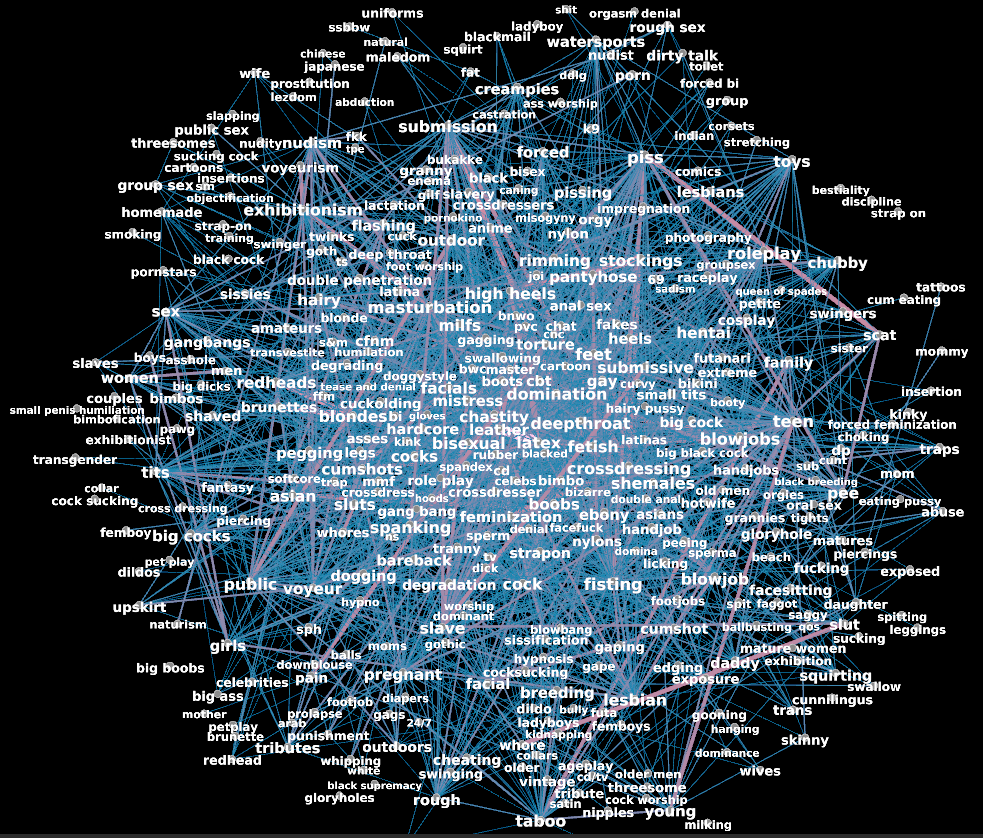
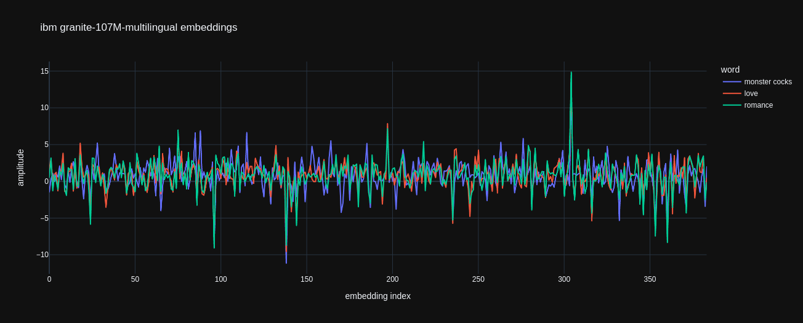
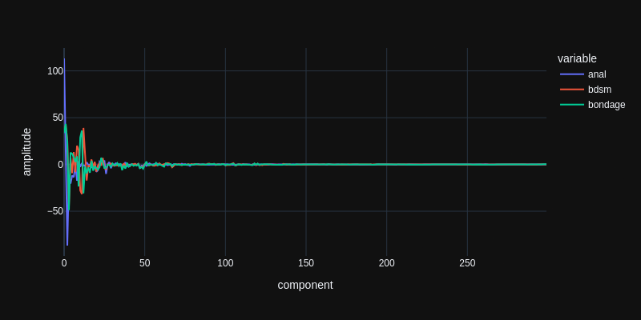
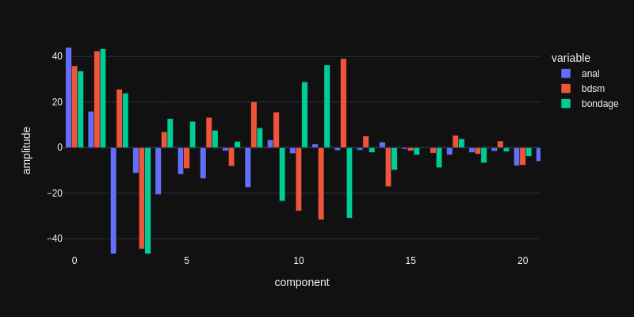
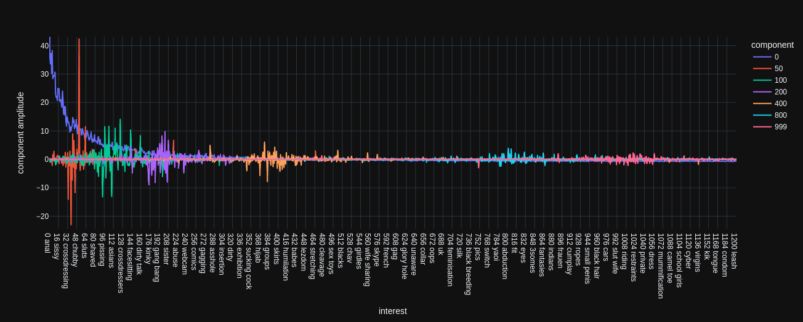
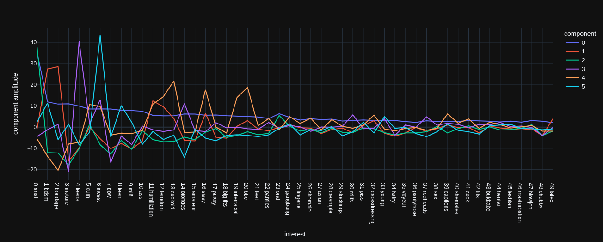
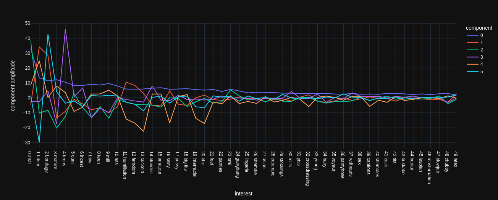
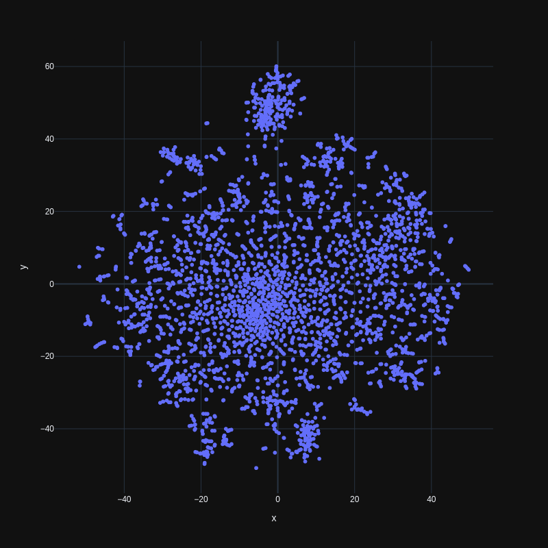

# Interest aggregation

This post might contain off-putting things, for two reasons: Firstly, it is investigating methods of user data aggregation, which can be an offending topic in itself and secondly, it investigates the interests of porn website users. For educational purposes only.

The data has been politely scraped over a couple of days from a free website that hosts images/videos, blogs and public user profiles. For this post i just looked at the "interests", which are zero or more words or groups of words, that each user can specify, to be found more easily on the profile search page, or to simply state the obvious.

The data[[[start
You can download the file [interest-graph.json](interest-graph.json) it contains some 2D-maps of interests and all the edges between interests that have been used together. The format:
```
{
    # all "interests" sorted by most-used first
    "vertices": ["anal", "bdsm", ...],
    # all connections of "interests" [index1, index2, count]
    "edges": [[0,23,3367], [0,5,3278], ...],
    # number of times each "interest" was used
    "vertex_counts": [22339, 10737, ...],
    # list of 2D-maps
    "vertex_positions": [
        {
            "name": "pca1000-tsne2",
            # list of xy positions
            "data": [[1.1901,-0.9366], [-0.5495,6.2871], ...]
        },
        ...
    }
}
```
The file has been rendered with [scripts/build_word_relations.py](../../../scripts/build_word_relations.py). You can have a look but it requires the scraped profiles data, of course.
end]]] published in this article does not contain any user data. Instead it is a point-cloud of interests, gathered by looking at patterns in about 116K profiles. Now dive into the realms of this little porn community with the *Interest Similarity Search*[[[start 
If you are worried that what you click and type will be transmitted to *'other parties'*, well.. I did not put anything like that into the javascript (<a href="{{url}}" target="_blank">{{file}}</a> ).

That does not mean that your browser can be trusted to keep your web behaviour private. That's not how things are nowadays. end]]] and read the technical details below.[[[start 
Haha, sorry. I'm over-using those newly implemented foot notes that work without javascript (thanks to [Tyler Vigen](https://www.tylervigen.com/spurious-correlations) for bringing it to my attention). 

However, this post is not so much a numerical log with endless technical terms and abbreviations like others in this blog. I assumed a more general audience and describe things in more detail.

In fact this article is more suited for my data blog [defgsus.github.io/blog/](https://defgsus.github.io/blog/) but i just realized that i never want to use the [Jekyll](https://github.com/jekyll/jekyll) static site renderer ever again. I tried it back then because it was the '*github*' thing to do but today i rather develop something myself. Which i did right here! So let's go on with this article and don't think about migrating the data blog at some point in distant time...

And yes! I tried to implement recursive integrated js-free foot notes but it's a bit complicated.. end]]]

## Interest Similarity Search

<div>
<noscript><hr><p>
Enable javascript to browse through the different interests.
<a href="{{ html.js[-1] }}">The script</a> fetches the json data from the static github page and manages the UI, nothing more.
</p><hr></noscript>
<div id="interest-graph-ui" hidden="hidden">
    <input class="interest-graph-ui-input" value="love"/>
    <select class="interest-graph-ui-select"></select>
    <select class="interest-graph-ui-num"></select>
    <div class="flex wrap reverse-when-small" style="margin-top: 1rem;">
        <div class="interest-graph-ui-result"></div>
        <div>&nbsp;</div>
        <div class="interest-graph-ui-map"></div>
    </div>
    <pre class="interest-graph-ui-info"></pre>
    <hr/>
</div>
</div>

## Data source

I do not usually scrape user profiles but this data is genuinely interesting. The particular website attracts and promotes all kinds of [kinkiness](#w=kinky) and [perversions](#w=perversion) as long as it looks like legal content. It's a safe place for people to freely admit they require [small penis humiliation](#w=small%20penis%20humiliation), [cum on food](#w=cum%20on%20food), [cock milking](#w=cock%20milking) or [financial domination](#w=financial%20domination). And i wondered if i could produce a map of sexual interests.

Those interest strings are case-sensitive in the search page, i guess because in porn language, ANAL means something different than just anal. I lower-cased all strings but otherwise left them as they are.[[[start I also left the encoding errors as they are because i found it hard to fix. For german phrases like [Ärsche](#w=ã„rsche) or [Füße](#w=fã¼ãÿe), it seems like utf8 encoding was latin1-decoded. Reversing that error via `encode("latin1").decode("utf8")` works for stuff that fits into latin1 but there is also a bit of chinese and smileys and other non-latin1 things so i just left everything as it is. end]]] [girl](#w=girl) is not [girls](#w=girls) and [mother/son](#w=mother/son) is not the same as [mother son](#w=mother%20son). The site only lists the first 5 pages for any search result and then repeats, which, i think, is a fair thing to do.[[[start It's actually quite funny how it just repeats the same page. That's how you quick-fix things permanently in the shady areas of the web. end]]] I got about 147K profiles at all but included only the ones with at least 5 listed interests. That's still 116K profiles which create a graph of 137K interests and 3.2M interconnections - links between one interest and another.[[[start Because the search only shows 5 pages, i searched for all interest strings that i previously found, sorted by most-famous and by last-logged-in and then repeated that for newly found interests. It's possible i got a quite skewed representation of user interests that way. Who knows? Certainly only got a fraction of the user profiles that list the top-ranking interests like anal, bdsm, bondage, mature, aso.. end]]]

## Graph/network representation

It turned out that, as graph representation, this data is quite unusable because of the overwhelming number of interconnections. The 30 most often listed interests already have like 600 connections between each other. I tried a few graph/network programs and they would stop reacting within acceptable amounts of time when loading networks with a thousand interests. Not to mention that the layouting algorithms, just by looking at interconnectedness - even weighted, do not have much chance to find a visual arrangement that really helps to understand the interest topology. [anal](#w=anal) is used 23 thousand times and is connected 230 thousands times with almost every other major interest. To visualize a network, you actually need to exclude anal, bdsm and a few others. I also
filtered out edges by some criteria, just to be able to look at the rest of the network more conveniently.



This network plot shows 375 nodes and many connections have been removed. It's an interesting starting point but not good for displaying all words and all connections. And, for example, the words 'public' and 'outdoors' are at very different places in the map. One can see that they are related because they have a thick connection drawn in between but i'd rather have them close together. The [layout algorithm](https://journals.plos.org/plosone/article?id=10.1371/journal.pone.0098679) did what it could. 

Note that there is nothing much of the users left in this representation, except the sum of how often each interest has been proclaimed together. Sorting the interests-browser above by the [number of edges](#f=edge_count) with your query-interest calculates the relation between one interest and another by how often these terms have been used together, but it's kind of boring. The top interests are spread everywhere. 

*Large graphs* are a heavy topic. There exist neat and well-researched algorithms to extract essential information from graphs, like *community detection*. But all of them have a terrible run-time for large graphs (e.g. running for days). Sensible pruning or reduction of graphs is the only means i am aware of to run any of the sophisticated graph algorithms in a short amount of time.[[[start For example, check *A Comprehensive Survey on Graph Reduction: Sparsification, Coarsening, and Condensation* ([arXiv:2402.03358](https://arxiv.org/abs/2402.03358)) end]]]


## Latent representation

Instead of comparing interests by their number of connections we can measure similarity in some 'representational space', which might be called [latent space](https://en.wikipedia.org/wiki/Latent_space), embedding space, latent features or feature vectors. There are many methods to compress complex data into latent features, including many kinds of neural networks. These methods typically create a vector (a list) of numbers of fixed size that can be compared with classic numeric means. A recommendation system can then suggest similar interests by calculating a single number from two feature vectors, e.g., the euclidean distance.

As an example, i added the feature vectors of some text embedding models to the similarity search. They take in a piece of text and output a fixed-sized vector that allows comparing the texts in a numerical way. It was done using the [Sentence Transformers](https://www.sbert.net/) library which supports an [incalculable collection of models](https://huggingface.co/models?library=sentence-transformers).[[[start [huggingface](https://huggingface.co) is **the** machine learning model hub with literally **millions** of models which makes it's model search page close to useless. You can search by tag or by full text but not both. Huh? They print the model sizes in the search results but you can't restrict your search to, e.g. small models or sort by size. I don't get it. end]]] I picked the following models:

| name in search interface            | huggingface page                                                                                                                         | comment                                                                                                           |
|:------------------------------------|:-----------------------------------------------------------------------------------------------------------------------------------------|:------------------------------------------------------------------------------------------------------------------|
| [granite107M](#f=granite107M-tsne2) | [ibm-granite/granite-embedding-107m-multilingual](https://huggingface.co/ibm-granite/granite-embedding-107m-multilingual) | It's small, multilingual and quite good                                                                           |
| [zip1M](#f=zip1M-tsne2)             | [tabularisai/Zip-1](https://huggingface.co/tabularisai/Zip-1)                                                             | It's **very** small, which makes a difference if you need to embed a trillion texts. Judge it's quality yourself. |  
| [mdbr-mt22M](#f=mdbr-mt22M-tsne2)   | [MongoDB/mdbr-leaf-mt](https://huggingface.co/MongoDB/mdbr-leaf-mt)                                                       | A general text embedding model from the MongoDB team                                                              |                                            
| [mdbr-ir22M](#f=mdbr-ir22M-tsne2)   | [MongoDB/mdbr-leaf-ir](https://huggingface.co/MongoDB/mdbr-leaf-ir)                                                       | From the same family but fine-tuned for *Information Retrieval*. Just included both models for comparison.        |

The embeddings produced by these models have nothing (or only a microscopic fraction) to do with this dataset. They are trained on huge text corpora to facilitate the search for similar text. For example, the ibm granite model judges [love](#w=love&f=granite107M-tsne2) very close to 'romance' and 'romantic', the general MongoDB model ties [love](#w=love&f=mdbr-mt22M-tsne2) to 'relationship' and 'couple'. The MongoDB IR model puts [love](#w=love&f=mdbr-ir22M-tsne2) close to 'innocent', 'beautiful' and 'showing off' (?), while the Zip-1 model more or less fails the [love](#w=love&n=50&f=zip1M-tsne2). The embeddings created by these models are a mix of syntactic and semantic features of the input text. E.g., they judge 'winter' and 'winter sports' to be similar but also 'january' or 'snow'. 

Here is an example for three different words and how the embeddings of the granite model look like:



'love' and 'romance' are pretty similar. We don't see much red in the plot because it's mostly behind the green. There is a lot of blue visible, though, because the 'monster cocks' embedding is very different from the other two. Please note that an embedding by itself carries no meaning. We don't know why there is a peak at index 304 and we don't need to care. The embeddings are meaningful only in relation to one another.

If you wonder what the `-tsne2` part in the search method dropdown means then jump to the [visual representation](#visual-representation) part. In short, instead of publishing a lot of long embedding vectors i compressed them to 2-dimensional vectors to limit the download bandwidth.[[[start This is just a static website without a backend. The similarity search runs in your browser so it needs to download all the vectors beforehand. If there was a backend, this site could post the search term to the backend and retrieve the results. In that case, the backend can crunch through any amount of data, provided the server has enough resources to respond in a quick manner. end]]]

That was a little digression on latent embeddings in general. Now, how do we create numeric vectors that represent this particular porn interests dataset?

### Representation learning with PCA

We can try to build a model of conglomerated user interest groups from the shared interests. First build a table like this:

|      | user0 | user1 | user... | user100000 |
|------|------:|------:|--------:|-----------:|
| anal |     1 |     0 |       1 |          0 |
| bdsm |     0 |     0 |       1 |          1 |
| ...  |     1 |     1 |       0 |          0 |

Then, for a start, fit a [Principal Component Analysis](https://en.wikipedia.org/wiki/Principal_component_analysis) (PCA) to the data. It will *squeeze* the vector of a 100K+ users into something smaller, say 1000, while preserving a high explainability of the variations in the data. I used the [sklearn IncrementalPCA](https://scikit-learn.org/stable/modules/generated/sklearn.decomposition.IncrementalPCA.html) which can be trained in batches which avoids having to put together a potentially gigantic table in memory at once.

I'm actually not sure if it's okay to call PCA a method of *representation learning* because nowadays, researchers almost always mean some form of neural network training while in comparison, the PCA is an ancient machine learning technique that *simply* fits a linear model by error-regression. However, it's output is mathematically understandable, it *represents* the most prominent features in the data and it is not a black-box like most neural networks. 

The *components* of the PCA, after fitting, each represent, in decreasing order of variance explanation, an aspect or trade of a modelled user interest group. That compresses the above table's size to `number-of-interests * 1000`,  which is an acceptable amount of data to process further and still contains (mathematically proven) a high amount of the stuff one is interested in.

To limit the size of the json data in this article, i only included interests that are proclaimed at least 30 times, which are about 3,000. [Click here](#n=all) to view them all. This also limits the interest-interest connections to mere 866K.[[[start These connections are the largest part of the json data. They are included merely to show that the interest similarity search above does something different than counting the number of connections between words. end]]]

The interests compressed into numbers by the fitted PCA look like this:

|      | component0 | component1 | component... | component999 |
|-----:|-----------:|-----------:|-------------:|-------------:|
| anal |    113.367 |    15.9827 |     -86.7374 |     -0.00222 |
| bdsm |    35.8675 |    42.4413 |      25.5585 |     -0.00038 | 
|  ... |    33.5606 |    43.3588 |      23.8518 |     -0.00636 |


To conceptually grasp the meaning of this compressed representation, first look at a plot of these numbers for the top-3 interests:



As mentioned above, the components are sorted by variance explanation. The first component explains the most variation in the data. So the mean amplitude of these numbers decreases from left to right. Every further component explains a piece of variation that is not explained by the components before. If we would calculate as many components as there are users, the PCA representation would not be a compression and the user interests could be lossless-ly reproduced from the representation. 

Here is a zoomed-in view as bar plot:



We do not yet know what the components actually represent but we can see that each interest is mapped to a unique mixture of these components. For example, the amplitudes of components 10 and 11 are positive for 'bondage' and negative for 'bdsm' and then it flips at component 12. They are mutually exclusive, although bdsm and bondage are quite related interests. These components seem to explain different streams of interests within the modelled user group. 'anal' just has a small amplitude in these components so it's not about that. Probably both sub-group users like 'anal', like 23 thousand others.

To represent interests and arrive at these numbers, the PCA is learning a number-of-users-sized vectors for each component during training. Those are amplitudes of relations between each component and each user:

|            |       user0 |        user1 |      user... |   user100000 |
|-----------:|------------:|-------------:|-------------:|-------------:|
| component0 |  0.00208772 |   0.00158501 |   0.00215929 |   0.00246174 |
| component1 | -0.00518107 |   0.00306462 |  -0.00334413 |  -0.00128104 |
| component2 |  0.00365257 |    0.0017839 |   0.00269069 | -0.000469027 |
|        ... | -0.00235109 |   -0.0026599 | -0.000812727 |  -0.00101272 |

To calculate the amplitude of, e.g., component 10 from above for the interest '[friends](#w=friends)', we create a vector of zeros or ones for each user, putting a one wherever the user has listed 'friends' as interest and then calculate the [dot product](https://en.wikipedia.org/wiki/Dot_product) of this vector and the component vector, which yields a single number: the amplitude of that component for the specified interest.[[[start There is also some mean-shifting and everything is done in big matrix operations but that's not relevant for understanding the concept. end]]] 

As long as we have the internal PCA vectors available, we can map back and forth between interests and users. As an example, we can look at which users are weighted strongest (positively and negatively) by component 10.

| user      |   component 10 weight to user | this user's interests                                                                                                                                                                                                                                                                                                                                                                                                                                                                                                           |
|:----------|------------------------------:|:--------------------------------------------------------------------------------------------------------------------------------------------------------------------------------------------------------------------------------------------------------------------------------------------------------------------------------------------------------------------------------------------------------------------------------------------------------------------------------------------------------------------------------|
| user55363 |                       0.01943 | **[anal](#w=anal)**, [big tits](#w=big%20tits), [bisexuals](#w=bisexuals), [blindfolds](#w=blindfolds), [blondes](#w=blondes), [blowjobs](#w=blowjobs), [bondage](#w=bondage), [brunettes](#w=brunettes), [cock sucking](#w=cock%20sucking), [crossdressers](#w=crossdressers), [cum swapping](#w=cum%20swapping), [dildos](#w=dildos), [fucking](#w=fucking), heels and nylons, [incest](#w=incest), [milfs](#w=milfs), [pussy licking](#w=pussy%20licking), [redheads](#w=redheads), [shemales](#w=shemales), [teen](#w=teen) |
| user83340 |                       0.01595 | [anal sex](#w=anal%20sex), [bbw](#w=bbw), [big ass](#w=big%20ass), [big tits](#w=big%20tits), [blondes](#w=blondes), [blowjobs](#w=blowjobs), [brunettes](#w=brunettes), [deepthroat](#w=deepthroat), [ebony](#w=ebony), [futanari](#w=futanari), [hentai](#w=hentai), **[lesbian](#w=lesbian)**, [masturbation](#w=masturbation), **[milf](#w=milf)**, [petite](#w=petite), pussyfucking, [redheads](#w=redheads), [shemale](#w=shemale), [squirting](#w=squirting), [threesome](#w=threesome)                                 |
| ...       |                               |                                                                                                                                                                                                                                                                                                                                                                                                                                                                                                                                 |
| user48429 |                       -0.0144 | [amateur](#w=amateur), [ass](#w=ass), [bdsm](#w=bdsm), [black](#w=black), [housewives](#w=housewives), **[lesbian](#w=lesbian)**, [lezdom](#w=lezdom), [mature](#w=mature), **[milf](#w=milf)**, [oral](#w=oral), [race play](#w=race%20play), redheads gingers, [role play](#w=role%20play), [schoolgirls](#w=schoolgirls), [small tits](#w=small%20tits), [spanking](#w=spanking), [teens](#w=teens), [young](#w=young)                                                                                                       |
| user353   |                       -0.0150 | **[anal](#w=anal)**, [bareback](#w=bareback), [bdsm](#w=bdsm), [celebs](#w=celebs), [creampies](#w=creampies), [exposure](#w=exposure), [gangbang](#w=gangbang), girl girl, [groupsex](#w=groupsex), [humiliation](#w=humiliation), many more, [mature](#w=mature), **[milf](#w=milf)**, [objects](#w=objects), [orgies](#w=orgies), [pee](#w=pee), [public](#w=public), [teens](#w=teens), [upskirts](#w=upskirts), [voyeur](#w=voyeur)                                                                                        |

The **bold** words are shared between these 4 positive and negative weighted users, all the other words are not shared. The non-linked words are not in the dataset (used less than 30 times) and have therefore not been seen by the PCA. Looking at the interests, it kind of gives a hint of what this component 10 is about. Or does it? For comparison, here is the same for component 0, the most important one:

| user      |   component 0 weight to user | this user's interests                                                                                                                                                                                                                                                                                                                                                                                                                              |
|:----------|-----------------------------:|:---------------------------------------------------------------------------------------------------------------------------------------------------------------------------------------------------------------------------------------------------------------------------------------------------------------------------------------------------------------------------------------------------------------------------------------------------|
| user239   |                  0.0121141   | [amateur](#w=amateur), [anal](#w=anal), [ass](#w=ass), [bdsm](#w=bdsm), [big tits](#w=big%20tits), [bondage](#w=bondage), [brunettes](#w=brunettes), [cuckold](#w=cuckold), [cum](#w=cum), [fetish](#w=fetish), [humiliation](#w=humiliation), [lingerie](#w=lingerie), [milf](#w=milf), [panties](#w=panties), [pussy](#w=pussy), [sex](#w=sex), [sluts](#w=sluts), [stockings](#w=stockings), [swingers](#w=swingers), [threesome](#w=threesome) |
| user60045 |                  0.0113297   | [amateur](#w=amateur), [anal](#w=anal), [ass](#w=ass), [bbc](#w=bbc), [bdsm](#w=bdsm), [bisexual](#w=bisexual), [blowjobs](#w=blowjobs), [bondage](#w=bondage), [captions](#w=captions), [chubby](#w=chubby), [cock](#w=cock), [creampie](#w=creampie), [crossdressing](#w=crossdressing), [cuckold](#w=cuckold), [curvy](#w=curvy), [interracial](#w=interracial), [latex](#w=latex), [pussy](#w=pussy), [sissy](#w=sissy), [traps](#w=traps)     |
| ...       |                              |                                                                                                                                                                                                                                                                                                                                                                                                                                                    |
| user82882 |                 -0.000236861 | bycicling, [clothing](#w=clothing), [cumming](#w=cumming), [dancing](#w=dancing), [drinking](#w=drinking), driving car, [eating](#w=eating), listening to music, [painting](#w=painting), [reading](#w=reading), [riding](#w=riding), [singing](#w=singing), sunbathing (beach or solarium), [swimming](#w=swimming), [walking](#w=walking), watching tv, working, [writing](#w=writing)                                                           |
| user18683 |                 -0.000244663 | [blank](#w=blank), dauerwichsen, eng, [euter](#w=euter), [fett](#w=fett), grabschen, [huren](#w=huren), [hã¤ngetitten](#w=hã¤ngetitten), kein limit, kein taboo, milchtitten, [mutter](#w=mutter), [promis](#w=promis), sacktitten, [schwanger](#w=schwanger), [slips](#w=slips), [spannen](#w=spannen), [strumpfhosen](#w=strumpfhosen), [titten](#w=titten), wã¤schewichsen                                                                      |

I would argue that component 0 has a lot to do with the usage frequency of the interests and, in extension, because of the source material, how 'generically porn' the interest is. user82882 has more facebook-style of interests and, as painful as it is to read user18683's interests, i think they are likely not judged by the PCA as belonging to the 'generic porn interests' group. From what has been put in front of the PCA, it has no idea what the words are. It's only looking at distributions. 

Similarly to the weights-per-user we can look at the interests which have the highest or lowest number for a particular component in their representation.

| interest                              |   component 0 amplitude |   interest frequency |
|:--------------------------------------|------------------------:|---------------------:|
| [anal](#w=anal)                       |              113.382    |                22339 |
| [cum](#w=cum)                         |               38.2688   |                 9571 |
| [mature](#w=mature)                   |               37.2678   |                10514 |
| [bdsm](#w=bdsm)                       |               35.8654   |                10737 |
| [bondage](#w=bondage)                 |               33.5587   |                10685 |
| [ass](#w=ass)                         |               30.7251   |                 8133 |
| [teens](#w=teens)                     |               30.1846   |                10142 |
| [milf](#w=milf)                       |               29.556    |                 8386 |
| [bbw](#w=bbw)                         |               29.4967   |                 9000 |
| [teen](#w=teen)                       |               29.0985   |                 8705 |
| [incest](#w=incest)                   |               28.3718   |                 9267 |
| [amateur](#w=amateur)                 |               24.9595   |                 7319 |
| [pussy](#w=pussy)                     |               24.8622   |                 6828 |
| [sissy](#w=sissy)                     |               24.4194   |                 7144 |
| [oral](#w=oral)                       |               24.057    |                 5818 |
| ...                                   |                         |                      |
| [honesty](#w=honesty)                 |               -0.934953 |                   39 |
| [painting](#w=painting)               |               -0.934953 |                   38 |
| [computer](#w=computer)               |               -0.935473 |                   32 |
| [pregnant girls](#w=pregnant%20girls) |               -0.936342 |                   33 |
| [sun](#w=sun)                         |               -0.938043 |                   34 |
| [fgm](#w=fgm)                         |               -0.938227 |                   31 |
| [walking](#w=walking)                 |               -0.938477 |                   40 |
| [magic](#w=magic)                     |               -0.938915 |                   33 |
| [running](#w=running)                 |               -0.939578 |                   35 |
| [analverkehr](#w=analverkehr)         |               -0.940006 |                   30 |
| [bleach](#w=bleach)                   |               -0.940138 |                   33 |
| [being naked](#w=being%20naked)       |               -0.941903 |                   31 |
| [working out](#w=working%20out)       |               -0.942007 |                   32 |
| [gardening](#w=gardening)             |               -0.945972 |                   32 |
| [singing](#w=singing)                 |               -0.952776 |                   32 |

Haha, singing and gardening! So, yes, component 0 is highly related to the number of times an interest appears in the dataset. Semantically, [analverkehr](#w=analverkehr) belongs to the 'typical group of interests` but the PCA is grouping it together with all the other german words. Not because it knows german but from the distributions in the dataset.  

The component 10 interests ranking:

| interest                          |   component 10 amplitude |   interest frequency |
|:----------------------------------|-------------------------:|---------------------:|
| [blondes](#w=blondes)             |                 30.2575  |                 7389 |
| [bondage](#w=bondage)             |                 28.7884  |                10685 |
| [big tits](#w=big%20tits)         |                 25.748   |                 6805 |
| [incest](#w=incest)               |                 24.94    |                 9267 |
| [bbw](#w=bbw)                     |                 21.9398  |                 9000 |
| [brunettes](#w=brunettes)         |                 13.1694  |                 3407 |
| [redheads](#w=redheads)           |                 12.9896  |                 4290 |
| [teen](#w=teen)                   |                 10.176   |                 8705 |
| [hentai](#w=hentai)               |                  8.01342 |                 4040 |
| [sissy](#w=sissy)                 |                  6.20872 |                 7144 |
| [crossdressing](#w=crossdressing) |                  5.86478 |                 4553 |
| [lingerie](#w=lingerie)           |                  5.82677 |                 5367 |
| [big ass](#w=big%20ass)           |                  5.40358 |                 2129 |
| [latex](#w=latex)                 |                  5.0976  |                 3722 |
| [ebony](#w=ebony)                 |                  4.71462 |                 3651 |
| ...                               |                          |                      |
| [hairy](#w=hairy)                 |                 -3.71873 |                 4445 |
| [homemade](#w=homemade)           |                 -3.8613  |                 1725 |
| [wife](#w=wife)                   |                 -3.86667 |                 2073 |
| [gangbang](#w=gangbang)           |                 -3.86836 |                 5776 |
| [femdom](#w=femdom)               |                 -4.15352 |                 7417 |
| [feet](#w=feet)                   |                 -5.05971 |                 6550 |
| [milf](#w=milf)                   |                 -5.70252 |                 8386 |
| [ass](#w=ass)                     |                 -6.38355 |                 8133 |
| [cuckold](#w=cuckold)             |                 -9.01121 |                 7399 |
| [humiliation](#w=humiliation)     |                 -9.59685 |                 7637 |
| [voyeur](#w=voyeur)               |                 -9.85645 |                 4386 |
| [mature](#w=mature)               |                -20.1691  |                10514 |
| [amateur](#w=amateur)             |                -22.3213  |                 7319 |
| [bdsm](#w=bdsm)                   |                -27.7799  |                10737 |
| [teens](#w=teens)                 |                -34.5912  |                10142 |

This component's amplitude is not proportional to the word frequency. Blondes and teens are completely opposite here. As well as bondage and bdsm, as we have seen before. Note that 'teen' and 'teens' are also in the opposite sides of this component. Some deep psychological archetype might divide users that identify themselves as interested in [teen](#w=teen) from users interested in [teens](#w=teens). The terms have not been used together a single time in this dataset.  

Now, whatever exact explanation behind each component's meaning might exist, the mixture of a 1000 components should give us a quite diverse map of interest territories.

In the next plot, the interests, sorted by frequency, are put on the x-axis, with the most-used on the left. The y-axis shows the PCA component amplitudes for a couple of components.   



Component 0 (blue) indeed is tied to the interest frequency. I imagine it like this: PCA starts to build user groups and realizes that the most variation in all the data can be explained by how typical or atypical the interests of each user are, in terms of the usage frequency. Then it goes out and tries to find the explanation for all the remaining data variation that is not explained by component 0. Interestingly, in the plot we see that each component's amplitudes are strongest (positive or negative) at around the X-th most frequent interest. Component 50 (red) has the largest amplitudes at around the 50 most frequent interest and this tendency holds for all the other components.   

This is not entirely optimal in my opinion. I'd like to calculate *interest similarity* with less dependence on the actual usage frequency. Eventually, i'm calculating the euclidean distance between those PCA features and a large component amplitude is not similar to a small one. I tried a couple of things to somehow *normalize* the PCA features[[[start For example, in the initial table, instead of placing a 1.0 into each cell, i placed the number `1.0 / (a + interest-frequency)` (with `a` between 0 and 1000) and then calculated the PCA on that data. Or i used the original PCA but divided each interest's PCA feature by the mean of it's absolute values. 

Some normalization methods actually worked when not comparing the normalized features by euclidean distance but instead by their [Pearson correlation coefficient](https://en.wikipedia.org/wiki/Pearson_correlation_coefficient) but i can not actually explain why it works for the normalized features but not for original features, although the correlation normalizes everything anyway.. end]]] but results got much more messy. The similarity search might consider quite unrelated interests as close to each other. 

In any case, the PCA is a very powerful and efficient method to get started. Above you can select different PCA component ranges in the method choice-box. For example, [pca1000](#f=pca1000-tsne2) uses the whole 1000 components to compare the interests, [pca100](#f=pca100-tsne2) only uses the first 100 and [pca\[10:1000\]](#f=pca[10:1000]-tsne2) will use all components **except** the first 10. I included them just for experimentation.

### Comparison with Factor Analysis

More common in psychology is the [Factor Analysis](https://en.wikipedia.org/wiki/Factor_analysis) (FA). It tries to explain the variation in the data in terms of a number of unobserved variables that are learned. As initial step, one needs to define the number of components that are taken into account. That's a bit different to PCA, where the first 100 components are the same regardless if we fit a PCA with 100, 200 or a 1000 components. The Factor Analysis gives different results depending on the number of components that are fitted. I tried a few numbers and found that [25](#f=fa25-tsne2) works quite well for this dataset. For example it groups most of the different [mother son](#w=mother%20son&f=fa25-tsne2) spellings nicely together, although it does not actually see the words.

Below are two plots like above but for the Factor Analysis with 10 and 25 components each:





It generally shows the same phenomenon that largest amplitudes are around the X-th most frequent interests.[[[start It's not so visible in this plot but i checked it with more components as well. end]]] The component 0 is certainly tied to the frequency of the interests as with the PCA. The first 4 components also behave the same for FA10 and FA25 but the following components each describe something different in the data.

There is some open research to determine the correct number of FA factors analytically but i'm not diving into that. I just tried a few numbers and subjectively chose one. You can try the FA with [5](#f=fa5-tsne2), [15](#f=fa15-tsne2) or [25](#f=fa25-tsne2) factors and judge it yourselves. 

Finally i merged the (subjectively) best working representations into the [magic-mix](#f=magic-mix-tsne2) method. It concatenates, for each interest, the PCA1000 features, the FA25 features and the granite sentence embedding into one vector (1000 + 25 + 384). The sentence embedding is multiplied by 0.3 so it has less influence on the overall interest similarity. However, since the PCA features have a lower amplitude for lesser used interest, as shown above, the sentence similarity has a stronger influence for these interests. I'm telling you because this is an article. A real-world recommendation system usually does not reveal what it is doing behind the curtains.

A little privacy notice.[[[start 
For educational purposes i'm creating a map of interests, aggregated over the individual user profiles. If we transpose the initial table at the top and put the interests into the columns, we create a map of users, aggregated over their shared interests. That is what's done every day. To target you with ads that supposedly do not waste your time (that's what the ad people are told), to calculate an individual price for your purchase that archives a maximum transfer of money to the shareholders (that's what the shareholders are told), to target fickle media consumers before the next election (that's what Cambridge Analytica was bragging about some years ago) or to algorithmically lower the wages of workers to the minimum possible.

[https://pluralistic.net/tag/algorithmic-wage-discrimination/](https://pluralistic.net/tag/algorithmic-wage-discrimination/)
end]]]

Below is a comparison for the top-50 interests. It shows the closest interests in terms of edge count (how often used together) and in terms of distance of feature-vectors. Note that we got rid of the 'anal' popping up everywhere without removing it from the graph or similar destructive measures. (The number in brackets is the edge count between top-interest and the closest interest.)

| interest                          | closest by edge count                 | closest by pca300 distance                     | closest by pca1000 distance                 | closest by fa25 distance                  |
|:----------------------------------|:--------------------------------------|:-----------------------------------------------|:--------------------------------------------|:------------------------------------------|
| [anal](#w=anal)                   | [oral](#w=oral) (3367x)               | [oral](#w=oral) (3367x)                        | [oral](#w=oral) (3367x)                     | [fisting](#w=fisting) (1721x)             |
| [bdsm](#w=bdsm)                   | [bondage](#w=bondage) (2982x)         | [whipping](#w=whipping) (268x)                 | [flogging](#w=flogging) (64x)               | [torture](#w=torture) (785x)              |
| [bondage](#w=bondage)             | [bdsm](#w=bdsm) (2982x)               | [gags](#w=gags) (496x)                         | [gags](#w=gags) (496x)                      | [latex](#w=latex) (1152x)                 |
| [mature](#w=mature)               | [bbw](#w=bbw) (2676x)                 | [granny](#w=granny) (1520x)                    | [granny](#w=granny) (1520x)                 | [granny](#w=granny) (1520x)               |
| [teens](#w=teens)                 | [anal](#w=anal) (2135x)               | [schoolgirls](#w=schoolgirls) (209x)           | [virgins](#w=virgins) (54x)                 | [young](#w=young) (1039x)                 |
| [cum](#w=cum)                     | [anal](#w=anal) (3278x)               | [swallowing](#w=swallowing) (193x)             | [jizz](#w=jizz) (91x)                       | [cock](#w=cock) (1578x)                   |
| [incest](#w=incest)               | [anal](#w=anal) (1952x)               | [mother](#w=mother) (404x)                     | [sister](#w=sister) (662x)                  | [family](#w=family) (1128x)               |
| [bbw](#w=bbw)                     | [mature](#w=mature) (2676x)           | [ssbbw](#w=ssbbw) (914x)                       | [ssbbw](#w=ssbbw) (914x)                    | [chubby](#w=chubby) (1686x)               |
| [teen](#w=teen)                   | [anal](#w=anal) (2083x)               | [girl](#w=girl) (155x)                         | [babe](#w=babe) (43x)                       | [young](#w=young) (1450x)                 |
| [milf](#w=milf)                   | [mature](#w=mature) (2676x)           | [cougar](#w=cougar) (264x)                     | [gilf](#w=gilf) (591x)                      | [gilf](#w=gilf) (591x)                    |
| [ass](#w=ass)                     | [anal](#w=anal) (2643x)               | [butt](#w=butt) (292x)                         | [butt](#w=butt) (292x)                      | [tits](#w=tits) (1404x)                   |
| [humiliation](#w=humiliation)     | [bdsm](#w=bdsm) (1959x)               | [degradation](#w=degradation) (866x)           | [degradation](#w=degradation) (866x)        | [degradation](#w=degradation) (866x)      |
| [femdom](#w=femdom)               | [humiliation](#w=humiliation) (1789x) | [forced bi](#w=forced%20bi) (301x)             | [ruined orgasm](#w=ruined%20orgasm) (82x)   | [chastity](#w=chastity) (1374x)           |
| [cuckold](#w=cuckold)             | [bbc](#w=bbc) (1687x)                 | [forced bi](#w=forced%20bi) (185x)             | [hotwife](#w=hotwife) (730x)                | [hotwife](#w=hotwife) (730x)              |
| [blondes](#w=blondes)             | [brunettes](#w=brunettes) (1898x)     | [red heads](#w=red%20heads) (230x)             | [brunettes](#w=brunettes) (1898x)           | [brunettes](#w=brunettes) (1898x)         |
| [amateur](#w=amateur)             | [anal](#w=anal) (1678x)               | [girlfriend](#w=girlfriend) (178x)             | [homemade](#w=homemade) (962x)              | [voyeur](#w=voyeur) (1078x)               |
| [sissy](#w=sissy)                 | [anal](#w=anal) (1895x)               | [faggot](#w=faggot) (268x)                     | [faggot](#w=faggot) (268x)                  | [crossdressing](#w=crossdressing) (1484x) |
| [pussy](#w=pussy)                 | [anal](#w=anal) (2067x)               | [cunt](#w=cunt) (151x)                         | [closeup](#w=closeup) (44x)                 | [tits](#w=tits) (1329x)                   |
| [big tits](#w=big%20tits)         | [anal](#w=anal) (1542x)               | [big asses](#w=big%20asses) (254x)             | [big areolas](#w=big%20areolas) (34x)       | [milfs](#w=milfs) (659x)                  |
| [interracial](#w=interracial)     | [bbc](#w=bbc) (1936x)                 | [big black cock](#w=big%20black%20cock) (174x) | [snowbunny](#w=snowbunny) (55x)             | [bbc](#w=bbc) (1936x)                     |
| [bbc](#w=bbc)                     | [interracial](#w=interracial) (1936x) | [bwc](#w=bwc) (367x)                           | [bnwo](#w=bnwo) (461x)                      | [interracial](#w=interracial) (1936x)     |
| [feet](#w=feet)                   | [anal](#w=anal) (1459x)               | [toes](#w=toes) (658x)                         | [toes](#w=toes) (658x)                      | [legs](#w=legs) (854x)                    |
| [panties](#w=panties)             | [anal](#w=anal) (1171x)               | [bras](#w=bras) (316x)                         | [bras](#w=bras) (316x)                      | [lingerie](#w=lingerie) (1152x)           |
| [oral](#w=oral)                   | [anal](#w=anal) (3367x)               | [vaginal](#w=vaginal) (94x)                    | [nsa](#w=nsa) (19x)                         | [sex](#w=sex) (519x)                      |
| [gangbang](#w=gangbang)           | [anal](#w=anal) (2048x)               | [blowbang](#w=blowbang) (242x)                 | [blowbang](#w=blowbang) (242x)              | [bukkake](#w=bukkake) (1242x)             |
| [lingerie](#w=lingerie)           | [stockings](#w=stockings) (1216x)     | [bras](#w=bras) (161x)                         | [suspenders](#w=suspenders) (47x)           | [crossdressing](#w=crossdressing) (803x)  |
| [shemale](#w=shemale)             | [anal](#w=anal) (1700x)               | [transexual](#w=transexual) (151x)             | [ladyboy](#w=ladyboy) (450x)                | [gay](#w=gay) (574x)                      |
| [asian](#w=asian)                 | [anal](#w=anal) (1154x)               | [thai](#w=thai) (198x)                         | [indonesian](#w=indonesian) (72x)           | [ebony](#w=ebony) (988x)                  |
| [creampie](#w=creampie)           | [anal](#w=anal) (1746x)               | [ao](#w=ao) (78x)                              | [insemination](#w=insemination) (46x)       | [bukkake](#w=bukkake) (459x)              |
| [stockings](#w=stockings)         | [pantyhose](#w=pantyhose) (1521x)     | [corsets](#w=corsets) (178x)                   | [suspenders](#w=suspenders) (79x)           | [pantyhose](#w=pantyhose) (1521x)         |
| [milfs](#w=milfs)                 | [teens](#w=teens) (1255x)             | [gilfs](#w=gilfs) (293x)                       | [gilfs](#w=gilfs) (293x)                    | [blowjobs](#w=blowjobs) (267x)            |
| [piss](#w=piss)                   | [anal](#w=anal) (1503x)               | [shit](#w=shit) (221x)                         | [shit](#w=shit) (221x)                      | [scat](#w=scat) (1173x)                   |
| [crossdressing](#w=crossdressing) | [sissy](#w=sissy) (1484x)             | [transvestite](#w=transvestite) (136x)         | [femboi](#w=femboi) (31x)                   | [feminization](#w=feminization) (636x)    |
| [young](#w=young)                 | [teen](#w=teen) (1450x)               | [tiny](#w=tiny) (168x)                         | [little](#w=little) (62x)                   | [taboo](#w=taboo) (273x)                  |
| [hairy](#w=hairy)                 | [mature](#w=mature) (1426x)           | [armpits](#w=armpits) (131x)                   | [hirsute](#w=hirsute) (37x)                 | [ebony](#w=ebony) (307x)                  |
| [voyeur](#w=voyeur)               | [amateur](#w=amateur) (1078x)         | [spy](#w=spy) (201x)                           | [hidden cam](#w=hidden%20cam) (72x)         | [homemade](#w=homemade) (285x)            |
| [pantyhose](#w=pantyhose)         | [stockings](#w=stockings) (1521x)     | [tights](#w=tights) (670x)                     | [tights](#w=tights) (670x)                  | [stockings](#w=stockings) (1521x)         |
| [redheads](#w=redheads)           | [blondes](#w=blondes) (1455x)         | [freckles](#w=freckles) (189x)                 | [pale skin](#w=pale%20skin) (44x)           | [brunettes](#w=brunettes) (973x)          |
| [sex](#w=sex)                     | [anal](#w=anal) (1052x)               | [fuck](#w=fuck) (109x)                         | [cyber](#w=cyber) (27x)                     | [oral](#w=oral) (519x)                    |
| [captions](#w=captions)           | [incest](#w=incest) (854x)            | [gifs](#w=gifs) (129x)                         | [babecock](#w=babecock) (33x)               | [anime](#w=anime) (103x)                  |
| [shemales](#w=shemales)           | [anal](#w=anal) (1127x)               | [trannies](#w=trannies) (160x)                 | [cross dressers](#w=cross%20dressers) (40x) | [crossdressers](#w=crossdressers) (502x)  |
| [cock](#w=cock)                   | [cum](#w=cum) (1578x)                 | [balls](#w=balls) (169x)                       | [spunk](#w=spunk) (28x)                     | [gay](#w=gay) (585x)                      |
| [tits](#w=tits)                   | [ass](#w=ass) (1404x)                 | [cunt](#w=cunt) (101x)                         | [arse](#w=arse) (23x)                       | [boobs](#w=boobs) (473x)                  |
| [bukkake](#w=bukkake)             | [anal](#w=anal) (1285x)               | [gokkun](#w=gokkun) (207x)                     | [gokkun](#w=gokkun) (207x)                  | [creampie](#w=creampie) (459x)            |
| [hentai](#w=hentai)               | [anal](#w=anal) (915x)                | [futa](#w=futa) (187x)                         | [pokemon](#w=pokemon) (76x)                 | [anime](#w=anime) (659x)                  |
| [lesbian](#w=lesbian)             | [anal](#w=anal) (1112x)               | [lezdom](#w=lezdom) (90x)                      | [tribbing](#w=tribbing) (31x)               | [hardcore](#w=hardcore) (210x)            |
| [masturbation](#w=masturbation)   | [anal](#w=anal) (1015x)               | [fingering](#w=fingering) (119x)               | [ejaculation](#w=ejaculation) (28x)         | [shaved](#w=shaved) (176x)                |
| [blowjob](#w=blowjob)             | [anal](#w=anal) (1625x)               | [rimjob](#w=rimjob) (99x)                      | [titjob](#w=titjob) (52x)                   | [facial](#w=facial) (550x)                |
| [chubby](#w=chubby)               | [bbw](#w=bbw) (1686x)                 | [plump](#w=plump) (136x)                       | [plumper](#w=plumper) (75x)                 | [ssbbw](#w=ssbbw) (153x)                  |
| [latex](#w=latex)                 | [bondage](#w=bondage) (1152x)         | [rubber](#w=rubber) (689x)                     | [rubber](#w=rubber) (689x)                  | [boots](#w=boots) (492x)                  |


## Visual representation

Okay, so how do we browse this modelled territory of interests except via endless tables of sorted words? The latent vector of any algorithm has a specific size, in our case 1000. That requires 1000-dimensional vision and thinking capability! Fortunately, other 3-dimensional beings have developed nice tools for further compressing an N-dimensional vector to a more comprehensible 2d or 3d version. Compressing our 100K users vector into two dimensions sounds like a **very** lossy process for sure, but to make far-too-complex data understandable, a plot
in two or three dimensions can be very informative. It's not that a 1000-dimensional problem can not be looked at in 2d, it just takes many different angles to do so.

One of the most famous algorithms is tSNE ([wiki](https://en.wikipedia.org/wiki/T-distributed_stochastic_neighbor_embedding), [python](https://scikit-learn.org/stable/modules/generated/sklearn.manifold.TSNE.html)). It's there for the exact purpose of mapping any feature space into two or three dimensions and make it look good. You don't have to think about anything[[[start except you have millions of items... then you have to think about what to do with your time until tSNE finishes end]]], not even remember what tSNE stands for. Just put your vectors in and get 2d positions out. If there are clusters in the data, tSNE will make them visible. If your data is uniformly distributed, you will see it in the plot. The thing about a point in the map is not if it's east or north, but how far away it is from other points of interest.



Looks nice, doesn't it? Even without some interactivity like showing the word when hovering a point, one can see some specifics of the whole dataset. It has some homogeneous core, a couple of clusters and a few outliers. 

In the Interest Similarity Search above, the similarity is calculated by calculating the euclidean distance of the resulting 2d positions. The 2d map is also displayed in a (pretty ugly) plot. You can zoom in and out (with the mouse-wheel or the zoom buttons) and explore the different interest territories. For the selected interest, all connections to other used-together interests are drawn via lines.

And that's about it. At the moment, i'm quite tired of the whole topic because i spent about two weeks on writing and data-crunching. Hope you enjoy and feel free to drop a comment on [github](https://github.com/defgsus/nn-experiments/issues) or send me a mail `cy5iZXJrZUBuZXR6a29sY2hvc2UuZGU=`. 
