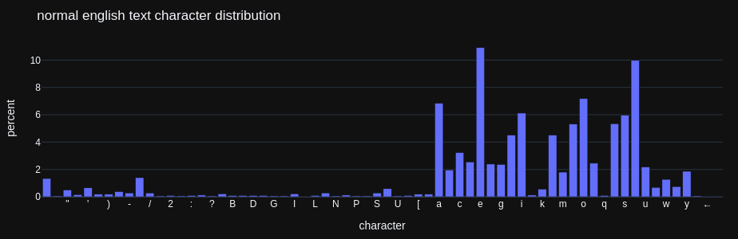
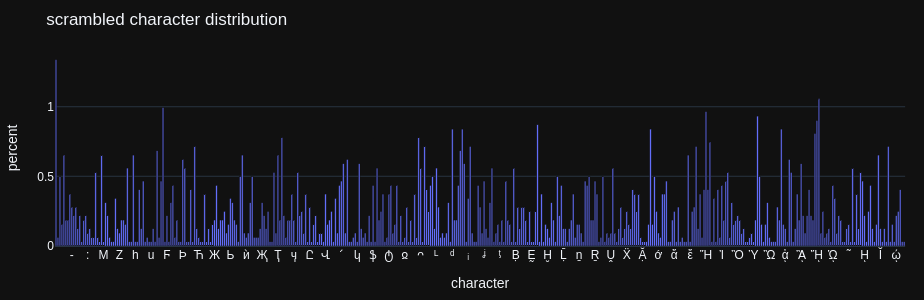

# Scraper protection without javascript

Found this on PixelMelt's [blog](https://blog.pixelmelt.dev/a-clever-but-not-so-good-scraper-protection/) and had a go at implementing it. Not that i care a lot about my articles being scraped by big-tech - **except** for my experiments with language models. That stuff should not be part of a training set.  

I do scrape web pages occasionally and don't feel like a [hypocrite](https://blog.ericgoldman.org/archives/2023/08/web-scraping-for-me-but-not-for-thee-guest-blog-post.htm) when implementing some protective measure to avoid being scraped myself. You can have all the quality stuff. Just not the things like [Text generation with microsoft/phi-2](../../logs/2024-02-12-lm-gen.md) or [Tool usage with the granite language model](../../logs/2025-08-23-evaluating-granite-llm.md).[[[start In the granite llm article i only hid the AI chats. My comments might actually be useful for the machine. end]]] It will just [cause harm](https://en.wikipedia.org/wiki/Model_collapse) to the expensive playthings called Large Language Models.

Blocking scraper bots has become [a profession](https://github.com/TecharoHQ/anubis), mainly because of the race to deploy the next best plaything between [beloved companies](https://www.astralcodexten.com/p/my-antichrist-lecture) like ClosedAI, Anthropiss or exAI, to name just a few. My little blog does not need to block anybody because it's powered by Microshut and Amazonk[[[start Microsoft bought github in [2018](https://thelinuxcode.com/lets-unpack-microsofts-acquisition-of-github/) and recently, if you look at the image urls in, e.g., a github issue, you will find a [web token](https://en.wikipedia.org/wiki/JSON_Web_Token) attached that contains things like `X-Amz-Algorithm=AWS4-HMAC-SHA256&X-Amz-Credential=AKIAVCODY...`

Ironically, that's how Microsoft protects it's *user created* assets from being scraped by the other big-techs 😂 end]]]. Github learned to [handle](https://github.blog/news-insights/denial-of-service-attacks/) [enormous](https://github.blog/news-insights/company-news/large-scale-ddos-attack-on-github-com/) [DDOS](https://arstechnica.com/information-technology/2015/03/github-battles-largest-ddos-in-sites-history-targeted-at-anti-censorship-tools/) [attacks](https://github.blog/news-insights/company-news/ddos-incident-report/) over time. So they can probably handle even ridiculously exaggerated scraping efforts. However, i'd really like to hide specific content from scrapers without referring to javascript because i really appreciate websites that still work without it[[[start My default [uMatrix](https://github.com/gorhill/uMatrix) setup looks like this:


First-party is allowed to load CSS and images. If that is not enough to display the interesting content i might just close the page. Oh, and i don't read faz.net anyways. Just took it as [a bad example](https://defgsus.github.io/blog/2021/03/19/ad-servers-today.html). end]]] and i'm [not the last person on earth](https://lwn.net/Articles/1008897/) that thinks so. 

So how to hide content from the average scraper? It's really cool! Copy some text from this article and paste it into an editor or somewhere. See? 

The text characters are scrambled and so are the [glyphs](https://en.wikipedia.org/wiki/Glyph) in the font file. The browser renders a readable version but it's only readable **visually**! The text in the html file is basically garbage. There is no easy way to reverse this shuffeling. You have to either do it visually by [rendering the glyphs](https://blog.pixelmelt.dev/kindle-web-drm/) and comparing them with glyphs for which you know the [code point](https://en.wikipedia.org/wiki/Code_point) or you need to [OCR](https://en.wikipedia.org/wiki/Optical_character_recognition) the whole page. Or you try to do it by statistical means. Here is the distribution of characters in this text without the scrambling (ignoring space):



One can spot the typical 'e's, 't's and 'a's and it *might* be possible to reverse any letter swapping if enough text is present on the page. **BUT** i did actually exchange each character with one of 13 others, selected randomly: 



So no. You'd need **a ton** of text to gain insights from this distribution. 

Non-static websites can generate a different font and scrambling at each page request (or at least choose from a pre-rendered couple of hundreds). In any case, even for this static blog, the *average scraper* is defeated. Someone has to specialize it for these things.   

My anti-scraper approach is pretty hacky ([scripts/blog/scrambling.py](../../../scripts/blog/scrambling.py)). The font file is rendered with the [fontTools](https://github.com/fonttools/fonttools) library. Thanks a lot to the authors for handling all this terribly complicated font stuff. Though, the usage of this library is quite complicated as well. It took me a while to find out how to do at least the basics:

```python
from fontTools.ttLib import TTFont

# load some font
font = TTFont("/usr/share/fonts/truetype/ubuntu/Ubuntu-R.ttf")
# decompile all the tables
font.ensureDecompiled()

# overwrite the 'a' glyph with the 'x' glyph
font.tables["glyf"]["a"] = font.tables["glyf"]["x"]

# also overwrite the metrics, otherwise the font spacing does not fit 
gs = font.getGlyphSet()
gs.hMetrics["a"] = gs.hMetrics["x"]

# export to web font
font.save("font-scrambled.woff2")
```

Setting the `hMetrics` is not enough, though. There is some other stuff i'm not aware of but it can be seen for some specific shufflings that the letters do not align correctly in all cases.[[[start
On my system it looks like this:


E.g., the two p's in 'happy' are not equal, the two l's in 'all' have different heights. One of the c's in 'correctly' is two low. Then again, it gives the whole thing some vibrancy. end]]] Also i broke the *umlauts* in the font file and probably some other special letters, don't know why.. but all in all i'm happy with it. Thanks to [PixelMelt](https://github.com/PixelMelt/) for posting the idea and to [AlextheBalex](https://github.com/AlextheBalex/) for immediately suggesting the statistical counter-attack. 

And happy scraping 🤣
