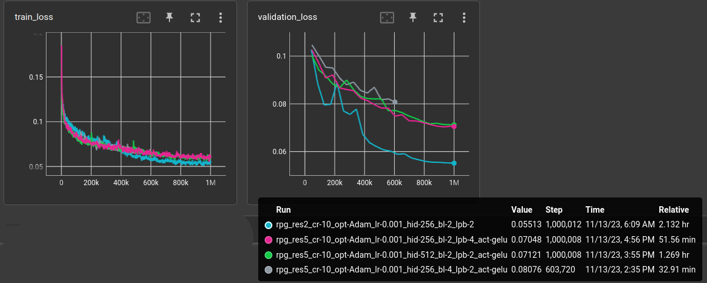

This is about learning "implicit neural representation",
mainly calculate `position + code -> color`.

# resnet21 for embedding -> ImageManifoldModel

Autoencoder with pre-trained resnet21 (without last avgpool).

```yaml
matrix:
  # compression ratio
  cr: [10]
  opt: ["Adam"]
  lr: [0.001]

  hid: [256]
  # blocks
  bl: [2]
  # layers per block
  lpb: [2]
  act: ["gelu"]

experiment_name: tests/rpg_res5_${matrix_slug}

trainer: experiments.ae.trainer.TrainAutoencoderSpecial

globals:
  SHAPE: (3, 32, 32)
  CODE_SIZE: 32 * 32 // ${cr}

train_set: |
  from experiments.datasets import rpg_tile_dataset 
  rpg_tile_dataset(SHAPE, validation=False, shuffle=True, random_shift=4, random_flip=True)

freeze_validation_set: True
validation_set: |
  from experiments.datasets import rpg_tile_dataset 
  rpg_tile_dataset(SHAPE, validation=True, shuffle=True, limit=500)

batch_size: 64
learnrate: ${lr}
optimizer: ${opt}
scheduler: CosineAnnealingLR
loss_function: l1
max_inputs: 1_000_000

model: |
  from src.models.encoder import resnet
  encoder = resnet.resnet18_open(weights=torchvision.models.ResNet18_Weights.IMAGENET1K_V1)
  with torch.no_grad():
      out_shape = encoder(torch.empty(2, *SHAPE)).shape[-3:]
  encoder = nn.Sequential(
      encoder,
      nn.Flatten(1),
      nn.Linear(math.prod(out_shape), CODE_SIZE)
  )
  #for p in encoder.parameters():
  #  p.requires_grad = False
  
  EncoderDecoder(
      encoder,
      ImageManifoldDecoder(
          num_input_channels=CODE_SIZE,
          num_output_channels=SHAPE[0],
          default_shape=SHAPE[-2:],
          num_hidden=${hid},
          num_blocks=${bl},
          num_layers_per_block=${lpb},
          activation="${act}",
      )
  )
```

Increasing the *number of hidden cells*, *blocks* and *layers per block*
did **not** provide a benefit on the 7k rpg tile dataset.
All larger versions performed worse:


