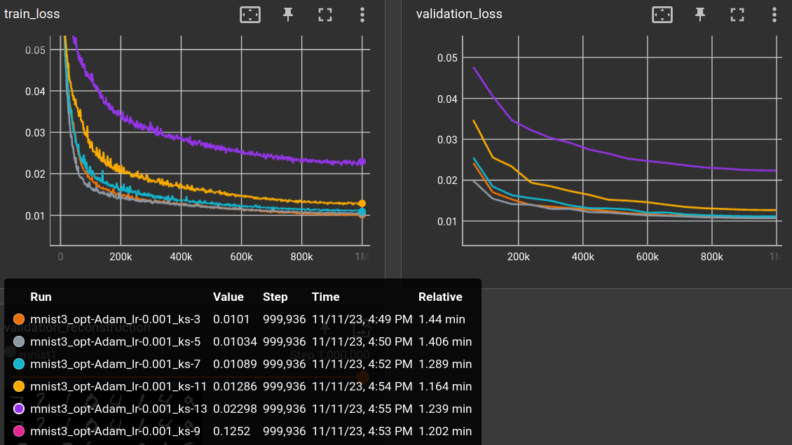

# 2023-11-11 varying kernel size

```yaml
matrix:
  opt: ["Adam"]
  lr: [0.001]
  ks: [3, 5, 7, 9, 11, 13]

experiment_name: mnist/mnist3_${matrix_slug}

trainer: TrainAutoencoder

globals:
  SHAPE: (1, 28, 28)
  CODE_SIZE: 28 * 28 // 10

train_set: |
  TransformDataset(
    TensorDataset(torchvision.datasets.MNIST("~/prog/data/datasets/", train=True).data),
    transforms=[lambda x: x.unsqueeze(0).float() / 255.],
  )

validation_set: |
  TransformDataset(
    TensorDataset(torchvision.datasets.MNIST("~/prog/data/datasets/", train=False).data),
    transforms=[lambda x: x.unsqueeze(0).float() / 255.],
  )

batch_size: 64
learnrate: ${lr}
optimizer: ${opt}
scheduler: CosineAnnealingLR
loss_function: l1
max_inputs: 1_000_000

model: |
  encoder = EncoderConv2d(SHAPE, code_size=CODE_SIZE, channels=(16, 32), kernel_size=${ks})

  encoded_shape = encoder.convolution.get_output_shape(SHAPE)
  decoder = nn.Sequential(
      nn.Linear(CODE_SIZE, math.prod(encoded_shape)),
      Reshape(encoded_shape),
      encoder.convolution.create_transposed(act_last_layer=False),
  )

  EncoderDecoder(encoder, decoder)
```


