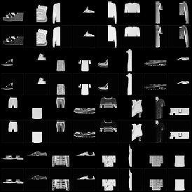
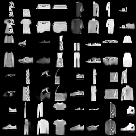
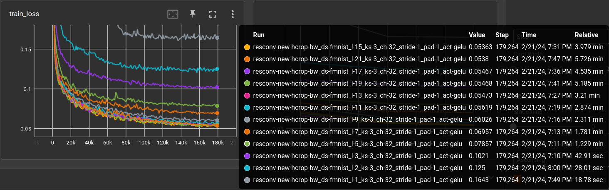

# Parameter tuning for a residual CNN

2024-02-21

The CNN is composed of an encoder and a decoder, while the decoder is typically
the reverse of the encoder. The layout is:

```
ResConv(
  (encoder): ModuleDict(
    (layer_1): ConvLayer(
      (bn): BatchNorm2d(1, eps=1e-05, momentum=0.1, affine=True, track_running_stats=True)
      (conv): Conv2d(1, 32, kernel_size=(3, 3), stride=(1, 1), padding=(1, 1))
      (act): GELU(approximate='none')
    )
    (layer_...): ConvLayer(
      (bn): BatchNorm2d(32, eps=1e-05, momentum=0.1, affine=True, track_running_stats=True)
      (conv): Conv2d(32, 32, kernel_size=(3, 3), stride=(1, 1), padding=(1, 1))
      (act): GELU(approximate='none')
    )
  )
  (decoder): ModuleDict(
    (layer_...): ConvLayer(
      (bn): BatchNorm2d(32, eps=1e-05, momentum=0.1, affine=True, track_running_stats=True)
      (conv): ConvTranspose2d(32, 32, kernel_size=(3, 3), stride=(1, 1), padding=(1, 1))
      (act): GELU(approximate='none')
    )
    (layer_15): ConvLayer(
      (bn): BatchNorm2d(32, eps=1e-05, momentum=0.1, affine=True, track_running_stats=True)
      (conv): ConvTranspose2d(32, 1, kernel_size=(3, 3), stride=(1, 1), padding=(1, 1))
      (act): Sigmoid()
    )
  )
)
```

In the forward pass each encoder layer stores it's result which is later 
added to the input of the inverse decoder layer. In the example above, result
of `layer_1` is added to the output of `layer_14` which is the input of `layer_15`.

I think this is basically a U-NET. In any case, we can add as much layers as we
want, while still being able to train the network. The residual connections 
will propagate the gradients through the whole thing, while demanding tasks
will utilize the deeper layers because they have a larger *receptive field*. 
For a little discussion of the receptive field, please check 
[Beyond a Gaussian Denoiser: Residual Learning of Deep CNN for Image Denoising (Zhang et al)](https://arxiv.org/abs/1608.03981).


## compare number of layers 

To evaluate the abilities of the network it's trained to 
**restore half-cropped images**. In this case, zalando's beloved 
[Fashion-MNIST](https://arxiv.org/abs/1708.07747) dataset, 
scaled to 32x32 pixels ([without interpolation](./autoencoder-experiments.md#take-care-of-the-choice-of-interpolation)). 

It's not completely ridiculous to expect a complete half from the network
since the images are all nicely centered and contain more or less the same
stuff (shirts, jackets, shoes, bags...).

Here are two examples. (The worst (first image) and best network from the 
following experiment). Odd rows show the network input and even rows
the reconstruction from the network.

 

The first network only has one layer (one convolution and one de-convolution),
so it's receptive field is only 3x3 pixels from the convolutional kernel. 
It can therefore not generate the other half of the image.

Comparing the number of channels after 3 epochs of training 
(180,000 training samples):



| layers |   ks |   ch |   stride |   pad | act   | validation loss | model params | train time (minutes) |
|-------:|-----:|-----:|---------:|------:|:------|----------------:|-------------:|---------------------:|
|     15 |    3 |   32 |        1 |     1 | gelu  |       0.0541419 |      261,411 |                 4.17 |
|     19 |    3 |   32 |        1 |     1 | gelu  |       0.0544393 |      335,907 |                 5.43 |
|     13 |    3 |   32 |        1 |     1 | gelu  |       0.0549113 |      224,163 |                 3.39 |
|     21 |    3 |   32 |        1 |     1 | gelu  |         0.05519 |      373,155 |                 5.98 |
|     17 |    3 |   32 |        1 |     1 | gelu  |       0.0554134 |      298,659 |                 4.74 |
|     11 |    3 |   32 |        1 |     1 | gelu  |       0.0572291 |      186,915 |                 3.02 |
|      9 |    3 |   32 |        1 |     1 | gelu  |        0.061094 |      149,667 |                 2.43 |
|      7 |    3 |   32 |        1 |     1 | gelu  |        0.070167 |      112,419 |                 1.87 |
|      5 |    3 |   32 |        1 |     1 | gelu  |       0.0797099 |       75,171 |                 1.30 |
|      3 |    3 |   32 |        1 |     1 | gelu  |        0.102242 |       37,923 |                 0.78 |
|      2 |    3 |   32 |        1 |     1 | gelu  |        0.124805 |       19,299 |                 0.52 |
|      1 |    3 |   32 |        1 |     1 | gelu  |        0.164834 |          675 |                 0.36 |

It's really nice to see such a distinguished parameter-performance ratio once in a while. 
From 1 to 11 layers, performance increases steadily, then it get's a bit mixed-up. 
Most likely, 11 layers archive a receptive field that includes the whole input patch 
of 32x32. It's *kind of* proving that the deep layers are used despite the 
residual skip connections.

TODO: repeat with 64x64


