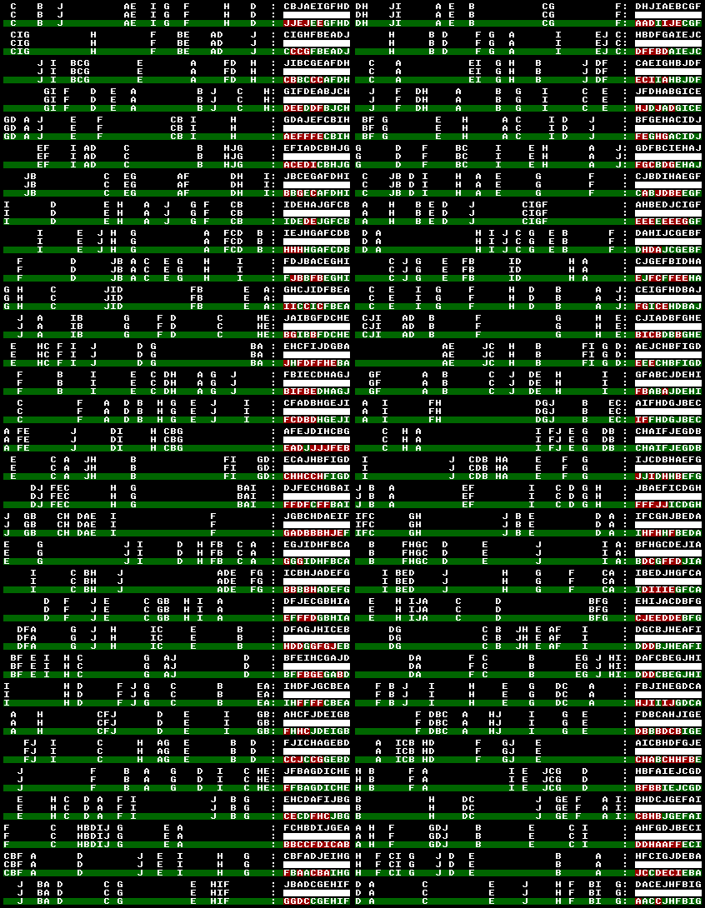
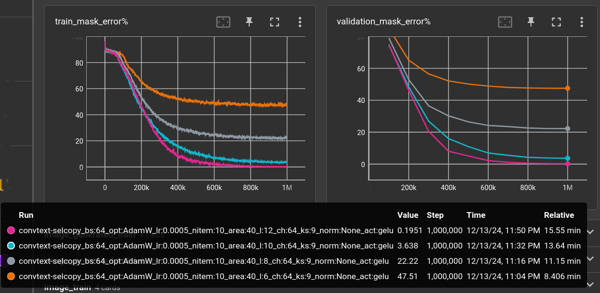
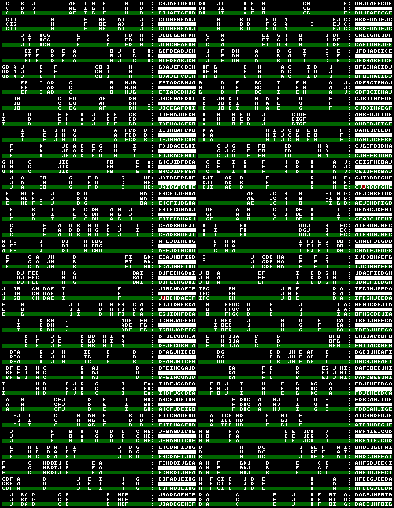
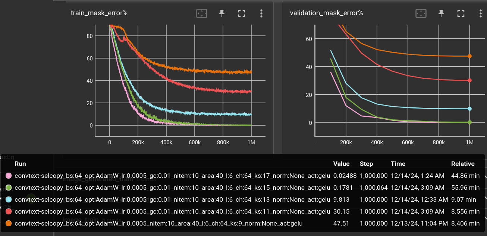

# 2024-12-14 Selective Copy Problem with a Very Small Language Model

Recently, i tried to understand the original [Mamba paper](https://arxiv.org/abs/2312.00752).
It's definitely worth read. The authors mention the *Selective Copying* as a toy example
that is better be handled by time-varying models instead of *conventional convolutional* models.

I tried the Mamba model, not from the [original authors](https://github.com/state-spaces/mamba),
but using [this repo](https://github.com/johnma2006/mamba-minimal/blob/master/model.py), 
because i couldn't bring it to run on my current system.

The readable re-implementation lacks all the (unreadable) speed optimization stuff and is indeed
pretty slow, compared to a simple CNN. 
So i quickly switched to 1D-convolutions for today's experiment.

The model has an input-embedding which is fed by raw byte values. It's nasty in reversing the model's
output put keeps things otherwise simple and understandable.

The Dataset is the (almost) endless stream of combinations of letters, arranged in a free space.
The task is to pick the letters and concatenate them, e.g.:

    A....D.C..B.. -> ADCB
    C..A....BD... -> CABD

I was previously trying stuff with masking, where parts of a text are hidden and the model learns
to reproduce the parts. For the *selective copy* dataset, this looks like

    B..C....A.D.. -> ????

but instead of a `?`, the mask byte value is actually zero.

Here's a typical model

    ConvTextModel(
      (embedding): Embedding(256, 64)
      (layers): ModuleList(
        (0-5): 6 x ConvTextLayer(
          (conv): Conv1d(64, 64, kernel_size=(9,), stride=(1,), padding=(3,))
          (act): GELU(approximate='none')
        )
      )
      (lm_head): Linear(in_features=64, out_features=256, bias=False)
    )

Feed any number (say L) of text bytes into the embedding, pass 64 x L matrices through
the stack of 1D convolutions, which keep the resolution (via padding) and add a residual
short-cut from layer-input to layer-output. Finally transform the 64-dim *latent space* 
into class logits for the 256 possible byte values. 

Whole thing is trained as usual, with AdamW, lr=0.0005, Cosine Annealing with Warmup, 
batch-size 64, for 1 million steps. 

The dataset is made from 10 letters in a 40-letter space. The validation set contains 5000
positions which are excluded from the (otherwise almost infinite) training set.

### Comparing number of layers

This is again a topic of *receptive fields* in CNNs. With an area of 40, some delimiter and 
10 letters for the answer the model has to *see* 50 cells apart.

#### 6 layers 

The model above with 6 layers @ kernel size 9 can see about 24 cells (6 * floor(9 / 2)) 
in each direction, which is not enough to solve the puzzle. After 1M steps, the error on 
the validation set looks like this:

(It's 64 examples, arranged in two columns. The first row is the original text, the second
row is the masked input to the model and the third row is the model reproduction,
with green background marking a fit and red for errors.)

It fails all over the place but predominantly at the beginning of the answer, because
the information needed for it is too far apart.

And yes, increasing the number of layers helps a lot:

The plots show the error percentage (how many letters are wrong) inside the masked area. 
Text outside the mask must also be reproduced by the model but is not considered in this plot.

|   nitem |   area |   l |   ch |   ks | act   |   validation loss (1,000,000 steps) | model params   |   train time (minutes) | throughput   |
|--------:|-------:|----:|-----:|-----:|:------|------------------------------------:|:---------------|-----------------------:|:-------------|
|      10 |     40 |   6 |   64 |    9 | gelu  |                          0.203547   | 237,952        |                   8.71 | 1,913/s      |
|      10 |     40 |   8 |   64 |    9 | gelu  |                          0.088512   | 311,808        |                  11.75 | 1,418/s      |
|      10 |     40 |  10 |   64 |    9 | gelu  |                          0.0164525  | 385,664        |                  14.51 | 1,148/s      |
|      10 |     40 |  12 |   64 |    9 | gelu  |                          0.00128227 | 459,520        |                  16.5  | 1,009/s      |

##### 12 layers

The 12-layer network gets down to an error of 0.2%. It can *see* about 48 cells in each direction,
which should be just enough to solve this task.

This is a nice little experiment setup. 
The 12-layer model's performance can be viewed as the baseline.  
The 6 layer model performs terrible (47% error) but at least at twice the speed. Can we
somehow get to equal performance with only 6 layers?

### Increasing kernel size

The most obvious thing! Now, in 2D image recognition, there seems to be a limit at about 7x7 
after which performance grows marginal compared to the exponentially increased compute demand
(from a paper i can't remember right now). For this 1D experiment, a kernel size of **17**
in the 6-layer network performs even better than the 12-layer network. 
Although, more than 5 times slower:

|   nitem |   area |   l |   ch |   ks | act   |   validation loss (1,000,000 steps) | model params   | train time (minutes) | throughput |
|--------:|-------:|----:|-----:|-----:|:------|------------------------------------:|:---------------|---------------------:|:-----------|
|      10 |     40 |   6 |   64 |    9 | gelu  |                            0.203547 | 237,952        |                 8.71 | 1,913/s    |
|      10 |     40 |   6 |   64 |   11 | gelu  |                             0.12667 | 287,104        |                 8.85 | 1,882/s    |
|      10 |     40 |   6 |   64 |   13 | gelu  |                           0.0355833 | 336,256        |                 9.44 | 1,764/s    |
|      10 |     40 |   6 |   64 |   15 | gelu  |                          0.00105004 | 385,408        |                58.02 | 286/s      |
|      10 |     40 |   6 |   64 |   17 | gelu  |                         0.000182635 | 434,560        |                49.15 | 339/s      |

For some reason (maybe some nifty specialized Cuda implementations), the 15 and 17 kernel are
unbearably slow. Or in other words, up until 13, they are blazingly fast. 

