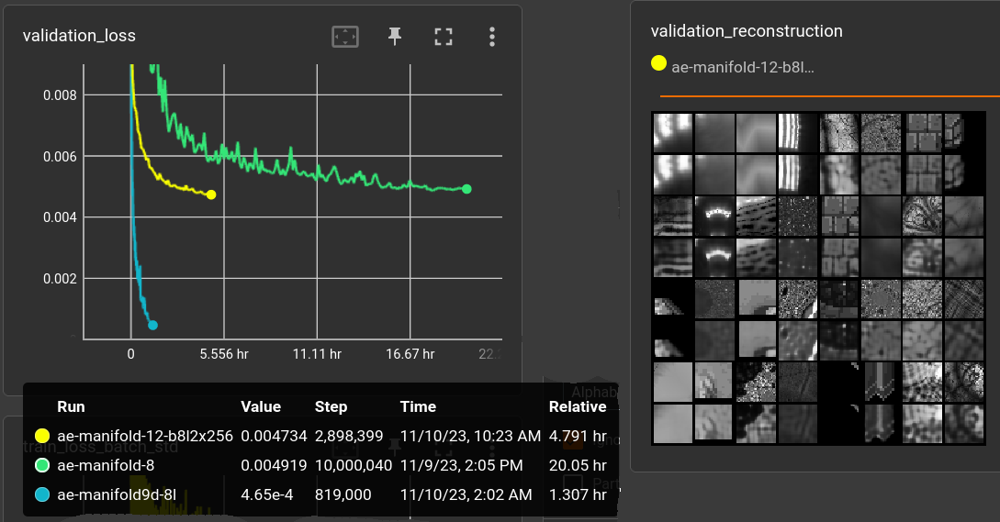

# "manifold" decoder

## 2023-11-09

After preliminary experiments, running this setup:

    DalleManifoldAutoencoder(
        shape=(1, 32, 32), 
        vocab_size=128, n_hid=64, n_blk_per_group=1, act_fn=nn.GELU, space_to_depth=True, 
        decoder_n_blk=4, decoder_n_layer=2, decoder_n_hid=64,
    )
    encoder params: 1,725,264
    decoder params: 42,497
    batch_size: 64
    steps: 1M
    learnrate: .0003 AdamW, CosineAnnealingLR 
    
on only 300 (randomly h&v-flipped) images of the RPG-tiles dataset (/scripts/datasets.py).

The encoder is a small version of the DALL-E VQ-VAE model. 
The decoder is basically a function of 

    encoding, pixel-position -> pixel-color

which i call "manifold" for now until i stumble across a better name.
It's made of X equal blocks of Y fully connected layers with 
batch-normalization and residual skip connections per block.

Besides l2 reconstruction loss there is an extra constraint on the distribution of the encoding:

    loss_batch_std = (.5 - feature_batch.std(0).mean()).abs()
    loss_batch_mean = (0. - feature_batch.mean()).abs()

The three runs add these losses with factor 0.1 (green), 0.001 (orange) and 0.0 (gray). 

Below are reproduced (right) samples of the orange model. 

and rendered to 64x64 resolution:

### upgrade decoder

fixed the std/mean loss factor to 0.0001 and increased number of decoder blocks:

    decoder_n_blk=8,  decoder_n_layer=2, decoder_n_hid=128, params: 283,649

plots in x = steps (top) and relative time (bottom):

The reproductions from the training set look good enough. 
other tiles can hardly be reproduced:

Some (very short) tests with different block/layer settings: 

    (cyan)    decoder_n_blk=8,  decoder_n_layer=2, decoder_n_hid=128, params: 283,649 
    (yellow)  decoder_n_blk=8,  decoder_n_layer=4, decoder_n_hid=128, params: 547,841
    (brown)   decoder_n_blk=16, decoder_n_layer=1, decoder_n_hid=128, params: 285,697 
    (magenta) decoder_n_blk=16, decoder_n_layer=2, decoder_n_hid=128, params: 549,889

### back to "real" dataset

The current dataset of choice for my autoencoders is a mixture of all
the rpg tiles (about 8k, h&v-flipped) and kali-set fractal patches
(about 50k, at 128x128 randomly cropped to 32x32).

    (light green) decoder_n_blk=8, decoder_n_layer=2, decoder_n_hid=300, params: 1,490,401
    (dark green)  decoder_n_blk=8, decoder_n_layer=2, decoder_n_hid=128, params: 283,649
    (cyan)        sames as dark green but on above small dataset

The light-green model above was quite unsuccessful in terms of 
image quality. It still uses 0.1 factor for std/mean-loss. 
Dark green model uses factor 0.0001 and performs a little better
even though having less parameters. It's not getting close 
to the desirable baseline of the 300-tile dataset (cyan), though.

Increasing the number of hidden cells in the decoder to 256 does 
not seem to be enough for acceptable quality:

    (yellow) decoder_n_blk=8, decoder_n_layer=2, decoder_n_hid=256, params: 1,091,585

It might get below 0.004 reconstruction loss with another 10 hours
but i'm targeting < 0.001. Stopping it.

